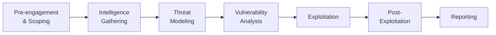

# Course 4 · Penetration Testing

**Code:** `SKL-PEN-712` · **Learning hours:** 20 · **Level:** Methodology / Professional

Up to now you've learned individual techniques. This course teaches you to run
them as a **professional engagement**: how to scope work legally, choose a
methodology, execute in phases, collect evidence, and write a report a client
can act on. This is what separates a hobbyist from a paid penetration tester.

## Modules
1. [Penetration Testing Fundamentals](module-01-penetration-testing-fundamentals.md)
2. [Penetration Testing Concepts](module-02-penetration-testing-concepts.md)

## An engagement end-to-end

⬅️ Prev: [Course 3](../03-professional-level-2/) · ➡️ Next: [Course 5 · AI for Cyber Security](../05-ai-for-cyber-security/)
