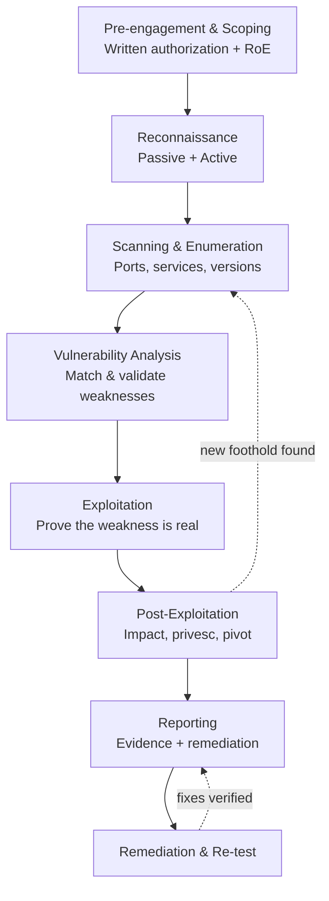

# Penetration Testing Fundamentals

> **What you'll learn:** What a penetration test ("pentest") really is, the different types and engagement models, and the step-by-step phases professionals follow to safely simulate a real attack — plus the tools, defenses, and reporting that make it useful.
> **Prerequisites:** Basic computer literacy, a rough idea of what a network and a web application are, and comfort using a command line. No prior security knowledge required.

| | |
|---|---|
| **Course** | Penetration Testing |
| **Course code** | SKL-PEN-712 |
| **Module** | Module 01 — Penetration Testing Fundamentals |
| **Level** | pentest |

---

## 1. In Plain English

Imagine you've just installed a brand-new security system in your house: locks, cameras, an alarm. You *think* it's secure, but you don't really know until someone tries to break in. So you hire a trusted professional locksmith and tell them: "Try to get into my house, use any trick you can think of, and then tell me exactly how you did it." That friendly burglar is a **penetration tester**, and the controlled break-in attempt is a **penetration test**.

A penetration test is an **authorized, simulated cyberattack** against a computer system, network, or application. The goal is not to cause harm — it's to find the weak spots *before* a real criminal does, and to prove which of those weak spots can actually be exploited. The word "authorized" is the most important word in that sentence: doing the exact same thing *without* written permission is a crime in almost every country.

Why should a total beginner care? Because almost everything we rely on — banking apps, hospital records, the power grid, your email — runs on software, and software has bugs. Some of those bugs are doors that an attacker can walk through. A penetration test is how organizations find those doors on purpose so they can lock them. Companies pay well for this skill, and learning it teaches you to *think like an attacker*, which is the single best way to become good at defending systems.

Throughout this module, remember the golden rule: **everything offensive here is for systems you own or have explicit written permission to test.** Penetration testing is a profession built on trust, scope, and paperwork as much as on technical skill.

---

## 2. Core Concepts

### 2.1 What Penetration Testing Is (and Isn't)

A **penetration test** is a structured, goal-driven exercise where a security professional (the **tester** or "ethical hacker") attempts to breach a system's defenses using the same techniques a malicious attacker would, then documents the findings and how to fix them.

It is helpful to distinguish it from two neighbours:

- **Vulnerability assessment** — an automated scan that produces a *list* of potential weaknesses ("this software is outdated, this port is open"). It tells you what *might* be wrong but does not prove it can be exploited.
- **Penetration test** — goes one step further: it *exploits* selected weaknesses to demonstrate real-world impact ("using that outdated software, I obtained the admin password and read the customer database"). It proves what an attacker could actually achieve.
- **Red teaming** — a broader, stealthier, objective-based simulation of a real adversary over a long period, often testing people, processes, and physical security too, while the defending **blue team** tries to catch them. A pentest is usually narrower and noisier than a red-team engagement.

### 2.2 Benefits of Penetration Testing

- **Finds real, exploitable risk**, not just theoretical issues — it separates "scary-sounding but harmless" from "actually dangerous."
- **Validates defenses** — confirms whether firewalls, monitoring, and patching are actually working.
- **Prioritizes remediation** — gives teams a ranked list so they fix the most dangerous problems first.
- **Supports compliance** — standards and regulations such as PCI DSS (payment card data), HIPAA (healthcare), ISO 27001, and SOC 2 expect regular testing.
- **Reduces breach cost** — finding and fixing a flaw is far cheaper than recovering from a real breach, fines, and reputational damage.
- **Trains the defenders** — the blue team learns what real attacks look like in their own environment.

### 2.3 Engagement Models: How Much Does the Tester Know?

The "box" terminology describes how much information the tester is given up front.

| Model | Tester's knowledge | Simulates | Trade-offs |
|---|---|---|---|
| **Black box** | None — only a name or IP range | An outside attacker with no insider info | Realistic but slow; may miss deep flaws |
| **Grey box** | Partial — e.g., a normal user login or basic architecture | A malicious user or an attacker who already has a foothold | Balanced; efficient and still realistic |
| **White box** | Full — source code, credentials, network diagrams | An insider, or a thorough audit | Most complete coverage; least realistic about "discovery" |

A useful analogy: black box is a burglar who knows nothing about your house; grey box is a guest who's been in your living room; white box is the architect who has the full blueprints.

### 2.4 Types of Penetration Testing (by Target)

The *target* determines the skills and tools used. The main categories:

- **Network penetration testing** — examines servers, routers, switches, firewalls, and the services running on them (open ports, weak protocols, misconfigurations). Split into **external** (from the internet) and **internal** (as if the attacker is already inside the LAN, e.g., a malicious employee or a compromised laptop).
- **Web application penetration testing** — focuses on websites and web APIs: injection flaws, broken authentication, broken access control, and similar. The **OWASP Top 10** is the industry reference list of the most common web risks.
- **Wireless penetration testing** — targets Wi-Fi and other radio networks: weak encryption (e.g., outdated WEP, weak WPA2 pre-shared keys), rogue access points, and "evil twin" networks that impersonate a legitimate hotspot.
- **Social engineering testing** — targets *people* rather than machines: phishing emails, phone-based **pretexting** (inventing a convincing story), and physical attempts like **tailgating** (following an employee through a secure door). Humans are often the easiest path in.
- **Mobile application testing** — examines Android/iOS apps and their backends.
- **Cloud penetration testing** — examines cloud configurations (e.g., overly permissive storage buckets, IAM roles). Note that cloud providers impose **rules of engagement**, so authorization extends to the provider too.
- **Physical penetration testing** — attempts to physically access facilities, server rooms, or unattended workstations.

### 2.5 Key Supporting Concepts

- **Scope** — the explicit list of what may (and may not) be tested. Staying in scope is a legal and ethical requirement.
- **Rules of Engagement (RoE)** — the agreed conditions: which targets, what times, which techniques are allowed (e.g., is denial-of-service permitted?), and who to contact in an emergency.
- **Vulnerability** — a weakness. **Exploit** — the technique or code that takes advantage of it. **Payload** — what runs after exploitation (e.g., a remote shell). **Privilege escalation** — going from a low-privilege account to admin/root. **Pivoting** — using one compromised machine as a stepping-stone to reach others.

---

## 3. How It Works (Step by Step)

Professionals follow a repeatable methodology. The phases below align with widely used frameworks such as the **PTES (Penetration Testing Execution Standard)** and **NIST SP 800-115**.

1. **Pre-engagement / Scoping.** Define goals, scope, rules of engagement, timing, and emergency contacts. Get **written authorization** (sometimes called the "get-out-of-jail" letter). Nothing technical happens until this is signed.
2. **Reconnaissance (Information Gathering).** Collect information about the target. **Passive recon** uses public sources (company website, DNS records, employee names) without touching the target. **Active recon** interacts directly (e.g., querying servers).
3. **Scanning & Enumeration.** Identify live hosts, open ports, running services and versions, and map the attack surface. This turns raw recon into a concrete list of possible entry points.
4. **Vulnerability Analysis.** Match discovered services and configurations to known weaknesses, then decide which are worth attempting. Filter out false positives.
5. **Exploitation.** Attempt to actually breach a selected weakness to confirm it is real — only within scope and within the agreed rules.
6. **Post-Exploitation.** Determine the *impact*: what data is reachable, can privileges be escalated, can you pivot to other systems, can access be maintained? This answers "so what?" — the business risk.
7. **Reporting.** Document findings, evidence, business impact, severity ratings, and clear remediation advice. The report is the actual *product* the client pays for.
8. **Remediation & Re-test.** The client fixes the issues; the tester verifies the fixes worked.



The dotted line from Post-Exploitation back to Scanning reflects a real truth: once you compromise one machine, you often start the cycle again from that new vantage point (pivoting), as long as it stays inside the agreed scope.

---

## 4. Real-World Examples

**1. The TJX / TJ Maxx breach (disclosed 2007).** Attackers exploited weak **wireless** security (the outdated WEP encryption) at store locations to get onto the corporate network, eventually exposing tens of millions of payment card records. This is a textbook example of why wireless penetration testing matters: a weak Wi-Fi network in a single store became a doorway to the entire company.

**2. Equifax (2017).** A widely reported breach traced to an unpatched vulnerability in a web application framework (Apache Struts) exposed sensitive data of roughly 147 million people. The flaw was *known* and a patch existed — a reminder that web-application testing and timely patching together prevent exactly this class of incident.

**3. A realistic phishing scenario (social engineering).** A tester, with permission, sends a finance team an email that looks like an internal IT password-reset notice. A few employees click and enter credentials on a tester-controlled page. No real harm is done, but the engagement proves that staff training and multi-factor authentication are needed — and quantifies the click rate so leadership can act.

---

## 5. Tools of the Trade

> These are standard, openly documented tools used in authorized testing. Use them only against systems you own or are authorized to test.

### Nmap — network mapping and port scanning
Discovers live hosts, open ports, and service versions.
```bash
nmap -sV -p- 192.168.56.101
```
Scans **all** TCP ports (`-p-`) on the target and attempts version detection (`-sV`) to identify what software is listening.

### Nikto — web server scanner
Checks a web server for common misconfigurations and outdated components.
```bash
nikto -h http://192.168.56.101
```
Runs a battery of checks against the target host (`-h`) and reports potential issues.

### Burp Suite — web application proxy
An intercepting proxy that sits between your browser and a web app so you can inspect and modify requests. Primarily used through its GUI; you configure your browser to route traffic through Burp's listener (commonly `127.0.0.1:8080`) and then explore requests and responses interactively.

### Metasploit Framework — exploitation framework
A library of exploits and payloads with a console interface.
```bash
msfconsole
# inside the console:
search type:exploit name:vsftpd
```
Launches the Metasploit console, then searches its module database for exploits matching a name — letting you study and (in a lab) safely run known exploit modules.

### Wireshark — packet analyzer
Captures and inspects network traffic to understand protocols and spot cleartext data. Typically used through its GUI; a capture filter such as `host 192.168.56.101` limits captured packets to traffic involving one host.

### Hydra — login brute-forcing (lab use)
Tests authentication strength against a service.
```bash
hydra -l admin -P wordlist.txt ssh://192.168.56.101
```
Tries each password in `wordlist.txt` for the user `admin` against the SSH service — used to demonstrate weak-password risk on systems you control.

### Kali Linux / Parrot OS
Linux distributions that bundle the tools above and hundreds more, giving testers a ready-made working environment.

---

## 6. Hands-On Lab (Authorized / Lab-Only)

> **Reminder: perform these steps only on systems you own or have explicit written authorization to test (e.g., a personal home lab or an intentionally vulnerable VM).**

Rather than focusing on a single tool, this lab practices the *professional engagement workflow* using a self-contained lab — for example, a deliberately vulnerable virtual machine (such as the Metasploitable or OWASP-provided practice VMs) running on an isolated host-only network on your own computer. The point is to rehearse **methodology, evidence collection, and reporting**, not just to "pop a box."

### Step A — Define scope and rules of engagement
Write them down *before* touching anything. A minimal RoE checklist:

- [ ] **Targets** — exact IPs/hostnames in scope, and anything explicitly out of scope.
- [ ] **Authorization** — written, signed approval from the asset owner on file.
- [ ] **Window** — permitted dates/times for testing.
- [ ] **Allowed techniques** — e.g., scanning and exploitation permitted; denial-of-service and data destruction **not** permitted.
- [ ] **Data handling** — how sensitive findings will be stored, encrypted, and deleted.
- [ ] **Emergency contact** — who to call if something breaks or a real attacker is spotted.
- [ ] **Stop conditions** — what events immediately halt the test.

### Step B — Execute the phases on the lab VM
Walk through reconnaissance → scanning → vulnerability analysis → controlled exploitation → post-exploitation, exactly as in Section 3, but contained to your isolated lab. Keep the network host-only so nothing escapes.

### Step C — Collect evidence as you go
For each finding, record: the timestamp, the exact command or request used, the raw output/response, and a screenshot. Evidence must let someone else **reproduce** the finding. Store it securely and never include real credentials or sensitive data in plaintext where it isn't needed.

### Step D — Write the report
A clear report is the deliverable. A solid skeleton:

1. **Executive Summary** — plain-language overview and overall risk, written for non-technical leaders.
2. **Scope & Methodology** — what was tested, when, and how (reference PTES/NIST 800-115).
3. **Findings** — one entry per issue, each with: title, **severity** (e.g., CVSS-based rating), affected asset, description, **evidence/proof-of-concept**, business impact, and **remediation**.
4. **Risk Summary Table** — all findings ranked by severity.
5. **Remediation Roadmap** — prioritized fixes and suggested timelines.
6. **Appendices** — tool output, methodology details, and a glossary.

Practising this end-to-end — even against one lab VM — is what separates a hobbyist from an employable tester.

---

## 7. Countermeasures & Defenses

**Prevent (reduce the attack surface):**
- Patch and update software promptly; track an inventory of assets and versions.
- Harden configurations: close unused ports, disable default/weak accounts, enforce least privilege.
- Use strong authentication: unique strong passwords and **multi-factor authentication (MFA)** everywhere.
- Encrypt data in transit and at rest; retire weak protocols (e.g., WEP, plain HTTP, SSLv3).
- Segment networks so a single compromise cannot reach everything (limits pivoting).
- Validate and sanitize all user input to prevent injection and access-control flaws.

**Detect (notice attacks in progress):**
- Centralized logging and a **SIEM** (Security Information and Event Management) to correlate events.
- **IDS/IPS** (Intrusion Detection/Prevention Systems) and endpoint detection (EDR) to flag suspicious behavior.
- Alert on anomalies: port scans, repeated failed logins (brute force), and unusual privilege changes.

**Respond & improve:**
- Maintain and rehearse an **incident response** plan.
- Run regular security-awareness and phishing training to harden the human layer.
- Conduct periodic penetration tests and **fix the findings** — then re-test to confirm.

---

## 8. Key Terms

- **Penetration test** — an authorized, simulated attack to find and prove exploitable weaknesses.
- **Vulnerability** — a weakness in a system that could be exploited.
- **Exploit** — a technique or piece of code that takes advantage of a vulnerability.
- **Payload** — the action/code executed after a successful exploit (e.g., a remote shell).
- **Scope** — the explicitly authorized list of what may be tested.
- **Rules of Engagement (RoE)** — the agreed conditions, limits, and contacts for a test.
- **Black/Grey/White box** — engagement models defined by how much the tester knows up front.
- **Reconnaissance** — gathering information about a target (passive or active).
- **Enumeration** — extracting detailed information (users, services, shares) from discovered systems.
- **Privilege escalation** — gaining higher access rights than originally granted.
- **Pivoting** — using a compromised system to reach other systems.
- **Social engineering** — manipulating people (e.g., phishing) to gain access.
- **Red team / Blue team** — the simulated attackers vs. the defenders.
- **Vulnerability assessment** — listing potential weaknesses without exploiting them.

---

## 9. Summary & Takeaways

- A penetration test is an **authorized** simulated attack whose goal is to find and *prove* exploitable weaknesses — written permission and scope come first, always.
- It goes beyond a vulnerability scan by demonstrating real-world impact, and it is narrower than a full red-team engagement.
- **Engagement models** (black/grey/white box) define tester knowledge; **target types** (network, web, wireless, social, mobile, cloud, physical) define the focus.
- Professionals follow repeatable **phases**: scoping → recon → scanning/enumeration → vuln analysis → exploitation → post-exploitation → reporting → re-test.
- The **report**, not the exploit, is the real deliverable — clear evidence and prioritized, actionable remediation.
- Common tools include Nmap, Burp Suite, Metasploit, Wireshark, Nikto, and Hydra, bundled in distros like Kali Linux.
- Strong defenses combine **prevention** (patching, MFA, segmentation, least privilege), **detection** (SIEM, IDS/IPS, EDR), and **response** (incident plans, training, re-testing).

**Further reading:** OWASP Top 10 and the OWASP Web Security Testing Guide; NIST SP 800-115 ("Technical Guide to Information Security Testing and Assessment"); the Penetration Testing Execution Standard (PTES); and the MITRE ATT&CK knowledge base of adversary tactics and techniques.
