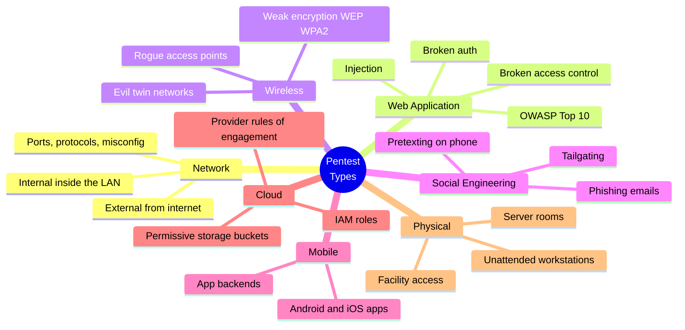
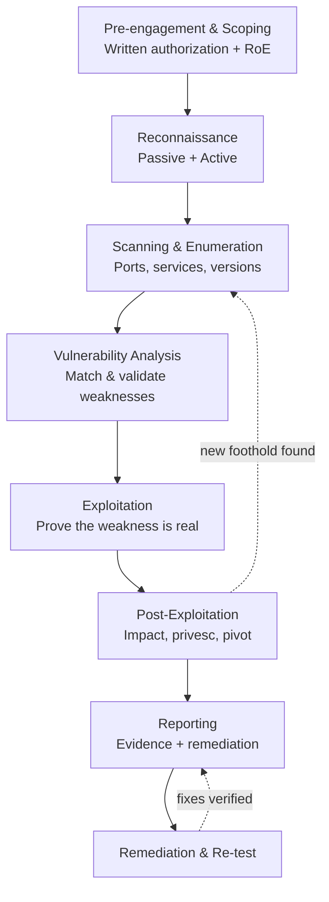
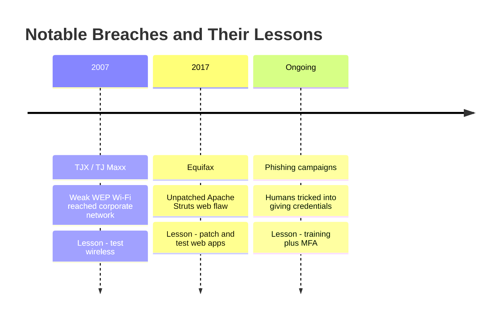
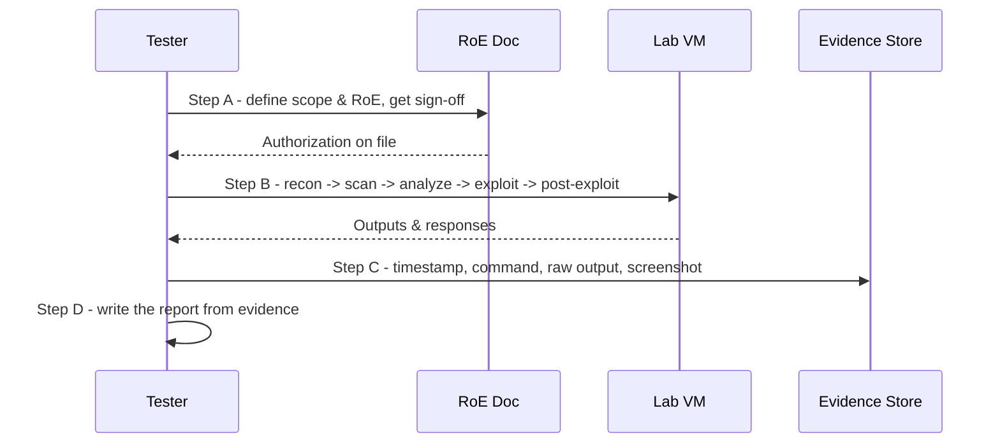

# Penetration Testing Fundamentals

> **What you'll learn:** What a penetration test ("pentest") really is, the types and engagement models, and the step-by-step phases professionals follow to safely simulate a real attack — plus the tools, defenses, and reporting that make it useful.
> **Prerequisites:** Basic computer literacy, a rough idea of what a network and a web application are, and comfort using a command line. No prior security knowledge required.

| | |
|---|---|
| **Course** | Penetration Testing |
| **Course code** | SKL-PEN-712 |
| **Module** | Module 01 — Penetration Testing Fundamentals |
| **Level** | pentest |

---

## 1. In Plain English

You just installed a new home security system — locks, cameras, an alarm. You *think* it's secure, but you don't really know until someone tries to break in. So you hire a trusted locksmith: "Try to get in using any trick you can, then tell me exactly how you did it." That friendly burglar is a **penetration tester**, and the controlled break-in is a **penetration test**.

A penetration test is an **authorized, simulated cyberattack** against a system, network, or application. The goal isn't harm — it's to find weak spots *before* a real criminal does, and to prove which ones can actually be exploited.

> 🔑 **Key idea:** "Authorized" is the most important word. Doing the exact same thing *without* written permission is a crime in almost every country.

Why care as a beginner? Almost everything we rely on — banking apps, hospital records, the power grid, your email — runs on software, and software has bugs. Some bugs are doors an attacker can walk through. A pentest finds those doors on purpose so they can be locked. The skill pays well, and it teaches you to *think like an attacker* — the single best way to get good at defending systems.

> ⚠️ **Warning:** The golden rule for this entire module — everything offensive here is for systems you **own** or have **explicit written permission** to test. Pentesting is a profession built on trust, scope, and paperwork as much as technical skill.

---

## 2. Core Concepts

### 2.1 What Penetration Testing Is (and Isn't) 🎯

A **penetration test** is a structured, goal-driven exercise where a security professional (the **tester** or "ethical hacker") attempts to breach a system's defenses using real attacker techniques, then documents the findings and how to fix them.

It helps to distinguish it from two neighbours:

| Activity | What it does | What it proves |
|---|---|---|
| 🔍 **Vulnerability assessment** | Automated scan producing a *list* of potential weaknesses (outdated software, open port) | What *might* be wrong — not that it's exploitable |
| 💥 **Penetration test** | *Exploits* selected weaknesses to show real impact (used outdated software → got admin password → read customer DB) | What an attacker could *actually achieve* |
| 🥷 **Red teaming** | Broad, stealthy, objective-based simulation over a long period; tests people, process, and physical security too, while the **blue team** tries to catch them | Whether the whole organization can detect and respond |

> 💡 **Tip:** A pentest is usually **narrower and noisier** than a red-team engagement. Red teaming is about evading detection; a pentest is about thorough coverage.

### 2.2 Benefits of Penetration Testing ✅

- **Finds real, exploitable risk** — separates "scary-sounding but harmless" from "actually dangerous."
- **Validates defenses** — confirms firewalls, monitoring, and patching actually work.
- **Prioritizes remediation** — a ranked list so teams fix the most dangerous problems first.
- **Supports compliance** — PCI DSS (payment cards), HIPAA (healthcare), ISO 27001, and SOC 2 all expect regular testing.
- **Reduces breach cost** — finding a flaw is far cheaper than recovering from a breach, fines, and reputational damage.
- **Trains the defenders** — the blue team sees what real attacks look like in their own environment.

### 2.3 Engagement Models: How Much Does the Tester Know? 📦

The "box" terminology describes how much information the tester gets up front.

| Model | Tester's knowledge | Simulates | Trade-offs |
|---|---|---|---|
| ⬛ **Black box** | None — only a name or IP range | Outside attacker with no insider info | Realistic but slow; may miss deep flaws |
| 🔲 **Grey box** | Partial — e.g., a normal user login or basic architecture | A malicious user, or an attacker with a foothold | Balanced; efficient and still realistic |
| ⬜ **White box** | Full — source code, credentials, network diagrams | An insider, or a thorough audit | Most complete coverage; least realistic about "discovery" |

> 💡 **Tip:** Black box = a burglar who knows nothing about your house. Grey box = a guest who's seen your living room. White box = the architect with the full blueprints.

### 2.4 Types of Penetration Testing (by Target) 🗺️

The *target* determines the skills and tools used.



- **Network pentest** — servers, routers, switches, firewalls, and their services (open ports, weak protocols, misconfigurations). Split into **external** (from the internet) and **internal** (as if already inside the LAN — a malicious employee or compromised laptop).
- **Web application pentest** — websites and web APIs: injection flaws, broken authentication, broken access control. The **OWASP Top 10** is the industry reference list of common web risks.
- **Wireless pentest** — Wi-Fi and other radio networks: weak encryption (outdated WEP, weak WPA2 pre-shared keys), rogue access points, and "evil twin" networks that impersonate a legitimate hotspot.
- **Social engineering** — targets *people*: phishing emails, phone **pretexting** (a convincing invented story), and physical **tailgating** (following an employee through a secure door). Humans are often the easiest path in.
- **Mobile application testing** — Android/iOS apps and their backends.
- **Cloud pentest** — cloud configurations (overly permissive storage buckets, IAM roles). Providers impose **rules of engagement**, so authorization extends to the provider too.
- **Physical pentest** — physically accessing facilities, server rooms, or unattended workstations.

### 2.5 Key Supporting Concepts 🧩

| Term | Meaning |
|---|---|
| **Scope** | The explicit list of what may (and may not) be tested. Staying in scope is a legal and ethical requirement. |
| **Rules of Engagement (RoE)** | Agreed conditions: which targets, what times, which techniques (is DoS allowed?), and who to contact in an emergency. |
| **Vulnerability** | A weakness. |
| **Exploit** | The technique or code that takes advantage of a vulnerability. |
| **Payload** | What runs after exploitation (e.g., a remote shell). |
| **Privilege escalation** | Going from a low-privilege account to admin/root. |
| **Pivoting** | Using one compromised machine as a stepping-stone to reach others. |

---

## 3. How It Works (Step by Step)

Professionals follow a repeatable methodology aligned with frameworks like **PTES (Penetration Testing Execution Standard)** and **NIST SP 800-115**.

1. **Pre-engagement / Scoping.** Define goals, scope, rules of engagement, timing, and emergency contacts. Get **written authorization** (the "get-out-of-jail" letter). Nothing technical happens until this is signed.
2. **Reconnaissance.** Collect information about the target. **Passive recon** uses public sources (website, DNS records, employee names) without touching the target. **Active recon** interacts directly (e.g., querying servers).
3. **Scanning & Enumeration.** Identify live hosts, open ports, running services and versions, and map the attack surface — turning raw recon into a concrete list of entry points.
4. **Vulnerability Analysis.** Match discovered services and configurations to known weaknesses, decide which are worth attempting, and filter out false positives.
5. **Exploitation.** Actually breach a selected weakness to confirm it's real — only within scope and agreed rules.
6. **Post-Exploitation.** Determine *impact*: what data is reachable, can privileges be escalated, can you pivot, can access be maintained? This answers "so what?" — the business risk.
7. **Reporting.** Document findings, evidence, business impact, severity, and clear remediation. The report is the actual *product* the client pays for.
8. **Remediation & Re-test.** The client fixes the issues; the tester verifies the fixes worked.



> 🔑 **Key idea:** The dotted line from Post-Exploitation back to Scanning reflects a real truth — once you compromise one machine, you often restart the cycle from that new vantage point (**pivoting**), as long as it stays inside the agreed scope.

---

## 4. Real-World Examples

> 🖼️ *Suggested image: a simple breach-chain diagram for the TJX case — store Wi-Fi (WEP) → corporate network → payment database.*

**1. TJX / TJ Maxx breach (disclosed 2007).** Attackers exploited weak **wireless** security (outdated WEP encryption) at store locations to reach the corporate network, eventually exposing tens of millions of payment card records. A textbook reason wireless testing matters: a weak Wi-Fi network in a single store became a doorway to the entire company.

**2. Equifax (2017).** A widely reported breach traced to an unpatched vulnerability in a web application framework (Apache Struts) exposed sensitive data of roughly 147 million people. The flaw was *known* and a patch existed — a reminder that web-app testing plus timely patching prevent exactly this class of incident.

**3. A realistic phishing scenario (social engineering).** With permission, a tester emails the finance team a fake internal "IT password-reset" notice. A few employees click and enter credentials on a tester-controlled page. No real harm is done, but the engagement proves staff training and MFA are needed — and quantifies the click rate so leadership can act.



---

## 5. Tools of the Trade

> ⚠️ **Warning:** These are standard, openly documented tools used in authorized testing. Use them only against systems you own or are authorized to test.

| Tool | Category | Primary use |
|---|---|---|
| **Nmap** | Network scanner | Discover hosts, ports, service versions |
| **Nikto** | Web server scanner | Find common server misconfigurations |
| **Burp Suite** | Web proxy (GUI) | Intercept and modify web requests |
| **Metasploit** | Exploitation framework | Library of exploits and payloads |
| **Wireshark** | Packet analyzer (GUI) | Inspect traffic, spot cleartext data |
| **Hydra** | Login brute-forcer | Demonstrate weak-password risk |
| **Kali / Parrot OS** | Linux distro | Bundles all the above and hundreds more |

### Nmap — network mapping and port scanning
Discovers live hosts, open ports, and service versions.
```bash
nmap -sV -p- 192.168.56.101
```
Scans **all** TCP ports (`-p-`) and attempts version detection (`-sV`) to identify what software is listening.

### Nikto — web server scanner
Checks a web server for common misconfigurations and outdated components.
```bash
nikto -h http://192.168.56.101
```
Runs a battery of checks against the target host (`-h`) and reports potential issues.

### Burp Suite — web application proxy
An intercepting proxy that sits between your browser and a web app so you can inspect and modify requests. Used through its GUI: configure your browser to route traffic through Burp's listener (commonly `127.0.0.1:8080`), then explore requests and responses interactively.

> 🖼️ *Suggested image: screenshot of Burp Suite's Proxy → Intercept tab showing a captured HTTP request.*

### Metasploit Framework — exploitation framework
A library of exploits and payloads with a console interface.
```bash
msfconsole
# inside the console:
search type:exploit name:vsftpd
```
Launches the Metasploit console, then searches its module database for exploits matching a name — letting you study and (in a lab) safely run known exploit modules.

### Wireshark — packet analyzer
Captures and inspects network traffic to understand protocols and spot cleartext data. Used through its GUI; a capture filter such as `host 192.168.56.101` limits captured packets to traffic involving one host.

### Hydra — login brute-forcing (lab use)
Tests authentication strength against a service.
```bash
hydra -l admin -P wordlist.txt ssh://192.168.56.101
```
Tries each password in `wordlist.txt` for the user `admin` against the SSH service — used to demonstrate weak-password risk on systems you control.

### Kali Linux / Parrot OS
Linux distributions that bundle the tools above and hundreds more, giving testers a ready-made working environment.

---

## 6. Hands-On Lab (Authorized / Lab-Only)

> ⚠️ **Warning:** Perform these steps only on systems you own or have explicit written authorization to test (e.g., a personal home lab or an intentionally vulnerable VM).

Rather than focusing on a single tool, this lab practices the *professional engagement workflow* in a self-contained lab — for example, a deliberately vulnerable VM (Metasploitable, or OWASP practice VMs) on an isolated **host-only** network on your own computer. The point is to rehearse **methodology, evidence collection, and reporting** — not just to "pop a box."



### Step A — Define scope and rules of engagement
Write them down *before* touching anything. A minimal RoE checklist:

- [ ] **Targets** — exact IPs/hostnames in scope, and anything explicitly out of scope.
- [ ] **Authorization** — written, signed approval from the asset owner on file.
- [ ] **Window** — permitted dates/times for testing.
- [ ] **Allowed techniques** — e.g., scanning and exploitation permitted; denial-of-service and data destruction **not** permitted.
- [ ] **Data handling** — how sensitive findings are stored, encrypted, and deleted.
- [ ] **Emergency contact** — who to call if something breaks or a real attacker is spotted.
- [ ] **Stop conditions** — events that immediately halt the test.

### Step B — Execute the phases on the lab VM
Walk through reconnaissance → scanning → vulnerability analysis → controlled exploitation → post-exploitation, exactly as in Section 3, but contained to your isolated lab. Keep the network host-only so nothing escapes.

### Step C — Collect evidence as you go
For each finding, record: the timestamp, the exact command/request, the raw output/response, and a screenshot. Evidence must let someone else **reproduce** the finding. Store it securely; never keep real credentials or sensitive data in plaintext where it isn't needed.

### Step D — Write the report
A clear report is the deliverable. A solid skeleton:

1. **Executive Summary** — plain-language overview and overall risk, for non-technical leaders.
2. **Scope & Methodology** — what was tested, when, and how (reference PTES / NIST 800-115).
3. **Findings** — one entry per issue: title, **severity** (e.g., CVSS-based), affected asset, description, **evidence/proof-of-concept**, business impact, and **remediation**.
4. **Risk Summary Table** — all findings ranked by severity.
5. **Remediation Roadmap** — prioritized fixes and suggested timelines.
6. **Appendices** — tool output, methodology details, and a glossary.

> 💡 **Tip:** Practising this end-to-end — even against one lab VM — is what separates a hobbyist from an employable tester.

---

## 7. Countermeasures & Defenses

Strong programs layer **prevention**, **detection**, and **response**. Map each defense to the attack phase it disrupts:

| Defense | Layer | Disrupts |
|---|---|---|
| Patch promptly + asset/version inventory | 🛡️ Prevent | Vulnerability analysis & exploitation |
| Harden configs: close ports, disable defaults, least privilege | 🛡️ Prevent | Scanning & exploitation |
| Strong auth + **MFA** everywhere | 🛡️ Prevent | Exploitation & credential abuse |
| Encrypt in transit/at rest; retire WEP, plain HTTP, SSLv3 | 🛡️ Prevent | Recon & data capture |
| Network segmentation | 🛡️ Prevent | Pivoting |
| Validate/sanitize all input | 🛡️ Prevent | Injection & access-control flaws |
| Centralized logging + **SIEM** | 🔎 Detect | All active phases |
| **IDS/IPS** and endpoint detection (**EDR**) | 🔎 Detect | Scanning, exploitation, post-exploitation |
| Alert on port scans, failed logins, privilege changes | 🔎 Detect | Recon, brute force, privesc |
| Rehearsed **incident response** plan | 🚑 Respond | Limits breach impact |
| Security-awareness & phishing training | 🚑 Respond | Social engineering |
| Periodic pentests + **fix findings** + re-test | 🚑 Respond | Closes the loop |

> 🔑 **Key idea:** Prevention shrinks the attack surface, detection catches what slips through, and response limits the damage. No single layer is enough.

---

## 8. Key Terms

| Term | Definition |
|---|---|
| **Penetration test** | An authorized, simulated attack to find and prove exploitable weaknesses. |
| **Vulnerability** | A weakness in a system that could be exploited. |
| **Exploit** | A technique or piece of code that takes advantage of a vulnerability. |
| **Payload** | The action/code executed after a successful exploit (e.g., a remote shell). |
| **Scope** | The explicitly authorized list of what may be tested. |
| **Rules of Engagement (RoE)** | The agreed conditions, limits, and contacts for a test. |
| **Black/Grey/White box** | Engagement models defined by how much the tester knows up front. |
| **Reconnaissance** | Gathering information about a target (passive or active). |
| **Enumeration** | Extracting detailed info (users, services, shares) from discovered systems. |
| **Privilege escalation** | Gaining higher access rights than originally granted. |
| **Pivoting** | Using a compromised system to reach other systems. |
| **Social engineering** | Manipulating people (e.g., phishing) to gain access. |
| **Red team / Blue team** | The simulated attackers vs. the defenders. |
| **Vulnerability assessment** | Listing potential weaknesses without exploiting them. |

---

## 9. Summary & Takeaways

- A penetration test is an **authorized** simulated attack to find and *prove* exploitable weaknesses — written permission and scope come first, always.
- It goes beyond a vulnerability scan by demonstrating real-world impact, and it is narrower than a full red-team engagement.
- **Engagement models** (black/grey/white box) define tester knowledge; **target types** (network, web, wireless, social, mobile, cloud, physical) define the focus.
- Professionals follow repeatable **phases**: scoping → recon → scanning/enumeration → vuln analysis → exploitation → post-exploitation → reporting → re-test.
- The **report**, not the exploit, is the real deliverable — clear evidence and prioritized, actionable remediation.
- Common tools include Nmap, Burp Suite, Metasploit, Wireshark, Nikto, and Hydra, bundled in distros like Kali Linux.
- Strong defenses combine **prevention** (patching, MFA, segmentation, least privilege), **detection** (SIEM, IDS/IPS, EDR), and **response** (incident plans, training, re-testing).

**Further reading:** OWASP Top 10 and the OWASP Web Security Testing Guide; NIST SP 800-115 ("Technical Guide to Information Security Testing and Assessment"); the Penetration Testing Execution Standard (PTES); and the MITRE ATT&CK knowledge base of adversary tactics and techniques.
