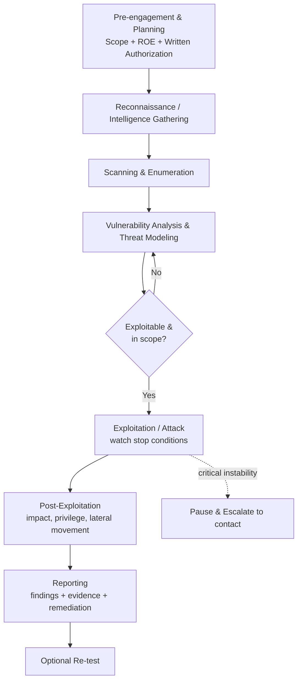

# Penetration Testing Concepts

> What you'll learn: the major penetration-testing methodologies (PTES, OSSTMM, NIST 800-115, OWASP), how to plan and scope a test responsibly, and how to manage the legal and operational risks involved.
> Prerequisites: basic networking (IP, ports, HTTP), basic operating-system literacy (Linux/Windows command line), and an understanding that all techniques here are for **authorized, lawful testing only**.

| Field | Value |
|-------|-------|
| Course | Penetration Testing |
| Course code | SKL-PEN-712 |
| Module | Module 02 — Penetration Testing Concepts |
| Level | pentest |

---

## 1. In Plain English

Imagine you hire a locksmith to break into your own house — not to steal anything, but to find out which doors and windows a real burglar could slip through. You give them written permission, agree on which buildings they may try, and ask for a report at the end listing every weakness they found and how to fix it. **Penetration testing** (often shortened to "pen testing") is exactly that, but for computers, networks, and applications.

A **penetration test** is an authorized, simulated attack against a system to find security weaknesses before a real attacker does. The person doing it — an **ethical hacker** or **penetration tester** — uses the same tools and tricks as criminals, but with permission and a goal of improving security rather than causing harm.

Why should a beginner care? Because almost everything we rely on — banking apps, hospitals, power grids, your email — runs on software that can have flaws. A pen test is one of the most direct ways an organization learns whether its defenses actually hold up under pressure, instead of just assuming they do.

The catch is that doing this *properly* is mostly about discipline, not hacking skill. You need a **methodology** (a repeatable, agreed-upon way of working), a clear **scope** (exactly what you may and may not touch), and **legal authorization** (written permission). Get those wrong and the same activity that makes you a security professional could make you a criminal. This module is about doing it the right way.

---

## 2. Core Concepts

### What a Penetration Test Actually Is

A penetration test is a **goal-oriented, time-boxed, authorized security assessment** that attempts to exploit vulnerabilities to demonstrate real-world impact. It differs from related activities:

- **Vulnerability assessment** — finds and lists weaknesses (often with automated scanners) but usually does **not** exploit them. It answers "what *could* be wrong?"
- **Penetration test** — goes a step further and *proves* exploitability. It answers "what can an attacker *actually* do?"
- **Red teaming** — a broader, stealthier, objective-driven exercise that tests not just technology but also people and processes (and the blue team's ability to detect), often over weeks.

### Why Methodologies Matter

A **methodology** is a structured framework describing *how* to conduct a test so results are consistent, repeatable, and defensible. Without one, two testers could examine the same system and produce wildly different results. Methodologies provide phases, checklists, and reporting expectations. The four most cited in this industry are below.

### PTES — Penetration Testing Execution Standard

**PTES** is a community-driven standard that breaks an engagement into seven phases. It is popular because it covers the *whole* lifecycle, not just the hacking part:

1. **Pre-engagement Interactions** — scoping, goals, rules of engagement, legal paperwork.
2. **Intelligence Gathering** — reconnaissance; collecting information about the target.
3. **Threat Modeling** — identifying likely attackers and the assets they'd want.
4. **Vulnerability Analysis** — finding weaknesses in the discovered systems.
5. **Exploitation** — attempting to break in using those weaknesses.
6. **Post-Exploitation** — determining the value of compromised systems (what data, what further access).
7. **Reporting** — communicating findings and remediation guidance.

### OSSTMM — Open Source Security Testing Methodology Manual

**OSSTMM**, maintained by ISECOM, is a peer-reviewed methodology focused on *measurable* security. Its distinguishing feature is rigor and metrics: it defines how to test across five **channels** — Human, Physical, Wireless, Telecommunications, and Data Networks — and produces a quantified score of "operational security" called the **RAV (Risk Assessment Value)**. OSSTMM is valued where audit-grade, repeatable measurement is needed.

### NIST SP 800-115

**NIST Special Publication 800-115**, the *Technical Guide to Information Security Testing and Assessment*, is a U.S. government standard widely used as a neutral reference. It groups assessment into a clean four-phase model:

1. **Planning** — define rules, goals, and approvals.
2. **Discovery** — gather information and identify vulnerabilities.
3. **Attack** — verify vulnerabilities by attempting to exploit them (gaining access, escalating privileges, etc.).
4. **Reporting** — document findings and recommendations.

It also distinguishes review techniques, target identification/analysis, and target vulnerability validation. Because it's vendor-neutral and freely published, it's often referenced in contracts and compliance.

### OWASP — Web Application Security

The **Open Worldwide Application Security Project (OWASP)** focuses specifically on **application** (especially web and API) security. Two outputs you must know:

- **OWASP Web Security Testing Guide (WSTG)** — a detailed, category-by-category methodology for testing web apps (authentication, session management, input validation, business logic, etc.).
- **OWASP Top 10** — a periodically updated awareness list of the most critical web application risks (e.g., broken access control, injection, security misconfiguration). It is a *priority list*, not a complete methodology, but it shapes what testers look for first.

OWASP also publishes the **ASVS (Application Security Verification Standard)** and the **MASVS/MASTG** for mobile apps.

### Choosing and Combining Methodologies

In practice, testers blend these. A typical engagement might use **PTES** for overall structure, **NIST 800-115** language for compliance reporting, **OWASP WSTG** for the web-app portion, and **OSSTMM** ideas where measurable, repeatable scoring is required.

| Methodology | Best for | Distinctive feature |
|-------------|----------|---------------------|
| PTES | Full-lifecycle infrastructure tests | 7 phases incl. threat modeling & post-exploitation |
| OSSTMM | Audit-grade, measurable assessments | 5 channels + RAV metric |
| NIST 800-115 | Compliance / government / neutral baseline | 4 phases, vendor-neutral |
| OWASP (WSTG/Top 10/ASVS) | Web, API, and mobile applications | Deep app-specific test cases |

### Guidelines and Recommendations

Regardless of methodology, professional testing follows shared good practices:

- **Define clear objectives** before touching anything ("test the customer portal for OWASP Top 10 risks," not "hack us").
- **Get written authorization** signed by someone with authority over the assets.
- **Agree on rules of engagement (ROE)** — what's in scope, timing, allowed techniques, escalation contacts.
- **Minimize harm** — avoid destructive tests on production unless explicitly approved; prefer maintenance windows.
- **Protect collected data** — engagement data often contains real secrets; encrypt it and destroy it per agreement.
- **Reproduce and evidence findings** so the client can verify and fix them.
- **Stay within scope** at all times — scope creep can become a legal problem.

### Understanding and Managing Risk

A pen test *intentionally* pokes at live systems, so it carries real operational risk:

- **Service disruption** — scans or exploits can crash fragile services or fill logs/disks.
- **Data exposure or corruption** — exploitation may read, alter, or accidentally delete data.
- **Triggering other parties** — touching cloud or shared infrastructure may violate a provider's rules.
- **Detection noise** — heavy testing can overwhelm monitoring teams (unless coordinated).

Risk is managed by: testing in **non-production or maintenance windows** where possible; defining **stop conditions** (instant pause if a critical system becomes unstable); keeping a live **escalation contact**; taking **backups/snapshots** beforehand; and **logging every action with timestamps** so any incident can be traced back to authorized testing rather than a real breach.

### Legal Authorization and Scoping

This is the concept that separates a professional from a criminal. **Authorization** must be **explicit, written, and granted by someone who owns or controls the target.** Key elements:

- **Scope** — the exact systems, IP ranges, domains, URLs, applications, accounts, and (sometimes) physical locations you may test. Anything not listed is **out of scope** and off-limits.
- **Third-party assets** — if the target uses a cloud provider or SaaS, you may also need that provider's permission; you can only authorize what you own.
- **Authorization letter / "get-out-of-jail" letter** — signed proof you're allowed to test, carried by the tester, naming dates, scope, and an authorizing signatory.
- **Relevant laws** — e.g., the U.S. **Computer Fraud and Abuse Act (CFAA)**, the UK **Computer Misuse Act**, India's **IT Act**, the EU's **GDPR** for data handling. Unauthorized access — even "to help" — can be a crime. Always confirm with legal counsel; this module is educational, not legal advice.

---

## 3. How It Works (Step by Step)

Here's how a well-run engagement flows, mapping loosely to PTES and NIST 800-115:

1. **Pre-engagement / Planning** — Meet the client. Define goals, scope, ROE, timing, and emergency contacts. Sign the authorization and any NDA. *Nothing technical happens until this is complete.*
2. **Reconnaissance (Intelligence Gathering)** — Passively (open sources) and actively (light probing) learn about the in-scope targets: hostnames, exposed services, technologies.
3. **Scanning & Enumeration** — Identify open ports, running services, and software versions; map the attack surface.
4. **Vulnerability Analysis / Threat Modeling** — Match discovered services to known weaknesses; decide which are worth attempting and which attacker would care.
5. **Exploitation (Attack)** — Attempt to gain access using validated vulnerabilities — carefully, watching stop conditions.
6. **Post-Exploitation** — Assess the impact: what data is reachable, can privileges be escalated, can you move laterally? Demonstrate business impact without causing damage.
7. **Reporting** — Write findings with severity, evidence, and remediation. Present to stakeholders.
8. **Re-test (optional)** — After fixes, verify the issues are actually resolved.



---

## 4. Real-World Examples

**Scenario — Authorized retail web-app test.** A retailer hires a firm to test its e-commerce portal under an OWASP WSTG methodology. Scope is limited to two domains and a staging environment. The tester finds a broken-access-control flaw letting one logged-in user view another's order history by changing an ID in the URL. Because it's authorized and scoped, the tester documents it with screenshots, reports it as High severity, and the retailer fixes it before any customer data leaks. This mirrors the "Broken Access Control" category that has topped the OWASP Top 10.

**Why scope and authorization matter — a cautionary pattern.** There are well-known cases where security researchers reported flaws they discovered but faced legal threats or prosecution because they had **no prior written authorization**. The lesson is consistent across the industry: good intentions are not a legal defense. Bug-bounty programs exist precisely to give researchers explicit, scoped permission ("safe harbor") so testing stays lawful.

**Methodology in compliance contexts.** Payment-card security (PCI DSS) and many government contracts *require* penetration tests and frequently reference neutral standards like **NIST SP 800-115** for the testing approach and **OWASP** for application testing. This is why knowing the methodologies isn't academic — it's contractual.

---

## 5. Tools of the Trade

> The commands below are illustrative and meant for **authorized lab/owned systems only.**

### Nmap — network discovery and port scanning

Maps which hosts are alive and which services/ports are exposed.

```bash
nmap -sV -p- 10.10.10.5
```
Scans all 65,535 TCP ports (`-p-`) on the target and attempts service/version detection (`-sV`). Output tells you the attack surface to investigate.

### OWASP ZAP — web application scanner/proxy

An intercepting proxy that helps find common web vulnerabilities, supports manual and automated testing, and is free/open-source.

```bash
zap.sh -cmd -quickurl https://lab.example.local -quickout /tmp/zap-report.html
```
Runs ZAP headlessly against a lab URL and writes an HTML report of findings.

### Burp Suite — web testing proxy

Industry-standard tool for intercepting, inspecting, and modifying HTTP/HTTPS traffic to test app logic and inputs. Typically driven through its GUI: configure the browser to proxy through Burp (default `127.0.0.1:8080`), then capture and replay requests in the Repeater tab.

### Metasploit Framework — exploitation framework

A framework of exploit modules, payloads, and post-exploitation tools used to validate vulnerabilities.

```bash
msfconsole -q -x "use auxiliary/scanner/smb/smb_version; set RHOSTS 10.10.10.5; run; exit"
```
Launches Metasploit quietly and runs an SMB version-detection module against a lab host — a *non-destructive* enumeration step, not an exploit.

### Nikto — web server scanner

Quickly checks a web server for common misconfigurations and known issues.

```bash
nikto -h https://lab.example.local
```
Probes the target web server and reports outdated software, risky files, and misconfigurations.

---

## 6. Hands-On Lab (Authorized / Lab-Only)

> **Reminder: perform these activities only on systems you own or have explicit written authorization to test (a dedicated lab, a deliberately vulnerable VM, or a scoped engagement).**

This lab is about the **engagement discipline**, not a single tool. Set up a safe practice environment (for example, an intentionally vulnerable VM running on an isolated host-only network) and walk through the professional workflow end to end.

**Step 1 — Define scope.** Write down exactly which VM IPs, hostnames, and apps are in scope, and which techniques are off-limits (e.g., no denial-of-service).

**Step 2 — Draft Rules of Engagement.** Use the checklist below.

**Step 3 — Execute methodically.** Recon → scan → analyze → (carefully) exploit in your lab, recording every command and its timestamp.

**Step 4 — Collect evidence.** Save command output, screenshots, and the request/response pairs that prove each finding. Store them securely.

**Step 5 — Write the report** using the skeleton below.

### Sample Rules-of-Engagement Checklist

- [ ] Written authorization signed by asset owner, with start/end dates.
- [ ] In-scope targets explicitly listed (IPs, domains, apps, accounts).
- [ ] Out-of-scope items explicitly listed (third-party, production DB, etc.).
- [ ] Allowed vs prohibited techniques defined (e.g., no DoS, no social engineering).
- [ ] Testing window / time zone agreed.
- [ ] Primary and emergency escalation contacts (name + 24/7 phone).
- [ ] Stop conditions defined (pause if a critical service degrades).
- [ ] Data-handling rules: encryption, storage location, retention, secure destruction.
- [ ] Evidence/logging requirement: timestamped record of all actions.
- [ ] Reporting format, deliverable date, and re-test arrangement agreed.

### Penetration-Test Report Skeleton

1. **Cover & Confidentiality Notice** — client, dates, classification.
2. **Executive Summary** — plain-language risk overview for management.
3. **Scope & Authorization** — what was tested, what wasn't, who approved it.
4. **Methodology** — standards followed (PTES / NIST 800-115 / OWASP WSTG).
5. **Findings** — each with: title, severity (e.g., CVSS-based rating), affected asset, description, evidence, business impact, and remediation.
6. **Risk Summary Table** — counts by severity, prioritized.
7. **Remediation Roadmap** — recommended fixes and rough effort/priority.
8. **Appendices** — tool output, raw evidence, methodology details.

---

## 7. Countermeasures & Defenses

The blue team (defenders) should treat pen-test findings as a roadmap. General defensive practices:

**Prevent**
- Patch and update software promptly; remove unused services to shrink the attack surface.
- Enforce least privilege and strong access control (the #1 web risk category).
- Validate and sanitize all input to block injection attacks.
- Use secure configuration baselines; disable default credentials.
- Apply multi-factor authentication and strong session management.

**Detect**
- Centralize and monitor logs (SIEM) for scanning, brute force, and unusual access.
- Set alerts for port scans, repeated failed logins, and privilege escalation events.
- Coordinate with testers so legitimate testing is distinguishable from real attacks.

**Mitigate / Respond**
- Maintain backups and tested recovery procedures before any high-risk testing.
- Have an incident-response plan and clear escalation path.
- Segment networks so a single compromise can't reach everything.
- Re-test after remediation to confirm fixes actually work.

---

## 8. Key Terms

- **Penetration test** — an authorized, simulated attack to find and prove exploitable weaknesses.
- **Vulnerability assessment** — identifying weaknesses without necessarily exploiting them.
- **Red teaming** — a broad, stealthy, objective-driven adversary simulation testing people, process, and tech.
- **Methodology** — a structured, repeatable framework for conducting a test.
- **PTES** — Penetration Testing Execution Standard; a seven-phase lifecycle framework.
- **OSSTMM** — Open Source Security Testing Methodology Manual; measurable, channel-based testing with the RAV metric.
- **NIST SP 800-115** — U.S. technical guide; four-phase (plan, discover, attack, report) assessment standard.
- **OWASP** — Open Worldwide Application Security Project; web/app security resources incl. WSTG, Top 10, ASVS.
- **Scope** — the explicit set of systems and techniques permitted in an engagement.
- **Rules of Engagement (ROE)** — agreed terms governing how the test is carried out.
- **Authorization letter** — signed proof a tester is permitted to test, with scope and dates.
- **Stop condition** — a predefined trigger to pause testing (e.g., critical instability).
- **Post-exploitation** — assessing the impact and reach after gaining access.

---

## 9. Summary & Takeaways

- A penetration test is an **authorized** simulated attack that *proves* exploitability — going beyond a vulnerability assessment.
- **Methodologies** (PTES, OSSTMM, NIST 800-115, OWASP) make tests consistent, repeatable, and defensible; professionals often combine them.
- **PTES** covers the full seven-phase lifecycle; **NIST 800-115** offers a neutral four-phase model; **OSSTMM** adds measurable metrics; **OWASP** specializes in applications.
- **Scoping and written authorization are non-negotiable** — they're what make the work legal rather than criminal.
- **Risk management** (stop conditions, backups, escalation contacts, action logging) keeps live testing safe.
- **Documentation and evidence** turn a test into something a client can act on; the report is the real deliverable.
- Good intentions don't replace permission — always test only owned/authorized systems.
- Defenders should consume findings to prevent, detect, and mitigate, then verify fixes with a re-test.

**Further reading:** PTES (pentest-standard.org), OSSTMM by ISECOM, NIST Special Publication 800-115, the OWASP Web Security Testing Guide and OWASP Top 10, and MITRE ATT&CK for adversary tactics and techniques.
