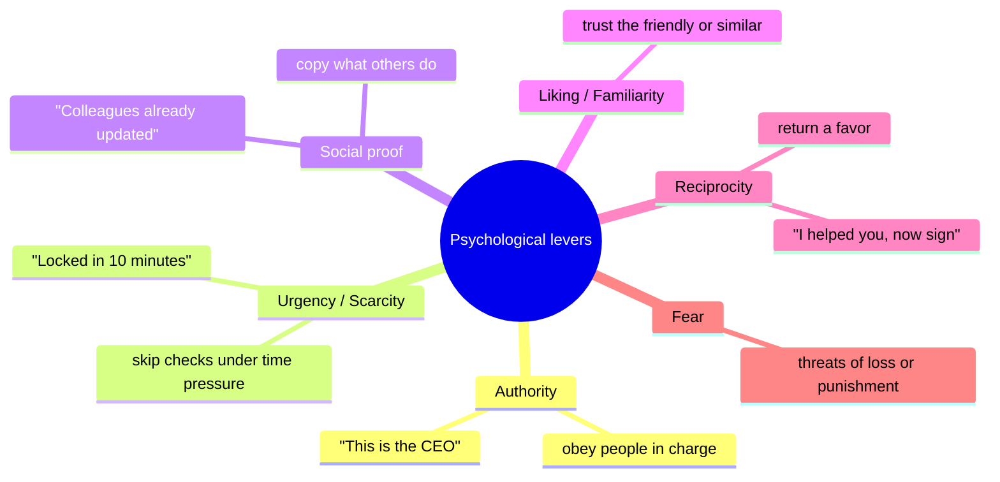
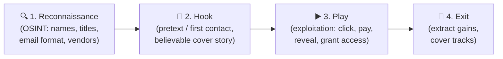
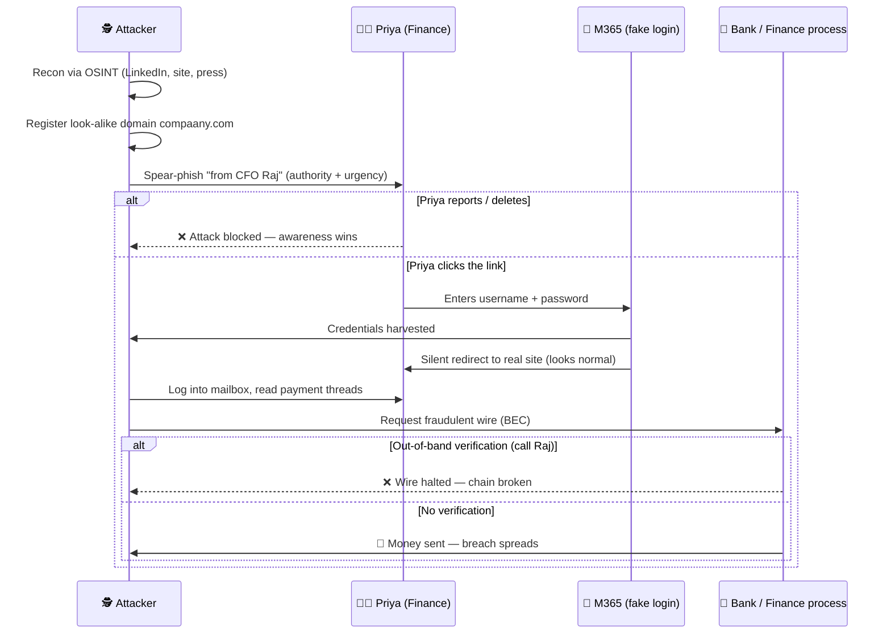
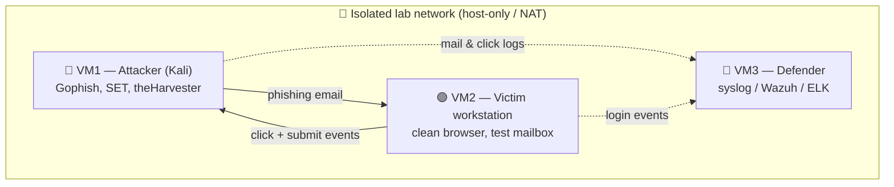

# Social Engineering

> **What you'll learn:** How attackers manipulate people (not machines) to gain access, money, or secrets — the techniques, real incidents, the tools involved, and how to defend yourself and an organization.
> **Prerequisites:** Basic familiarity with email, web browsing, and common workplace IT (logins, badges, help desks). No prior security knowledge required.

| | |
|---|---|
| 📘 **Course** | Professional Level 2 |
| 🔖 **Course code** | SKL-CSP2-711 |
| 🧩 **Module** | Social Engineering |
| 🎯 **Level** | level2 |

---

> 📺 **Watch — top video on this topic:** [](https://www.youtube.com/watch?v=MJgrbu-tEeg) [What is Social Engineering? Attacks & Techniques Explained](https://www.youtube.com/watch?v=MJgrbu-tEeg)

---

## 1. In Plain English

A thief wants into a locked office. The hard way: pick the locks, cut the alarm, climb through a window — noisy and risky. The easy way: stand by the door holding a coffee in each hand, smile, and ask the next employee, *"Could you grab the door? My hands are full."* Most people will. The thief just walked in — no lock-picking required.

That second approach is **social engineering**: tricking *people* into helping the attacker, instead of attacking technology directly. Computers do exactly what they're told. People are helpful, busy, trusting, and easily rushed — and attackers exploit exactly those tendencies.

Why should a beginner care? Social engineering is involved in a huge share of real-world breaches. You can have the world's best firewall and still get hacked if an employee clicks a fake invoice or reads a password to someone posing as IT support. The "vulnerability" is human psychology, and *everyone* is part of the defense.

> 🔑 **Key idea:** The strongest technical controls are bypassed by attacking the humans who hold the keys.

> ⚠️ **Warning:** Every offensive technique here is described so you can **recognize and defend** against it. Testing these on people is only acceptable in **authorized engagements** (e.g. a company-hired phishing simulation) or a **private lab you own**.

> 🖼️ *Suggested image: side-by-side illustration — "break-in" (lockpicks, ladder) vs "walk-in" (friendly person holding door) to anchor the core metaphor.*

---

## 2. Core Concepts

### Social engineering

**Social engineering** is any attack that manipulates human behavior to bypass security controls. Instead of exploiting a software bug, the attacker exploits trust, authority, fear, curiosity, or helpfulness. The goal is to make the victim do one of three things:

| Goal | Example |
|---|---|
| 🔓 **Reveal information** | A password, an MFA code, internal details |
| 🖱️ **Perform an action** | Click a link, move money, plug in a USB stick |
| 🚪 **Grant access** | Let someone through a door, install software |

Almost every attack leans on a small set of **psychological levers**:



### The attack lifecycle

Most engagements follow four phases. **OSINT** (Open-Source Intelligence — intelligence from public sources like LinkedIn, company sites, and social media) quietly powers the first phase.



### Phishing and its cousins

**Phishing** is sending fraudulent messages — usually email — that appear to come from a trusted source, to trick recipients into revealing data or running malware. Variants are named by **target** and **channel**:

| Variant | Channel | Who/What it targets | Tell-tale lure |
|---|---|---|---|
| **Phishing** | Email (broad) | Anyone | Generic "verify your account" |
| **Spear phishing** | Email (targeted) | A *specific* individual | Personalized with real details |
| **Whaling** 🐋 | Email (targeted) | A "big fish" (CEO/CFO) | High-stakes, executive context |
| **Vishing** 📞 | Phone call | Anyone reachable by voice | "Bank fraud department calling" |
| **Smishing** 💬 | SMS / text | Mobile users | "Package undeliverable, confirm here" |
| **BEC** 💸 | Email | Finance / payments staff | Impersonated exec/supplier redirecting payment |

### Pretexting

**Pretexting** is inventing a believable scenario (the "pretext") to justify the attacker's request — e.g. calling the help desk as a new remote employee who "can't log in" so they reset the password. It's the storytelling backbone behind vishing, impersonation, and many phishing campaigns.

### Baiting

**Baiting** lures a victim with something enticing. The classic physical version: infected USB drives labeled "Payroll 2025" dropped in a parking lot, betting someone plugs one in out of curiosity. The digital version: a tempting "free movie download" that is actually malware.

### Tailgating and piggybacking

- **Tailgating** — following an authorized person through a secure door before it closes, *without* badging in.
- **Piggybacking** — the same, but with the victim's *consent* (they hold the door because you look like you belong — the coffee-cup trick from Section 1).

### Insider threats

An **insider threat** is risk from someone who already has legitimate access — employee, contractor, or partner.

| Type | Intent | Typical behavior |
|---|---|---|
| 😈 **Malicious** | Deliberate | Steals data or sabotages (revenge, money, espionage) |
| 🤷 **Negligent** | Careless, well-meaning | Reuses passwords, falls for phishing, misdirected email |
| 🎭 **Compromised** | None (account hijacked) | A legit account taken over by an outsider operating "from inside" |

> 🔑 **Key idea:** Social engineering and insider threats intertwine — a phished employee *becomes* a compromised insider.

### Impersonation on social networking sites

Attackers create **fake or cloned profiles** on LinkedIn, Facebook, or X to build trust: cloning a real person's profile to fool their connections, posing as a recruiter to extract resumes, or befriending employees to map an org. The harvested information feeds straight back into reconnaissance and spear phishing.

### Identity theft

**Identity theft** is stealing and using someone's personal information — name, national ID, date of birth, card numbers — to impersonate them for fraud (opening accounts, taking loans, filing fake tax returns). Social engineering is a primary *fuel*: phishing and pretexting collect the raw personal data thieves then monetize. The most prized data points are collectively called **PII (Personally Identifiable Information)**.

---

## 3. How It Works (Step by Step)

A realistic **spear-phishing → credential theft** chain — the most common pattern in corporate breaches.

1. **Recon (OSINT).** Attacker finds on LinkedIn that "Priya" works in Finance under "CFO Raj," and learns from the company site that the email format is `first.last@company.com`.
2. **Pretext.** Attacker registers a look-alike domain (`compaany.com`) and drafts an email "from Raj" referencing a real ongoing project (from a press release) for authority and credibility.
3. **Hook.** Priya receives: *"Priya — finalizing the Henderson deal. Review the updated invoice and confirm the wire today, it's time-sensitive."* (Authority + urgency.)
4. **Lure.** The email links to a fake Microsoft 365 login page, identical to the real one.
5. **Capture.** Priya enters her credentials; the fake page **harvests** them and silently forwards her to the real site so nothing seems wrong.
6. **Use / pivot.** Attacker logs into Priya's mailbox, reads payment threads, then either initiates a fraudulent wire (BEC) or phishes more colleagues from a trusted internal address.
7. **Detection point (defense).** A mail gateway flags the look-alike domain; or Priya reports it; or finance enforces **out-of-band verification** (calling Raj on a known number) before any wire — breaking the chain.



---

## 4. Real-World Examples

| Incident | Technique | What happened | Lesson |
|---|---|---|---|
| **Twitter/X takeover** (Jul 2020) | Vishing + pretexting | Attackers posed as internal IT to phone Twitter staff, gained admin-tool access, hijacked verified accounts for a crypto scam | Even tech-savvy firms fall when *people* are targeted; powerful internal tools amplify damage |
| **RSA SecurID breach** (2011) | Spear phishing | A few employees got an Excel attachment ("2011 Recruitment Plan"); opening it installed a backdoor, leading to theft of SecurID 2FA data | A single targeted email to a non-executive can compromise a security company itself |
| **Business Email Compromise** (general pattern) | BEC / impersonation | Finance staff wired large sums after urgent "CEO/supplier" emails urging confidentiality; FBI ranks BEC among the costliest cybercrime categories | BEC needs **no malware** — just a convincing story and a rushed approval process |

> 💡 **Tip:** Notice the common thread — none of these required breaking encryption. They broke *trust and process*.

---

## 5. Tools of the Trade

Standard tools used in **authorized** awareness training, pen tests, and red-team work — described here for defensive understanding.

| Tool | Category | Use case | Side |
|---|---|---|---|
| **theHarvester** | OSINT | Enumerate public emails/subdomains/hosts | 🔴 Offensive recon |
| **Gophish** | Phishing framework | Run *authorized* phishing simulations, measure click rates | 🟡 Training |
| **SET** (Social-Engineer Toolkit) | Attack framework | Craft phishing pages/payloads in a lab | 🔴 Offensive (lab) |
| **Maltego** | OSINT graphing | Visualize links between people, domains, profiles | 🔴 Offensive recon |
| **Email header inspection** | Built-in (defensive) | Verify a message's real sender path | 🟢 Defensive |

### theHarvester (OSINT)
Collects emails, subdomains, and host names from public sources to understand a target's exposure.
```bash
theHarvester -d example.com -b bing,duckduckgo -l 200
# -d target domain, -b data sources to query, -l limit results
# Shows what public footprint an attacker could enumerate about a domain.
```

### Gophish (phishing simulation framework)
Open-source platform to run *authorized* phishing simulations and measure click rates.
```bash
# Launch the Gophish server (admin UI served locally, default :3333)
./gophish
# Then configure from the web dashboard: a Sending Profile, a landing-page
# template, a target group, and a campaign.
# Used by security teams to train staff and report on susceptibility.
```

### Social-Engineer Toolkit (SET)
Menu-driven framework for crafting phishing pages and payloads in lab settings.
```bash
sudo setoolkit
# Navigate: 1) Social-Engineering Attacks -> 2) Website Attack Vectors
#           -> Credential Harvester Method -> Site Cloner
# Clones a login page to demonstrate credential capture in an authorized lab.
```

### Maltego (OSINT graphing)
Maps relationships between people, domains, emails, and social profiles visually, showing how reconnaissance data connects. Used via its GUI by running "transforms" against an entity (a domain or email) to expand the graph of related data.

> 🖼️ *Suggested image: a Maltego graph view showing a domain entity fanning out into emails, people, and social profiles.*

### Built-in email header inspection (defensive)
No special tool needed — view the raw headers of a suspicious email to check the real sender path.
```text
# In most mail clients: "Show original" / "View source"
# Inspect: Return-Path, Received: chain, SPF/DKIM/DMARC results
# A "pass" on DMARC with a matching Return-Path raises confidence; failures are a red flag.
```

---

## 6. Hands-On Lab (Authorized / Lab-Only)

> ⚠️ **Warning:** Perform every step only against systems, accounts, and people you own or have **explicit written authorization** to test. Never target real third parties.

**Goal:** Build a self-contained lab, run an end-to-end phishing simulation against a *consenting test account you control*, and validate that your detection controls catch it.

**Lab topology:**



**Attack chain:**
1. **Recon.** From the attacker VM, run `theHarvester` against a *domain you own* to see what public data exists. Note the email format and any exposed addresses.
2. **Pretext.** Draft a believable scenario (e.g. a fake "password expiry" notice) using authority + urgency, kept clearly within your test scope.
3. **Build the campaign.** In Gophish, create a sending profile (your lab SMTP), a cloned login landing page, a target group with only your *test* victim address, and a campaign. Adapt the templates yourself — do not expect copy-paste to work; match your lab's domain.
4. **Launch & capture.** Send to the victim VM. From the victim, open the email, click through, and submit dummy credentials. Confirm Gophish records the **open**, **click**, and **submitted data** events.
5. **Pivot (optional, lab-only).** Log into a lab service with the captured test credentials — purely to show impact.

**Validate the defense / detection:**

6. **Detect.** On the defender VM, confirm the simulated email and click generated log events. Write or tune a detection rule that fires on: (a) inbound mail referencing a look-alike domain, (b) a click to your landing-page host, or (c) a login from an unexpected source for the test account.
7. **Verify out-of-band control.** Add a process step requiring phone/secondary-channel confirmation before any "sensitive action," and show that following it stops the attack.
8. **Report.** Produce a short metrics report (open rate, click rate, submit rate) exactly as a real awareness program would — this is the deliverable that drives training.

> 💡 **Tip — success criteria:** the attack events are *both* captured by Gophish *and* visible/alertable on the defender side, proving you can run **and** detect the technique.

---

## 7. Countermeasures & Defenses

Defense is **layered** — no single control is enough. Map each attacker move to a counter:

| Layer | Control | Stops / blunts |
|---|---|---|
| 👥 **People** | Awareness training + phishing simulations | Recognition of lures |
| 👥 **People** | Out-of-band verification habit | BEC, vishing, wire fraud |
| 👥 **People** | One-click, blame-free "Report Phish" | Slow/under-reporting |
| 🔄 **Process** | Dual approval + call-back for wires & payment changes | BEC |
| 🔄 **Process** | Least privilege + prompt deprovisioning | Insider damage |
| 🔄 **Process** | Tested incident-response plan | Slow containment |
| 📧 **Email/Identity** | SPF + DKIM + DMARC (reject/quarantine) | Spoofed senders |
| 📧 **Email/Identity** | Secure email gateway (link rewrite/sandbox, look-alike domain detection) | Malicious links, new domains |
| 📧 **Email/Identity** | Phishing-resistant MFA (FIDO2/hardware keys) | Stolen-password reuse |
| 📧 **Email/Identity** | SIEM monitoring | Impossible-travel, mailbox-rule/forwarding abuse |
| 🚪 **Physical** | Badge access + anti-tailgating (mantraps, turnstiles, guards, escorts) | Tailgating/piggybacking |
| 🚪 **Physical** | Disable autorun + restrict USB ports | Baiting |

**Detection signals to watch:**
- Look-alike domains, mismatched display name vs. real address, DMARC failures.
- Sudden urgency + secrecy + payment-change requests.
- Logins from unusual locations/times; new inbox forwarding rules.

> 🔑 **Key idea:** Two habits carry outsized impact — **out-of-band verification** for sensitive requests, and **phishing-resistant MFA** so a stolen password alone is useless.

> 🖼️ *Suggested image: layered "defense-in-depth" rings diagram — People → Process → Email/Identity → Physical wrapping a core asset.*

---

## 8. Key Terms

- **Social engineering** — manipulating people into actions or disclosures that compromise security.
- **OSINT** — Open-Source Intelligence; data gathered from public sources for reconnaissance.
- **Phishing** — fraudulent messages impersonating a trusted source to steal data or deliver malware.
- **Spear phishing / Whaling** — phishing targeted at a specific person / a senior executive.
- **Vishing** — phishing conducted by voice phone call.
- **Smishing** — phishing conducted by SMS/text message.
- **Pretexting** — using an invented, believable scenario to justify a malicious request.
- **Baiting** — luring a victim with something enticing (e.g., an infected USB drive).
- **Tailgating / Piggybacking** — following an authorized person through a secure door (without / with their consent).
- **Insider threat** — risk from someone with legitimate access (malicious, negligent, or compromised).
- **BEC (Business Email Compromise)** — impersonating an executive/supplier to redirect payments.
- **Identity theft** — stealing personal data to impersonate someone for fraud.
- **PII** — Personally Identifiable Information.
- **MFA** — Multi-Factor Authentication; requiring more than a password to log in.
- **SPF / DKIM / DMARC** — email-authentication standards used to detect and block spoofed senders.

---

## 9. Summary & Takeaways

- Social engineering attacks **people, not machines** — exploiting trust, authority, urgency, fear, and curiosity.
- Phishing, vishing, smishing, pretexting, baiting, and tailgating are variations on one idea across different **channels**.
- Most attacks follow a lifecycle: **recon → hook → exploit → exit**, and OSINT quietly powers the whole thing.
- **Insider threats** (malicious, negligent, compromised) and **fake social-media profiles** feed reconnaissance and turn humans into entry points.
- Stolen personal data drives **identity theft**, making PII protection a core defensive goal.
- Defense is **layered**: aware people + verified processes + email/identity technology + physical controls.
- Highest-impact habits: **out-of-band verification** for sensitive requests and **phishing-resistant MFA**.
- A blame-free **reporting culture** turns every employee into a sensor, not a liability.

**Further reading:** NIST SP 800-50 / SP 800-61 (security awareness and incident response); MITRE ATT&CK (Initial Access — *Phishing*, T1566); OWASP awareness materials; CISA guidance on phishing and Business Email Compromise.
