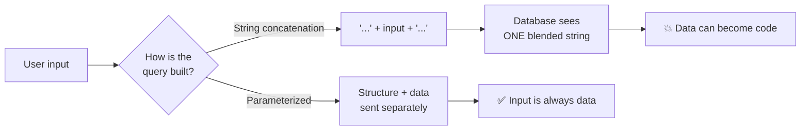
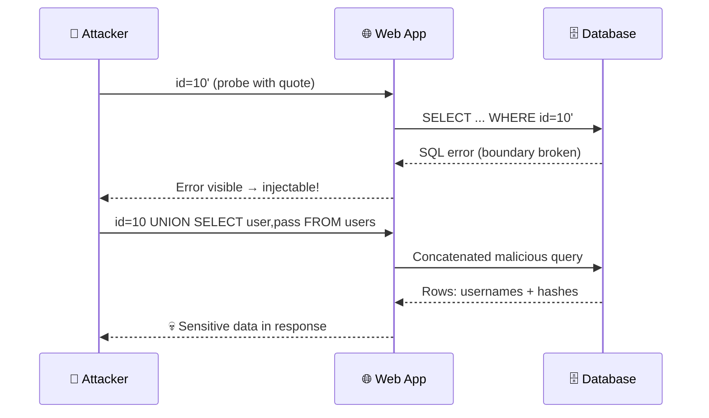
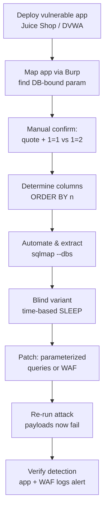
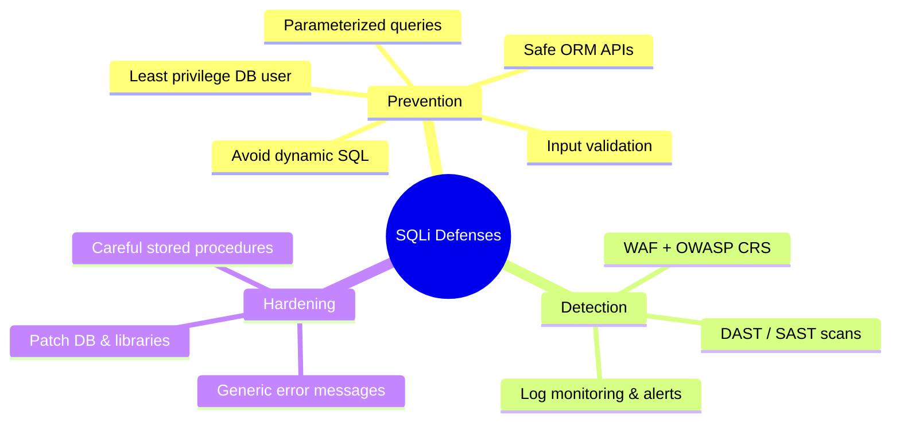
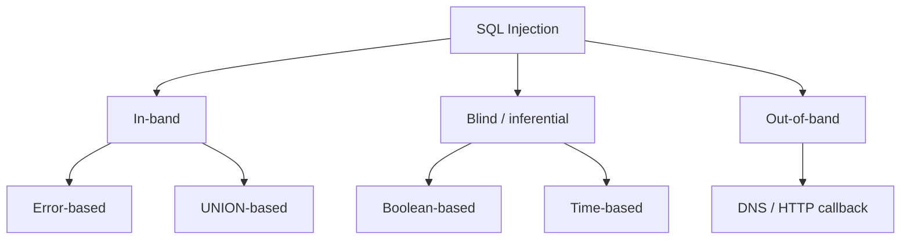

# SQL Injection

> **What you'll learn:** How attackers trick a database into running their commands, the main attack flavors, the tools used, and exactly how defenders stop it.
> **Prerequisites:** Basic grasp of how web apps talk to databases, a little SQL (the `SELECT ... FROM ... WHERE ...` shape), and comfort with a terminal.

| Course | Course code | Module | Level |
|--------|-------------|--------|-------|
| Skillogic CSPP — Professional Level 2 | SKL-CSP2-711 | Module 07: SQL Injection | level2 |

---

> 📺 **Watch — top video on this topic:** [](https://www.youtube.com/watch?v=ciNHn38EyRc) [Running an SQL Injection Attack — Computerphile](https://www.youtube.com/watch?v=ciNHn38EyRc)

---

## 1. In Plain English 🗣️

Imagine sliding a note to a bank teller: *"Withdraw $100 from my account."* They check your ID and comply. Now imagine a sneakier note: *"Withdraw $100 — AND ALSO read out every account number and balance in the bank."* If the teller blindly obeys without separating *your request* from *general bank commands*, you've robbed the bank with a pen.

That is **SQL injection**. SQL (pronounced "sequel," short for **Structured Query Language**) is the language websites use to talk to their **database** — the storage where usernames, passwords, orders, and messages live. When you type a username into a login box, the site builds an SQL sentence like "find the user whose name equals what they typed." SQL injection happens when an attacker types not just a username but extra SQL commands, and the site glues those commands into its sentence and runs them.

> 🔑 **Key idea:** The single most important defensive principle in software is *never mix untrusted data with executable commands.*

**Why a beginner should care:**

- It has been one of the most damaging web vulnerabilities for over two decades.
- It can leak millions of passwords, expose credit cards, or delete an entire database — often through nothing more than a text box.
- It consistently ranks near the top of the **OWASP Top 10**, the industry's list of the most critical web app risks.

---

## 2. Core Concepts 🧠

### 2.1 What a database query looks like

A **query** is a request sent to a database. A typical login check:

```sql
SELECT * FROM users WHERE username = 'alice' AND password = 'secret123';
```

This reads: "Give me every column (`*`) from the `users` table where the username is `alice` and the password is `secret123`." The single quotes (`'...'`) mark where **data** starts and ends. Everything outside the quotes is treated as a **command**; everything inside should be just data.

### 2.2 The root cause: mixing data with code

Many apps build queries by **string concatenation** — pasting user input into the query string:

```python
query = "SELECT * FROM users WHERE username = '" + user_input + "'"
```

Type `alice` and the query is fine. But the database can't see the boundary between the developer's intended command and the attacker's data — it just sees one final string. If the attacker includes a quote character, they "break out" of the data section into the command section. This confusion between **code and data** is the entire vulnerability.



### 2.3 Breaking out of the quotes

Suppose an attacker types this into the username box:

```
' OR '1'='1
```

The query becomes:

```sql
SELECT * FROM users WHERE username = '' OR '1'='1';
```

The leading single quote closed the empty username string early. Now `OR '1'='1'` is read as a *command*, and since `'1'='1'` is always true, the `WHERE` filter matches **every row**. A login check meant to find one user now returns all of them — often logging the attacker in as the first one (frequently an administrator).

> ⚠️ **Warning:** A single unescaped quote character is all it takes. The simplest probe an attacker sends is literally `'`.

### 2.4 Injection points

An **injection point** is any place user-controlled data flows into a query. Anywhere data reaches the database is a candidate:

| Injection point | Example |
|-----------------|---------|
| Login / form fields | username, password boxes |
| Search boxes | product search term |
| URL parameters | `?id=5` |
| HTTP headers | cookies, `User-Agent` |
| API bodies | JSON values from a mobile app |

### 2.5 Why it's so impactful

Depending on the database account's permissions, a successful injection can let an attacker:

- **Read** any data (`SELECT`)
- **Modify or delete** data (`UPDATE`, `DELETE`, `DROP`)
- **Bypass authentication**
- **Read files** from the server
- In some configurations, **run operating-system commands**

> 💡 **Tip:** The blast radius depends heavily on how much power the database user account has — a key idea revisited under defenses (least privilege).

---

## 3. How It Works (Step by Step) 🔁

The lifecycle of a typical SQL injection attack against a vulnerable web app:

| # | Step | What the attacker does |
|---|------|------------------------|
| 1 | **Find an input** | Identify a field that reaches the DB, e.g. `https://shop.example/item?id=10` |
| 2 | **Probe** | Submit a special character like `id=10'`; a DB error or odd behavior hints at injectability |
| 3 | **Confirm control** | Compare `id=10 AND 1=1` (loads normally) vs `id=10 AND 1=2` (changes/empties) |
| 4 | **Map the shape** | Use `UNION SELECT` / `ORDER BY` to learn column count and data types |
| 5 | **Extract data** | Append a query pulling usernames, password hashes, schema names into the page |
| 6 | **Escalate** | Read config files, write a web shell, pivot into the network |
| 7 | **Cover tracks / report** | Hide activity (real attack) or document findings (authorized test) |

The sequence below shows the request flow and where the trust boundary is crossed:



---

## 4. Real-World Examples 🌍

**TalkTalk (2015).** The UK telecom suffered a breach in which attackers used SQL injection to reach a database with personal details of well over 100,000 customers, including some bank account information. The UK data-protection regulator issued a then-record fine — a textbook case of a "classic" web flaw causing massive real-world harm. *(Kept to widely reported facts: SQLi was the entry vector, the regulator fined the company, and a six-figure number of customers were affected.)*

**Retail / payment-card breach era.** Across the late 2000s and 2010s, numerous large breaches were attributed at least partly to SQL injection against public-facing web apps, exposing payment-card and account data. These repeated incidents are a big reason payment-security standards (like **PCI DSS**) explicitly require protection against injection.

**Realistic scenario — the vulnerable search box.** A small e-commerce site concatenates the search term straight into a query. A penetration tester (with written authorization) enters:

```
widget' UNION SELECT username, password_hash FROM users-- 
```

The trailing `-- ` comments out the rest of the original query. The page, designed to show product names and prices, instead lists usernames and password hashes in the product grid. One field exposed the entire customer table.

> 🖼️ *Suggested image: side-by-side screenshot of a normal product search result vs the same page leaking a usernames/password-hash table after a UNION payload.*

---

## 5. Tools of the Trade 🛠️

> ⚠️ **Warning:** Use every tool below ONLY against systems you own or are explicitly authorized to test.

| Tool | Type | Best for | Mode |
|------|------|----------|------|
| 🤖 **sqlmap** | Automated exploiter | Detecting + dumping at scale | Automatic |
| 🕷️ **Burp Suite** | Intercepting proxy | Hand-editing & observing requests | Manual / semi-auto |
| 💻 **DB CLI (`mysql`/`psql`)** | Native client | Reproducing queries, verifying fixes | Manual (defender) |

### 🤖 sqlmap

The best-known open-source tool for automated SQL injection detection and exploitation. It probes a target with many payloads, identifies the database type, and can dump tables, read files, and more.

```bash
# Test a single URL parameter for injection
sqlmap -u "https://shop.example/item?id=10" --batch

# If injectable, enumerate the databases
sqlmap -u "https://shop.example/item?id=10" --dbs --batch

# Dump a specific table from a chosen database
sqlmap -u "https://shop.example/item?id=10" -D shopdb -T users --dump --batch
```

`-u` sets the target URL, `--batch` accepts default prompts automatically, `--dbs` lists databases, and `-D`/`-T`/`--dump` select a database, table, and extract its rows.

### 🕷️ Burp Suite

An intercepting proxy that sits between your browser and the target, letting you view and modify every HTTP request. **Repeater** lets you hand-edit a request and resend it; the Pro scanner can flag injection automatically.

```
# Conceptual workflow (done in the Burp GUI):
1. Configure browser to use Burp's proxy (127.0.0.1:8080)
2. Capture a request to the search endpoint
3. Send to Repeater, modify the parameter to add a single quote
4. Resend and inspect the response for SQL errors
```

Manual testing is about observing how responses change when you alter input.

### 💻 Database CLI clients (lab / defender side)

Native clients like `mysql` or `psql` reproduce queries so you can confirm a fix works.

```bash
# Connect to a local MySQL lab database
mysql -u labuser -p -h 127.0.0.1 labdb
```

This opens an interactive session to run the same query the app runs and verify behavior.

> 🖼️ *Suggested image: Burp Suite Repeater showing a request with an injected single quote and the resulting SQL error in the response pane.*

---

## 6. Hands-On Lab (Authorized / Lab-Only) 🧪

> ⚠️ **Warning:** Perform these steps ONLY on systems you own or have explicit written authorization to test. Never point these tools at systems you do not control.

**Goal:** Stand up an intentionally vulnerable app, exploit a SQL injection end-to-end, then apply and verify a defense.

**Build your sandbox** so nothing leaks to the public internet:

| Option | Setup | Isolation |
|--------|-------|-----------|
| **A — Local VMs** | "Attacker" VM (e.g., Kali) + "target" VM | Host-only network (they reach each other, not the internet) |
| **B — Cloud sandbox** | Small firewalled cloud VM | Security-group rules limit access to your own IP only |



**Steps:**

1. **Deploy the target.** On the target VM, run a known-vulnerable training app such as OWASP Juice Shop or DVWA (Damn Vulnerable Web Application) in a container. Note its IP and the login/search endpoints.
2. **Map the app.** From the attacker VM, browse through Burp Suite. Identify a parameter that hits the database (a login field or `id` parameter). Record the exact request.
3. **Manual confirmation.** Resend via Burp Repeater, appending a single quote. Observe any error or behavioral change — your evidence of injectability. Then test `AND 1=1` vs `AND 1=2` to confirm logic control.
4. **Determine columns.** Adapt a `UNION SELECT` payload to find the column count (try `ORDER BY 1`, `ORDER BY 2`, ... until it errors). Adjust based on responses.
5. **Automate and extract.** Point sqlmap at the confirmed parameter (`sqlmap -u "<your-target-url>" --dbs --batch`). Enumerate tables and dump a non-sensitive demo table. Compare sqlmap's findings against your manual results.
6. **Try a blind variant.** Switch to an endpoint that returns no data. Use a **time-based** test (a payload telling the DB to sleep N seconds) and confirm the response delay matches — adjust the sleep value and watch the timing.

**Validate the defense:**

7. **Patch the code.** Convert the vulnerable query to **parameterized queries** (prepared statements) instead of string concatenation. If you can't edit the app, place a **WAF** (e.g., ModSecurity with the OWASP Core Rule Set) in front of it.
8. **Re-run the attack.** Repeat steps 3–5 against the patched app. Confirm previously successful payloads now fail — input is treated as literal data, or the WAF blocks the request.
9. **Verify detection.** Check the application and WAF logs. Confirm injection attempts generate an alert/log entry. This proves both prevention *and* detection work.

> 💡 **Tip:** Document each step with the request, the response, and a screenshot. That record is exactly what a real penetration-test report contains.

---

## 7. Countermeasures & Defenses 🛡️

Defenses stack in layers — prevention first, then detection, then hardening.



### 🥇 Prevention (most important layer)

- **Parameterized queries / prepared statements** — send query structure and data **separately** so the database never confuses one for the other. The single most effective fix.
- **Safe ORM / query-builder APIs** that parameterize by default — but avoid their "raw query" escape hatches unless those parameterize too.
- **Least privilege** for the DB account. The app's account should read/write only the tables it needs — never an admin/`root` user. This shrinks the blast radius if injection still occurs.
- **Validate and constrain input** at the boundary: enforce types (an `id` should be an integer), lengths, and allow-lists where valid values are known. A *supplement*, never a replacement for parameterization.
- **Avoid dynamic SQL** built from strings; if unavoidable (e.g., dynamic table names), strictly allow-list permitted values.

### 🔍 Detection & monitoring

- Deploy a **WAF** (Web Application Firewall) like ModSecurity + OWASP CRS to spot and block known injection patterns.
- Centralize and alert on **database and application logs** — repeated SQL errors, unusual `UNION`/`SLEEP`/comment sequences, or sudden large result sets are red flags.
- Run **DAST/SAST scanners** and periodic penetration tests to catch flaws before attackers do.

### 🧱 Mitigation & hardening

- Return **generic error messages** to users; log details only server-side so attackers can't learn the schema from error text.
- Keep database software and libraries patched.
- Use **stored procedures carefully** — they help only if they use parameters, not concatenation.

### Attack vs Defense at a glance

| Attacker technique | Primary defense | Why it works |
|--------------------|-----------------|--------------|
| `' OR '1'='1` auth bypass | Parameterized query | Input can never become a command |
| `UNION SELECT` data dump | Parameterized + least privilege | No code injection; limited data even if leaked |
| Error-based extraction | Generic error messages | Schema details never reach the attacker |
| Time-based blind | WAF + log/anomaly alerts | Suspicious `SLEEP` patterns flagged |
| OS command / file read | Least privilege DB user | Account lacks the permission to do it |

> ⚠️ **Warning — WAF evasion:** Attackers slip past WAFs with case changes (`UnIoN`), inline comments (`UN/**/ION`), URL/hex encoding, whitespace tricks, or split payloads. A WAF is a *supplementary* control — the real fix lives in the code via parameterized queries.

---

## 8. Key Terms 📚

| Term | Definition |
|------|------------|
| **SQL** | Structured Query Language; used to query and manage relational databases. |
| **SQL injection (SQLi)** | Inserting malicious SQL via user input so the database executes attacker-controlled commands. |
| **Query** | A command sent to a database to read or modify data. |
| **Injection point** | Any input that flows into a database query (form field, URL parameter, header, etc.). |
| **In-band injection** | Attack and results travel over the same channel. Includes **error-based** (data via error messages) and **UNION-based** (results appended to the normal response). |
| **Blind injection** | No data is directly returned; the attacker infers it. **Boolean-based** uses true/false page differences; **time-based** uses deliberate delays (e.g., DB sleep) to read data one bit at a time. |
| **Out-of-band (OOB) injection** | Data exfiltrated through a separate attacker-controlled channel (e.g., DNS or HTTP callbacks), used when in-band and blind methods are impractical. |
| **Parameterized query / prepared statement** | A query where structure and data are sent separately, preventing data from being treated as code. |
| **Least privilege** | Granting an account only the minimum permissions it needs. |
| **WAF (Web Application Firewall)** | A filter that inspects HTTP traffic and blocks malicious patterns. |
| **sqlmap** | Open-source tool that automates SQL injection detection and exploitation. |

### The families of SQLi



---

## 9. Summary & Takeaways ✅

- SQL injection happens when **untrusted input is mixed with SQL commands**, letting attackers run their own database queries.
- It stems from **string-concatenated queries**; the database can't tell the developer's command from the attacker's data.
- The main families are **in-band** (error-based, UNION-based), **blind** (boolean- and time-based), and **out-of-band** — differing in *how the attacker gets the data back*.
- A repeatable **methodology** — find input, probe, confirm logic control, map the schema, extract, escalate — drives both attackers and authorized testers.
- **sqlmap** and **Burp Suite** automate and assist testing; use them only with authorization.
- **WAFs help but can be evaded** (case-swapping, comments, encoding), so they are a supplement, never the primary fix.
- The definitive cure is **parameterized queries**, backed by **least privilege**, **input validation**, **generic errors**, and **logging/monitoring**.
- Always practice offensive techniques in an **isolated, owned lab**, and validate that defenses both *prevent* and *detect* the attack.

> 🔑 **Key idea:** Separate code from data. Everything in this module is one application of that single rule.

**Further reading:** OWASP Top 10 and the OWASP SQL Injection Prevention Cheat Sheet; NIST SP 800-115 (Technical Guide to Information Security Testing and Assessment); MITRE CWE-89 (Improper Neutralization of Special Elements used in an SQL Command) and the MITRE ATT&CK technique for Exploitation of Public-Facing Applications; PortSwigger Web Security Academy SQL injection materials.
