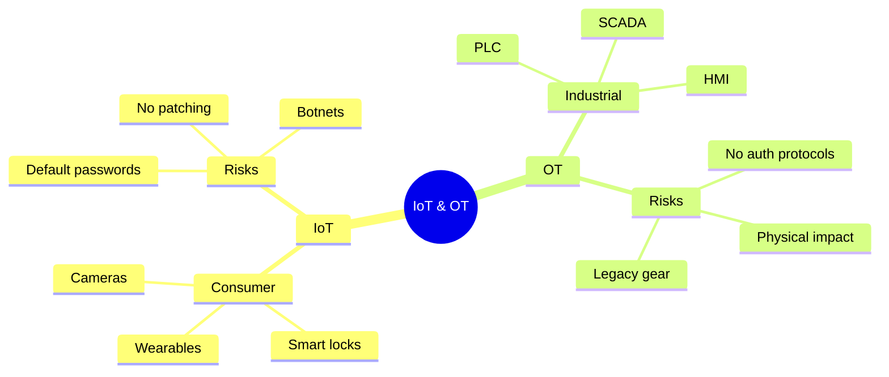
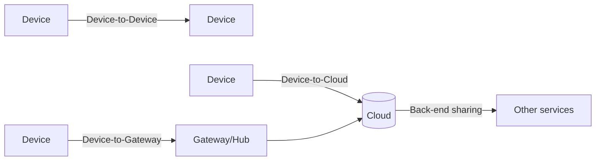
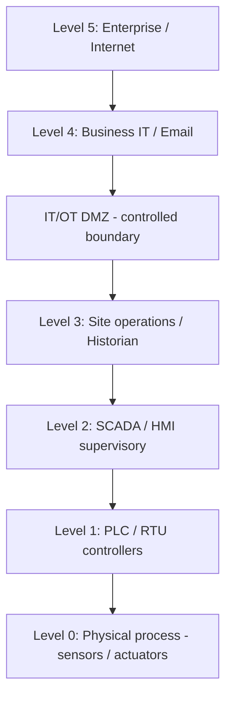
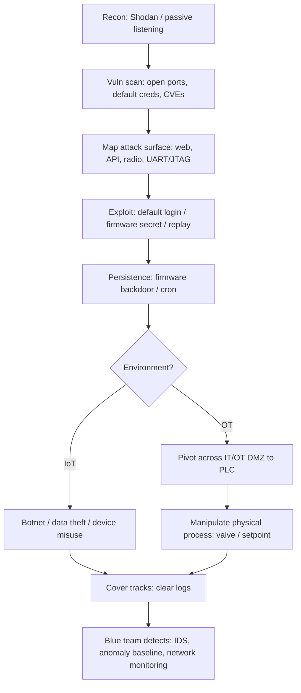
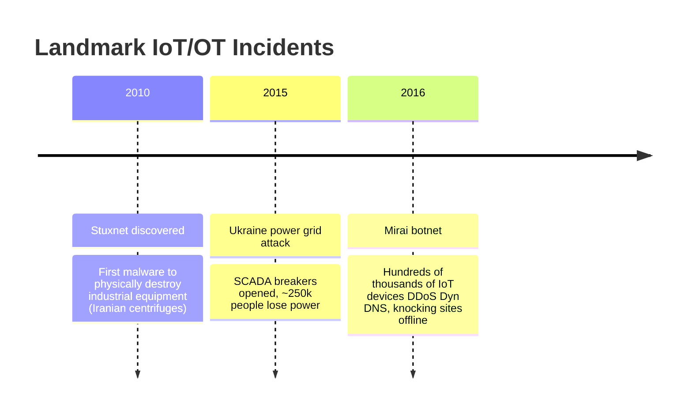
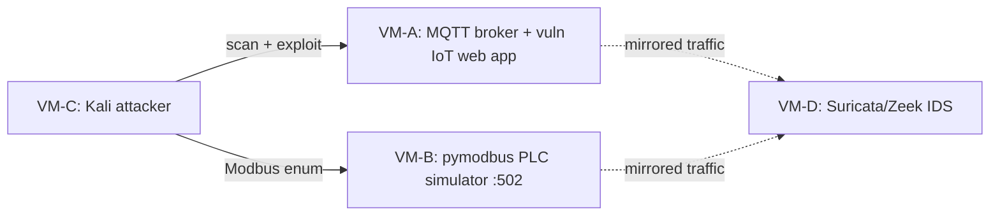

# IoT & OT Hacking 🔌

> **What you'll learn:** How internet-connected "smart" devices (IoT) and industrial control machinery (OT) work, how attackers find and exploit them, and how defenders detect and stop those attacks.
> **Prerequisites:** Basic networking (IP addresses, ports, TCP/UDP), comfort with a Linux terminal, and the earlier CSPP modules on reconnaissance and network scanning.

| | |
|---|---|
| **Course** | Professional Level 2 |
| **Course code** | SKL-CSP2-711 |
| **Module** | IoT & OT Hacking |
| **Level** | level2 |

---

> 📺 **Watch — top video on this topic:** [](https://www.youtube.com/watch?v=FrWG2M1W2OA) [Exploring IoT and OT Hacking](https://www.youtube.com/watch?v=FrWG2M1W2OA)

---

## 1. In Plain English

Your home is filling up with gadgets that talk to the internet: a video doorbell, a phone-controlled thermostat, a baby monitor, a smart speaker, even a fridge. Each is a tiny computer. Collectively we call them **IoT** — the **Internet of Things**. The "thing" is any everyday object given a network connection and a small brain to send and receive data.

Now scale that up to something serious: the machines running a water treatment plant, a power grid, a factory line, or an oil pipeline. These are controlled by specialized computers too, but the stakes are **physical** — misbehavior can poison water, kill the lights, or destroy machinery. This is **OT** — **Operational Technology**, the technology that monitors and controls physical processes in the real world.

Why should a beginner care? These devices are often the **weakest link**. A laptop gets patched monthly; a smart bulb or a 20-year-old factory controller almost never does. A cheap camera with a default password of `admin/admin` can become the doorway into an entire network — or one of millions of devices in a **botnet** (an army of hijacked machines used to attack others).

> 🔑 **Key idea:** Think of a house with a state-of-the-art front door (your patched laptop) but a flimsy pet flap at the back (the smart bulb). This module teaches where the pet flaps are, how attackers crawl through them, and how to seal them.



---

## 2. Core Concepts

### 2.1 What "IoT" actually means 📱

An **IoT device** is a physical object embedded with sensors, software, and a network connection that lets it collect and exchange data. Examples: smart cameras, smart locks, fitness trackers, connected medical devices, home routers.

The four parts of a typical IoT device:

| Part | Role | Beginner analogy |
|---|---|---|
| **Sensors / actuators** | Sensors *read* the world (temperature, motion); actuators *change* it (unlock a door, spin a motor) | The senses and the hands |
| **Microcontroller / SoC** | The small brain (System on a Chip) running the firmware | The CPU |
| **Firmware** | Permanent software baked onto a chip that makes the device work | The device's operating system |
| **Connectivity** | Wi-Fi, Bluetooth, Zigbee, Z-Wave, cellular — radio used to reach other devices and the cloud | The mouth and ears |

### 2.2 The IoT communication models 🔗

Devices rarely work alone. Common arrangements:



- **Device-to-Device:** two gadgets talk directly (a fitness band to your phone over Bluetooth).
- **Device-to-Cloud:** the device sends data to a vendor's internet servers.
- **Device-to-Gateway:** devices talk to a local hub that translates and forwards traffic.
- **Back-end data sharing:** the cloud shares your data with other services.

### 2.3 Common IoT protocols (defined before use) 📡

| Protocol | What it is | Watch out for |
|---|---|---|
| **MQTT** (Message Queuing Telemetry Transport) | Lightweight publish/subscribe messaging. Devices *publish* to named **topics**; others *subscribe*; a central **broker** routes messages | Often allows anyone to connect with **no password** if misconfigured |
| **CoAP** (Constrained Application Protocol) | A web-like protocol (similar to HTTP) for tiny devices, running over UDP | UDP-based; can be abused for amplification |
| **UPnP** (Universal Plug and Play) | Lets devices auto-discover each other on a LAN | Can auto-expose services to the internet — a historical hole factory |
| **Zigbee / Z-Wave** | Low-power radio for home automation (bulbs, sensors) forming a **mesh network** (devices relay each other's traffic) | Weak/legacy key handling in older versions |

### 2.4 The OWASP IoT Top 10 🛑

**OWASP** (Open Worldwide Application Security Project) is a non-profit that publishes respected security guidance. Its **IoT Top 10** lists the most common IoT weaknesses:

| # | Weakness | Plain explanation |
|---|---|---|
| 1 | Weak/default/hardcoded passwords | Same `admin`/`admin` on every unit, baked in and unchangeable |
| 2 | Insecure network services | Open ports running buggy services |
| 3 | Insecure ecosystem interfaces | Vulnerable web, API, or cloud dashboards |
| 4 | Lack of secure update mechanism | No way to patch, or updates aren't signed/encrypted |
| 5 | Insecure/outdated components | Old libraries with known bugs |
| 6 | Insufficient privacy protection | Personal data stored or sent carelessly |
| 7 | Insecure data transfer/storage | No encryption in transit or at rest |
| 8 | Lack of device management | Can't monitor or decommission devices |
| 9 | Insecure default settings | Ships wide open |
| 10 | Lack of physical hardening | Easy to open the case and read the chips |

### 2.5 What "OT" actually means (and ICS, SCADA, PLC) 🏭

| Term | Meaning |
|---|---|
| **OT** (Operational Technology) | Hardware/software that detects or causes changes in physical processes — pumps, valves, turbines, conveyors |
| **ICS** (Industrial Control System) | Umbrella term for systems used to control industrial processes |
| **SCADA** (Supervisory Control and Data Acquisition) | A *type* of ICS that monitors/controls equipment spread over a wide area (e.g., a regional power grid). Includes operator screens, **historians** (databases of process data), and remote units |
| **PLC** (Programmable Logic Controller) | A rugged little industrial computer that directly controls a machine — "if tank level > 90%, close valve." The muscle that touches the physical world |
| **HMI** (Human-Machine Interface) | The screen an operator uses to watch and command the process |
| **RTU** (Remote Terminal Unit) | Like a PLC but built for remote field sites |

> 🖼️ *Suggested image: a labeled photo of a real PLC and HMI panel inside an industrial control cabinet*

### 2.6 The Purdue Model 🧱

The **Purdue Model** is the classic reference architecture for organizing an OT network into layers, from the physical machines (Level 0) up to the business IT network (Levels 4–5). Security relies on **segmentation** — keeping layers separated so an attacker who lands in office email can't reach a PLC. The IT↔OT boundary is the **IT/OT DMZ**.



> 💡 **Tip:** The deeper an attacker gets (toward Level 0), the more physical the damage. The DMZ is the single most important chokepoint to defend.

### 2.7 Insecure industrial protocols ⚠️

OT protocols were designed decades ago for reliability, *not* security — most have **no authentication or encryption** by default.

| Protocol | Port (typical) | Used in | Security note |
|---|---|---|---|
| **Modbus** | 502 | General PLCs | Simple master/slave read/write; anyone who can reach it can usually command it |
| **DNP3** (Distributed Network Protocol) | 20000 | Utilities (electric/water) | Trusting by design |
| **EtherNet/IP** | 44818 | Industrial automation | Vendor/industry protocol, similarly trusting |
| **PROFINET** | varies | Factory automation | No native auth |
| **S7comm** (Siemens) | 102 | Siemens PLCs | No native auth |

> ⚠️ **Warning:** In OT, *reachability often equals control*. Network access **is** the prize — there's frequently no second lock behind the door.

---

## 3. How It Works (Step by Step) 🔍

Attackers and authorized penetration testers follow a repeatable **hacking methodology**. For an IoT/OT engagement:

1. **Recon / information gathering.** Identify devices, vendors, firmware versions, exposed services. Use internet-device search engines (Shodan, Censys) and passive listening.
2. **Vulnerability scanning.** Probe for open ports, default credentials, known **CVEs** (publicly catalogued vulnerabilities), and weak protocol configs.
3. **Attack surface mapping.** Enumerate every entry point: web/admin interfaces, mobile app, cloud API, radio (Bluetooth/Zigbee), and physical ports (UART, JTAG — debug interfaces on the board).
4. **Gaining access / exploitation.** Log in with default creds, exploit a vulnerable service, replay a captured command, or extract secrets from firmware.
5. **Maintaining access.** Install persistence (firmware backdoor, cron job) so access survives reboots.
6. **Lateral movement / pivoting.** Use the compromised device as a stepping stone deeper — in OT, from the IT side across the DMZ toward PLCs.
7. **Impact / actions on objective.** IoT: join a botnet, steal video feeds. OT: manipulate a process (open a valve, change a setpoint).
8. **Covering tracks.** Clear logs and remove artifacts.

For OT specifically, **MITRE ATT&CK for ICS** catalogues these attacker behaviors (tactics and techniques) in a standardized way — invaluable for red and blue teams alike.



---

## 4. Real-World Examples 📰

> 🖼️ *Suggested image: a simplified diagram of the Mirai botnet — many IoT cameras flooding one DNS target*



| Incident | Target | Technique | Lesson |
|---|---|---|---|
| 🤖 **Mirai botnet (2016)** | Cameras, home routers | Scanned the internet, tried a built-in list of common default usernames/passwords; hijacked hundreds of thousands of devices into a botnet for massive **DDoS** (Distributed Denial of Service). One attack disrupted **Dyn**, a major DNS provider, knocking Twitter, Netflix, and Reddit offline for many users | **Default passwords at scale are catastrophic** |
| ☢️ **Stuxnet (2010)** | **Siemens** PLCs running uranium-enrichment centrifuges in Iran | A sophisticated worm spread via USB and the IT network, then quietly altered centrifuge speeds while feeding operators normal-looking readings. Widely cited as the first malware to cause real physical destruction of industrial equipment | **OT is reachable and physically consequential** |
| ⚡ **Ukraine power grid (2015)** | Electricity distributors' SCADA | Attackers compromised IT networks, pivoted into SCADA, remotely opened circuit breakers (cutting power to ~250,000 people), and wiped systems to slow recovery | **IT compromise + poor IT/OT segmentation = grid-level impact** |

> 💡 **Tip:** Treat these as documented, widely reported cases — cite them accurately and avoid embellishing specifics.

---

## 5. Tools of the Trade 🧰

> ⚠️ **Warning:** All tools below are for use **only** on systems you own or are explicitly authorized to test.

| Tool | Category | Use case |
|---|---|---|
| **Shodan / Censys** | Internet device search | Find internet-exposed devices by banner, port, or product |
| **Nmap** | Network scanner | Discover open ports, fingerprint services, run OT protocol scripts |
| **Mosquitto clients** | MQTT testing | Subscribe/publish to a broker to check exposure |
| **Binwalk** | Firmware analysis | Extract and inspect firmware images for secrets |
| **Metasploit** | Exploitation platform | Modules for common IoT/SCADA targets |

**Shodan / Censys — internet device search engines.**
```bash
# Search Shodan for exposed devices reporting a specific product (via CLI)
shodan search "product:MQTT port:1883" --fields ip_str,port,org
```
Lists IPs running MQTT brokers on the default port 1883 — useful to confirm whether *your* broker is unintentionally exposed.

**Nmap — network scanner.**
```bash
# Scan a host for the common Modbus port and run an enumeration script
nmap -p 502 --script modbus-discover 192.0.2.10
```
Port 502 is Modbus; `modbus-discover` enumerates accessible unit IDs **without** sending control commands.

**Mosquitto clients — MQTT testing.**
```bash
# Subscribe to ALL topics on a broker you control to see if it's open
mosquitto_sub -h 192.0.2.20 -t '#' -v
```
The `#` wildcard subscribes to every topic; if it works with no credentials, the broker is unauthenticated.

**Binwalk — firmware analysis.**
```bash
# Identify and extract embedded filesystems/keys from a firmware blob
binwalk -e firmware.bin
```
`-e` extracts found components (e.g., a SquashFS filesystem) so you can hunt for hardcoded passwords or keys.

**Metasploit Framework — exploitation platform.**
```bash
# Search Metasploit for SCADA-related modules
msfconsole -q -x "search scada; exit"
```
Lists auxiliary/exploit modules relevant to industrial systems for authorized testing.

---

## 6. Hands-On Lab (Authorized / Lab-Only) 🧪

> ⚠️ **Warning:** Perform this **only** on lab systems you own or are explicitly authorized to test. Never touch production or third-party IoT/OT devices.

**Goal:** Stand up a small simulated IoT/OT environment, run the full methodology against it, then validate that your detection works.



**Build the lab (multi-VM or cloud sandbox):**
1. Create an isolated virtual network (VirtualBox/VMware host-only, or an isolated cloud VPC with no internet egress).
2. **VM-A (vulnerable IoT):** an MQTT broker (e.g., Mosquitto) with authentication disabled, plus a deliberately vulnerable IoT web app image.
3. **VM-B (OT simulator):** an open-source Modbus PLC simulator (e.g., a Python `pymodbus` server) exposing holding registers on port 502.
4. **VM-C (attacker):** Kali Linux with Nmap, Metasploit, binwalk, and mosquitto clients.
5. **VM-D (defender):** a sensor running an IDS (Suricata or Zeek) with traffic mirrored to it.

**Attack chain (adapt IPs/ports yourself):**
1. From VM-C, run host discovery and a service scan across the lab subnet; identify the MQTT (1883) and Modbus (502) hosts.
2. Subscribe to the MQTT broker with the `#` wildcard. Confirm it accepts you without credentials and observe message flow.
3. Publish a crafted message to a control topic and watch the IoT app react — demonstrating command injection via an open broker.
4. Run the Modbus enumeration script against VM-B to read holding registers (read-only). **Stop there** — note where a *write* would change a simulated "valve" value, and reason about the physical impact rather than performing destructive actions.
5. Obtain the IoT app's firmware image (provided in your lab), run binwalk extraction, and search the extracted filesystem for hardcoded credentials.

> 🖼️ *Suggested image: a terminal screenshot showing mosquitto_sub receiving messages from an open broker*

**Validate the defense/detection (required):**
1. On VM-D, confirm the IDS logged the port scan and the unauthenticated MQTT subscription. Write/enable a rule that alerts on Modbus traffic (port 502) from any host *not* on an allow-list.
2. Re-run step 4 and verify the IDS fires an alert. Capture the alert and the matching packet in your notes.
3. Remediate VM-A: enable MQTT authentication and TLS, then re-run step 2 and confirm the connection is now refused. Document before/after.

**Deliverable:** a short report mapping each action to its MITRE ATT&CK for ICS / IoT technique and showing the matching detection.

---

## 7. Countermeasures & Defenses 🛡️

Defense is **layered** — no single control is enough. The table pairs each common attack with its primary defense:

| Attack vector | Primary defense |
|---|---|
| Default/hardcoded passwords | Force unique strong passwords at first boot; eliminate hardcoded creds |
| Unauthenticated broker/cloud traffic | Certificate-based auth + TLS for device-to-cloud and broker traffic |
| Open/unused services (UPnP, Telnet) | Disable unused services, ports, protocols |
| Flat network → easy pivot | Segment IoT/OT onto separate VLANs; enforce Purdue layering + IT/OT DMZ |
| Reachable OT protocols (Modbus, DNP3) | Firewall allow-lists restricting them to known hosts |
| Unpatchable/unsigned firmware | Apply signed, encrypted updates; verify integrity before install |
| Unknown/rogue devices | Maintain an asset inventory; alert on new devices |
| Physical chip/debug access | Disable/lock UART/JTAG; vet vendors; require an SBOM |

**Identity & access**
- Eliminate default and hardcoded credentials; force unique strong passwords at first boot.
- Use certificate-based authentication and TLS for device-to-cloud and broker traffic.
- Disable unused services, ports, and protocols (e.g., UPnP, Telnet).

**Network architecture**
- Segment IoT and OT onto separate VLANs/networks; never run them flat with corporate IT.
- Enforce the Purdue Model layering and an IT/OT DMZ; allow only explicitly required flows.
- Restrict OT protocols (Modbus, DNP3) to known hosts via firewall allow-lists.

**Patch & lifecycle management**
- Apply signed, encrypted firmware updates; verify integrity before install.
- Maintain an asset inventory so you know every device and its version.
- Plan secure decommissioning (wipe credentials/keys).

**Monitoring & detection**
- Deploy passive OT-aware network monitoring/IDS (Zeek, Suricata, or ICS-specific tools) that learns a **baseline** of normal traffic and alerts on anomalies.
- Watch for new/unauthorized devices, unexpected Modbus writes, and protocol use outside maintenance windows.
- Centralize logs into a **SIEM** (Security Information and Event Management) and map detections to MITRE ATT&CK for ICS.

**Physical & supply chain**
- Harden devices physically (disable/lock UART/JTAG debug ports).
- Vet vendor security and require a **SBOM** (Software Bill of Materials) where possible.

> 🔑 **Key idea:** Because OT protocols rarely authenticate, the network *is* the access control. Segmentation and the IT/OT DMZ do the job the protocols can't.

---

## 8. Key Terms 📖

| Term | Meaning |
|---|---|
| **IoT** | Internet-connected everyday devices with sensors, firmware, and network access |
| **OT** | Technology that monitors/controls physical industrial processes |
| **ICS** | Industrial Control System; umbrella term for OT control systems |
| **SCADA** | Supervisory system for monitoring/controlling geographically spread equipment |
| **PLC** | Programmable Logic Controller; rugged computer that directly drives a machine |
| **HMI** | Human-Machine Interface; the operator's control screen |
| **Firmware** | The embedded software baked into a device |
| **MQTT** | Lightweight publish/subscribe messaging protocol with a central broker |
| **Modbus** | Simple, unauthenticated industrial protocol to read/write PLC values (port 502) |
| **Purdue Model** | Layered reference architecture for segmenting OT networks |
| **Botnet** | A network of hijacked devices controlled by an attacker |
| **DDoS** | Distributed Denial of Service; overwhelming a target with traffic from many sources |
| **CVE** | A publicly catalogued, identified software/hardware vulnerability |
| **MITRE ATT&CK for ICS** | Knowledge base of attacker tactics/techniques against industrial systems |

---

## 9. Summary & Takeaways ✅

- IoT and OT devices are full computers, but often unpatched, default-configured, and trusting by design — making them the network's weakest link.
- The attack methodology is consistent: recon → scan → map attack surface → exploit → persist → pivot → impact → cover tracks.
- IoT failures cluster around default passwords, exposed services, and absent secure updates (see the OWASP IoT Top 10).
- OT protocols (Modbus, DNP3) usually lack authentication, so **network reachability often equals physical control** — which is why segmentation and the Purdue Model matter most.
- Real incidents (Mirai, Stuxnet, Ukraine grid) prove these risks are physical and large-scale, not theoretical.
- Core tools: Shodan/Censys (discovery), Nmap (scanning), Mosquitto clients (MQTT), binwalk (firmware), Metasploit (exploitation) — authorized use only.
- Defense is layered: kill default creds, segment networks, sign firmware updates, deploy OT-aware passive monitoring tied to a SIEM.
- Detection must be **validated**: every offensive action in a lab should map to a working alert before you call a control effective.

**Further reading:** OWASP IoT Top 10 and OWASP Firmware Security Testing Methodology; NIST SP 800-82 (Guide to Operational Technology Security); MITRE ATT&CK for ICS; CISA ICS advisories and the Purdue Enterprise Reference Architecture.
