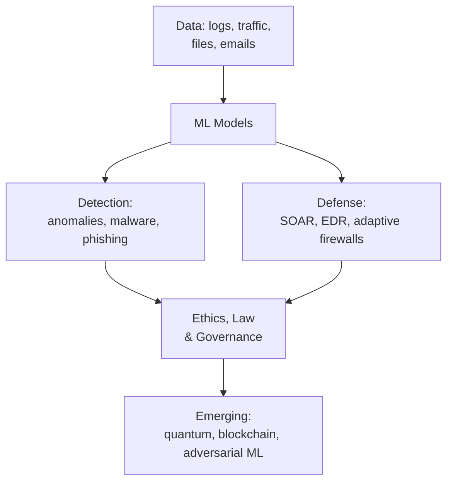

# Course 5 · AI for Cyber Security

**Code:** `SKL-AICS-720` · **Learning hours:** 20 · **Level:** Applied / Machine Learning

The final course shows how **artificial intelligence and machine learning** are
reshaping both attack and defense — from detecting anomalies and malware to
automating incident response, plus the ethics, law, and emerging trends
(quantum, blockchain, adversarial ML) you need to think about.

## Modules
1. [Fundamentals of AI in Cyber Security](module-01-fundamentals-of-ai-in-cyber-security.md)
2. [AI for Threat Detection and Analysis](module-02-ai-for-threat-detection-and-analysis.md)
3. [AI in Cyber Defence Mechanisms](module-03-ai-in-cyber-defence-mechanisms.md)
4. [Ethical & Legal Considerations in AI](module-04-ethical-and-legal-considerations-in-ai.md)
5. [Emerging Trends & Future of AI in Cyber Security](module-05-emerging-trends-and-future-of-ai.md)

## Where AI plugs into security

⬅️ Prev: [Course 4](../04-penetration-testing/) · 🏁 You've reached the end — back to [main index](../README.md)
