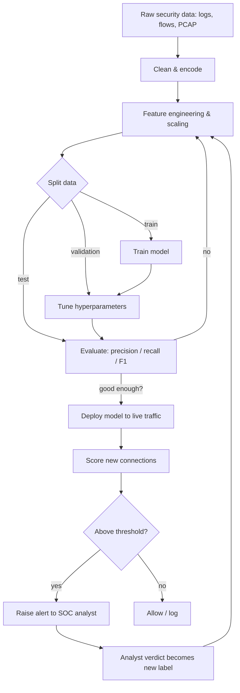

# Fundamentals of AI in Cyber Security

> **What you'll learn:** how artificial intelligence and machine learning actually work, the main families of algorithms, how raw security data becomes useful features, what neural networks and deep learning add, and which tools (scikit-learn, TensorFlow, PyTorch) practitioners use to build defensive models.
> **Prerequisites:** basic Python, comfort with the command line, and high-school-level math (no calculus required to follow along). No prior security or ML experience needed.

| Field | Value |
|-------|-------|
| Course | AI for Cyber Security |
| Course code | SKL-AICS-720 |
| Module | 01 — Fundamentals of AI in Cyber Security |
| Level | ai |

---

## 1. In Plain English

Imagine you run the front desk of a large building. Thousands of people walk in every day. Most are employees and visitors going about normal business, but occasionally someone tries to sneak in with a stolen badge. You can't inspect everyone by hand, so you learn patterns: regulars who arrive at 9 a.m., the way the badge reader beeps, what "normal" looks like. When something is *off* — a badge used twice in two cities within minutes — your instincts fire. **Artificial Intelligence (AI)** is the attempt to give computers that same kind of pattern-spotting instinct, and **Machine Learning (ML)** is the most successful way we currently teach it.

In cyber security the "building" is your network, and the "people walking in" are network connections, login attempts, emails, files, and user actions — millions per day, far too many for humans to review. AI lets a defensive system learn what normal traffic looks like and flag the suspicious. Attackers, meanwhile, use the same techniques to write convincing phishing emails, guess passwords, or evade filters. So understanding the fundamentals isn't optional — it is becoming the language both attackers and defenders speak.

A total beginner should care because almost every modern security product — spam filters, antivirus, fraud detection, intrusion detection — now has ML inside it. If you understand *how the model decides*, you can tell when it is wrong, why it raised an alert, and how an attacker might fool it. This module builds that foundation from zero, with no assumed background.

---

## 2. Core Concepts

### Artificial Intelligence vs Machine Learning vs Deep Learning

These three terms are often used interchangeably, but they nest inside one another like Russian dolls.

- **Artificial Intelligence (AI)** — the broad goal of making machines perform tasks that normally need human intelligence (recognizing faces, understanding language, making decisions).
- **Machine Learning (ML)** — a subset of AI where, instead of a programmer writing explicit rules, the machine *learns rules automatically from examples (data)*. You show it thousands of labeled emails and it figures out what "spam" looks like.
- **Deep Learning (DL)** — a subset of ML that uses **neural networks** (defined below) with many layers. It powers image recognition, large language models, and modern malware classifiers.

> Rule of thumb: **All deep learning is machine learning; all machine learning is AI; but not all AI is machine learning.** Older "expert systems" used hand-written `if/then` rules — that is AI without learning.

### What a "Model" Is

A **model** is the mathematical object that a learning algorithm produces. Think of it as a recipe with adjustable knobs (called **parameters** or **weights**). Training = turning the knobs until the recipe's predictions match the known answers in your data. Once trained, you feed it *new* data and it predicts. In security a model might take features of a network connection and output a probability that it is an attack.

### Features and Labels

- A **feature** is a single measurable property of something. For a network connection: bytes sent, duration, destination port, protocol. Features are the *inputs*.
- A **label** is the correct answer you want to predict: `attack` or `benign`. Labels are the *outputs* you train against.
- A **feature vector** is just the list of features for one example, e.g. `[1500 bytes, 0.3s, port 443, TCP]`.

### Supervised Learning

**Supervised learning** means you train on data where every example already has the correct label. The algorithm learns the mapping from features to labels. Two sub-types:

- **Classification** — predict a *category*. "Is this email phishing or not?" (binary) or "Which malware family is this?" (multi-class). Most intrusion-detection models are classifiers.
- **Regression** — predict a *number*. "How many failed logins will this account have in the next hour?"

Common supervised algorithms you will meet:

| Algorithm | Idea in one line | Security use |
|-----------|------------------|--------------|
| Logistic Regression | Draws a weighted line separating two classes | Baseline phishing/spam detection |
| Decision Tree | A flowchart of yes/no questions | Explainable malware triage |
| Random Forest | Many decision trees voting together | Intrusion detection (robust, popular) |
| Support Vector Machine (SVM) | Finds the widest gap between classes | Small, clean datasets |
| Gradient Boosting (XGBoost) | Trees built sequentially to fix prior errors | Fraud and anomaly scoring |

### Unsupervised Learning

**Unsupervised learning** works on data *without labels*. The algorithm finds structure on its own. This matters in security because brand-new attacks have no labels yet — you can only say "this looks different from normal."

- **Clustering** — group similar items. K-Means (defined later) groups network sessions; weird, tiny clusters may be attacks.
- **Anomaly / outlier detection** — learn what "normal" looks like and flag deviations. Algorithms like **Isolation Forest** and **One-Class SVM** are built for this. This is the backbone of behavioral intrusion detection.
- **Dimensionality reduction** — squeeze many features into a few while keeping the important information (e.g. **PCA**, Principal Component Analysis). Used to visualize traffic or speed up other models.

> There is also **semi-supervised** learning (a few labels plus lots of unlabeled data) and **reinforcement learning** (an agent learns by trial-and-error rewards, used in some automated-response research), but supervised and unsupervised are the two you must know cold.

### Overfitting, Underfitting, and Generalization

- **Overfitting** — the model memorizes the training data, including its noise, and fails on new data. Like a student who memorizes past exam answers but can't solve new problems.
- **Underfitting** — the model is too simple to capture the pattern at all.
- **Generalization** — the goal: good performance on data the model has *never seen*.

We guard against overfitting by splitting data into **training**, **validation**, and **test** sets, and by **cross-validation** (rotating which slice is held out).

### Evaluating a Model (Why Accuracy Lies)

In security, attacks are rare — maybe 1 in 1000 connections. A model that says "benign" every time is **99.9% accurate** and **completely useless**. So we use better metrics:

- **Confusion matrix** — counts of True Positives (attack caught), True Negatives (benign passed), **False Positives** (false alarm), **False Negatives** (missed attack).
- **Precision** = of everything flagged as attack, how many really were? (Low precision = alert fatigue.)
- **Recall (Sensitivity)** = of all real attacks, how many did we catch? (Low recall = missed breaches.)
- **F1 score** — the balance between precision and recall.
- **ROC / AUC** — how well the model separates classes across all thresholds.

### Neural Networks and Deep Learning

A **neural network** is loosely inspired by brain cells. It is built from **neurons (nodes)** arranged in **layers**:

- **Input layer** — receives the feature vector.
- **Hidden layers** — each neuron computes a weighted sum of its inputs, adds a **bias**, then passes the result through an **activation function** (a nonlinear function like **ReLU** or **sigmoid** that lets the network learn curves, not just straight lines).
- **Output layer** — produces the prediction (e.g. probability of "malware").

The network learns by **backpropagation**: it makes a prediction, measures the error with a **loss function**, and uses calculus (**gradient descent**) to nudge every weight slightly in the direction that reduces error. Repeat over many passes through the data, called **epochs**.

**Deep learning** simply means many hidden layers. Specialized architectures matter in security:

- **CNN (Convolutional Neural Network)** — great at spatial patterns; used to classify malware by turning a binary file into an "image."
- **RNN / LSTM** — handle *sequences*; used for log-sequence analysis and detecting unusual command patterns.
- **Transformers** — the architecture behind large language models; used for analyzing code, logs, and natural-language phishing.

Deep learning shines when you have *huge amounts of data* and *complex raw patterns* (raw bytes, packet payloads, text). For small tabular datasets, classic models like Random Forest often win and are easier to explain.

### Data Processing and Analysis

Models are only as good as the data fed to them. The typical pipeline:

1. **Collection** — gather logs, PCAPs (packet captures), flow records, alerts.
2. **Cleaning** — remove duplicates, fix missing values, drop corrupt rows.
3. **Feature engineering** — turn raw data into meaningful features (e.g. "connections per minute," "ratio of unusual ports").
4. **Encoding** — convert text categories (like protocol `TCP`/`UDP`) into numbers, because models do math, not words. Techniques: **label encoding**, **one-hot encoding**.
5. **Scaling / normalization** — put features on a comparable range so "bytes" (millions) doesn't drown out "duration" (seconds). Techniques: **standardization** (mean 0, std 1) and **min-max scaling**.
6. **Splitting** — train/validation/test, often **stratified** so rare attacks appear in each split.
7. **Handling imbalance** — oversample attacks (**SMOTE**), undersample normal traffic, or weight the classes.

---

## 3. How It Works (Step by Step)

Here is the end-to-end flow of building and using an ML-based intrusion detector, the defensive workhorse of AI security.

1. **Ingest data** — collect labeled network flows (benign vs attack).
2. **Preprocess** — clean, encode categorical fields, scale numeric fields.
3. **Split** — carve out a held-out test set the model never sees during training.
4. **Train** — fit a classifier (say Random Forest) on the training set.
5. **Validate & tune** — check metrics on validation data; adjust **hyperparameters** (settings chosen *before* training, like tree depth).
6. **Test** — measure precision/recall on the untouched test set.
7. **Deploy** — run the model on live traffic.
8. **Score & alert** — for each new connection the model outputs a probability; above a threshold it raises an alert.
9. **Feedback loop** — analysts confirm true/false alerts; this becomes new labeled data to **retrain** and fight model drift (the world changing over time).



---

## 4. Real-World Examples

**1. Spam and phishing filters (Gmail, Microsoft 365).** Email providers have used ML classifiers for over a decade. Features include sender reputation, link structure, header anomalies, and message text. Google has publicly stated its ML filters block the large majority of spam and phishing reaching Gmail. This is supervised classification at planet scale, retrained constantly as attackers adapt.

**2. Credit-card fraud detection.** Payment networks score every transaction in milliseconds using ML models trained on billions of past transactions. Features like amount, location, merchant type, and time-since-last-purchase feed a model (often gradient boosting) that decides approve / decline / challenge. This is the most mature, commercially proven use of ML for security-adjacent fraud.

**3. The defensive research datasets — KDD Cup '99 and NSL-KDD.** The 1999 DARPA/KDD intrusion-detection dataset became the most widely used benchmark for network attack classification. Researchers later released **NSL-KDD** to fix duplicate-record problems in the original. Countless intrusion-detection papers and student projects (including the lab below) are built on it. It is a realistic, *defensible* example of how labeled attack data trains classifiers — and a cautionary tale, because models that score 99% on it often fail on modern traffic, illustrating overfitting and dataset drift.

---

## 5. Tools of the Trade

### scikit-learn
The standard Python library for classical ML (no deep learning). Great for tabular security data, fast to prototype.

```python
from sklearn.ensemble import RandomForestClassifier
clf = RandomForestClassifier(n_estimators=200, random_state=42)
clf.fit(X_train, y_train)          # learn from labeled data
preds = clf.predict(X_test)        # predict on unseen data
```
*What it does:* builds 200 decision trees that vote, trains them on `X_train`/`y_train`, then classifies new samples. `random_state` makes results reproducible.

### pandas
The data-wrangling library. Loads, cleans, and explores tabular data.

```python
import pandas as pd
df = pd.read_csv("nsl_kdd.csv")
print(df["label"].value_counts())   # how many attacks vs benign?
```
*What it does:* reads a CSV into a DataFrame (a table) and counts each label so you can see class imbalance.

### TensorFlow / Keras
Google's deep-learning framework; **Keras** is its beginner-friendly high-level API.

```python
import tensorflow as tf
model = tf.keras.Sequential([
    tf.keras.layers.Dense(64, activation="relu", input_shape=(41,)),
    tf.keras.layers.Dense(1, activation="sigmoid"),
])
model.compile(optimizer="adam", loss="binary_crossentropy", metrics=["accuracy"])
```
*What it does:* defines a small neural network with one hidden layer of 64 ReLU neurons and a single sigmoid output (probability of "attack"), then sets the training recipe.

### PyTorch
Meta's deep-learning framework, popular in research for its flexibility.

```python
import torch.nn as nn
net = nn.Sequential(
    nn.Linear(41, 64), nn.ReLU(),
    nn.Linear(64, 1), nn.Sigmoid(),
)
```
*What it does:* defines the same shape of network as above using PyTorch's module style.

### Jupyter Notebook
An interactive coding environment that mixes code, output, and notes — the default workspace for data exploration.

```bash
pip install jupyter && jupyter notebook
```
*What it does:* installs and launches the notebook server in your browser.

---

## 6. Hands-On Lab (Authorized / Lab-Only)

> **Reminder:** Run this only on your own machine or an authorized training lab. Use public, openly licensed datasets — never live production traffic or data you are not permitted to use.

**Goal:** train a simple intrusion-detection classifier on the **NSL-KDD** dataset (a public, widely used network-intrusion benchmark) and measure how well it catches attacks.

**Libraries needed:** `pandas`, `scikit-learn`. Install with:

```bash
pip install pandas scikit-learn
```

**Dataset:** NSL-KDD (`KDDTrain+` / `KDDTest+`), freely available from academic mirrors. Each row is a network connection with 41 features plus a label naming the attack type (or `normal`).

```python
import pandas as pd
from sklearn.preprocessing import LabelEncoder, StandardScaler
from sklearn.ensemble import RandomForestClassifier
from sklearn.metrics import classification_report

# 1. Column names for NSL-KDD (41 features + label + difficulty)
cols = [
    "duration","protocol_type","service","flag","src_bytes","dst_bytes",
    "land","wrong_fragment","urgent","hot","num_failed_logins","logged_in",
    "num_compromised","root_shell","su_attempted","num_root","num_file_creations",
    "num_shells","num_access_files","num_outbound_cmds","is_host_login",
    "is_guest_login","count","srv_count","serror_rate","srv_serror_rate",
    "rerror_rate","srv_rerror_rate","same_srv_rate","diff_srv_rate",
    "srv_diff_host_rate","dst_host_count","dst_host_srv_count",
    "dst_host_same_srv_rate","dst_host_diff_srv_rate","dst_host_same_src_port_rate",
    "dst_host_srv_diff_host_rate","dst_host_serror_rate","dst_host_srv_serror_rate",
    "dst_host_rerror_rate","dst_host_srv_rerror_rate","label","difficulty",
]

train = pd.read_csv("KDDTrain+.txt", names=cols)
test  = pd.read_csv("KDDTest+.txt",  names=cols)

# 2. Turn the multi-class label into a simple binary target: attack vs normal
for df in (train, test):
    df["target"] = (df["label"] != "normal").astype(int)

# 3. Encode text categorical features into numbers
cat_cols = ["protocol_type", "service", "flag"]
for c in cat_cols:
    le = LabelEncoder()
    # fit on combined values so train/test share the same encoding
    le.fit(pd.concat([train[c], test[c]]))
    train[c] = le.transform(train[c])
    test[c]  = le.transform(test[c])

# 4. Separate features (X) from the answer (y); drop non-feature columns
drop = ["label", "difficulty", "target"]
X_train, y_train = train.drop(columns=drop), train["target"]
X_test,  y_test  = test.drop(columns=drop),  test["target"]

# 5. Scale numeric features to a comparable range
scaler = StandardScaler().fit(X_train)
X_train = scaler.transform(X_train)
X_test  = scaler.transform(X_test)

# 6. Train a Random Forest classifier
clf = RandomForestClassifier(n_estimators=200, random_state=42, n_jobs=-1)
clf.fit(X_train, y_train)

# 7. Evaluate with precision / recall / F1 — NOT just accuracy
preds = clf.predict(X_test)
print(classification_report(y_test, preds, target_names=["normal", "attack"]))
```

**Reading the code as a beginner:**
- *Step 1* names the 41 columns so pandas can label the table.
- *Step 2* collapses dozens of attack names into one yes/no `target` (1 = attack).
- *Step 3* converts words like `tcp`/`http` into numbers because the model only does math; we fit the encoder on train+test together so the same word maps to the same number everywhere.
- *Step 4* separates inputs from the answer.
- *Step 5* rescales features so large-valued ones don't dominate.
- *Step 6* trains the forest of 200 voting trees (`n_jobs=-1` uses all CPU cores).
- *Step 7* prints precision, recall, and F1 per class — the honest scoreboard for imbalanced security data.

**What to notice:** scores are usually lower than on the training set because `KDDTest+` deliberately contains attack types the model never saw — a built-in lesson about generalization and why real-world models need constant retraining.

---

## 7. Countermeasures & Defenses

**Building trustworthy ML defenses**
- Train on **representative, up-to-date data**; retrain regularly to counter drift.
- Track **precision and recall**, not accuracy, given class imbalance.
- Keep a **human in the loop** — let analysts confirm or reject alerts and feed verdicts back.
- Prefer **explainable models** (or add tools like SHAP) so analysts understand *why* an alert fired.

**Defending the model itself (adversarial ML)**
- **Adversarial examples:** attackers tweak inputs slightly to fool a model (e.g. padding a malware file). Defend with **adversarial training** (train on such examples) and input sanitization.
- **Data poisoning:** attackers slip malicious samples into training data. Defend with data-provenance controls, anomaly checks on the training set, and access control on the pipeline.
- **Model evasion / extraction:** limit query rates, monitor for probing, and avoid exposing raw confidence scores externally.

**Operational hygiene**
- **Layer defenses (defense in depth):** ML augments, never replaces, firewalls, signatures, MFA, and patching.
- **Baseline normal behavior** so anomaly detectors have an accurate reference.
- **Validate inputs** at every boundary and never trust external data.
- **Protect training data and secrets** (no hardcoded credentials in pipelines).
- **Monitor model performance in production** and alert when metrics degrade.

---

## 8. Key Terms

- **Artificial Intelligence (AI)** — machines performing tasks that normally require human intelligence.
- **Machine Learning (ML)** — AI that learns rules from data instead of hand-coded rules.
- **Deep Learning (DL)** — ML using multi-layer neural networks.
- **Feature** — a measurable input property; **label** — the correct output answer.
- **Supervised learning** — learning from labeled examples (classification or regression).
- **Unsupervised learning** — finding structure in unlabeled data (clustering, anomaly detection).
- **Model** — the trained mathematical object that makes predictions.
- **Overfitting** — memorizing training data and failing on new data.
- **Neural network** — layered network of weighted neurons with nonlinear activations.
- **Backpropagation** — the algorithm that adjusts weights to reduce prediction error.
- **Precision / Recall / F1** — metrics for performance on imbalanced data.
- **False positive / false negative** — a false alarm / a missed attack.
- **Hyperparameter** — a setting chosen before training (e.g. number of trees).
- **Adversarial example** — an input crafted to fool a model.
- **Data poisoning** — corrupting training data to sabotage a model.

---

## 9. Summary & Takeaways

- AI is the goal; ML is learning rules from data; deep learning is ML with deep neural networks — they nest, they are not synonyms.
- **Supervised learning** needs labels and predicts known categories; **unsupervised learning** finds structure and is essential for spotting *novel* attacks.
- Good data work — cleaning, encoding, scaling, balancing — matters more than fancy algorithms.
- In security, **accuracy is misleading**; judge models by precision, recall, and F1 because attacks are rare.
- **Neural networks** learn complex raw patterns via backpropagation; classic models like Random Forest still win on small, tabular data and are easier to explain.
- **scikit-learn + pandas** cover classical ML; **TensorFlow** and **PyTorch** cover deep learning.
- ML models are themselves attackable (adversarial examples, poisoning) — defend the model, keep humans in the loop, and layer it with traditional controls.
- Always work on authorized systems and public datasets; never on data you aren't permitted to use.

**Further reading:** NIST AI Risk Management Framework (AI RMF 1.0); MITRE ATLAS (adversarial threat landscape for AI systems); OWASP Machine Learning Security Top 10; the scikit-learn, TensorFlow, and PyTorch official documentation.
