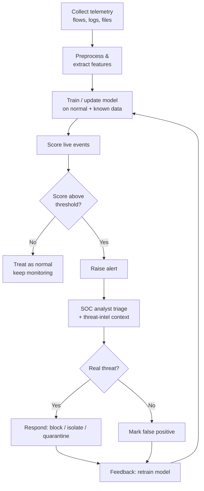

# AI for Threat Detection and Analysis

> **What you'll learn:** How artificial intelligence and machine learning spot cyber attacks — from weird network behavior to brand-new malware — faster and at a bigger scale than humans can. **Prerequisites:** basic comfort with computers and networks, a little Python, and curiosity. No prior machine-learning experience required.

| | |
|---|---|
| **Course** | AI for Cyber Security |
| **Course code** | SKL-AICS-720 |
| **Module** | AI for Threat Detection and Analysis |
| **Level** | ai |

---

## 1. In Plain English

Imagine a brand-new security guard standing at the door of a huge office building. On their very first day they have no idea who works there. But after a few weeks they learn the rhythms: who comes in at 8 a.m., which doors are usually used, what a normal delivery looks like. Now, when someone climbs through a back window at 3 a.m., the guard *instantly* knows something is wrong — not because they have a photo of that exact burglar, but because the behavior is **abnormal**. That intuition, learned from watching "normal" over and over, is exactly what AI brings to cybersecurity.

Traditional security tools work like a bouncer with a printed list of banned faces. If your face (or your virus) isn't on the list, you walk right in. Attackers know this, so they constantly change disguises. **Artificial Intelligence (AI)** — and specifically **Machine Learning (ML)**, the branch of AI where computers learn patterns from data instead of being explicitly programmed — flips the problem around. Instead of memorizing every known bad thing, it learns what *good* looks like and flags anything that doesn't fit, or it learns the subtle fingerprints that bad things share even when they wear new disguises.

Why should a total beginner care? Because the volume of cyber activity today is impossible for humans to watch by hand. A medium-sized company can generate billions of log events per day. AI is the tireless, pattern-hungry assistant that reads all of it, raises its hand when something looks off, and lets human analysts focus on the handful of events that truly matter. In this module you'll learn the main ways AI is used to *detect* and *analyze* threats — and you'll write a tiny working example yourself.

---

## 2. Core Concepts

### Anomaly Detection

**Anomaly detection** is the practice of learning what "normal" looks like and then flagging anything that deviates significantly. An **anomaly** (also called an **outlier**) is a data point that doesn't fit the established pattern.

There are three broad styles:

- **Supervised** — you train on data that is already labeled "normal" or "attack." The model learns the boundary between them. Accurate, but it needs lots of labeled examples and can't catch attacks it never saw.
- **Unsupervised** — you give the model only unlabeled data and ask it to find points that sit far from the crowd. Great for discovering *unknown* threats; produces more false alarms.
- **Semi-supervised** — you train only on "normal" data (because normal is plentiful and easy to collect), and treat anything that doesn't fit as suspicious. This is the most common real-world setup.

Common techniques include statistical thresholds (e.g., "alert if a value is more than 3 standard deviations from the mean"), clustering, **Isolation Forest** (an algorithm that isolates outliers by randomly splitting data — anomalies get isolated in fewer splits), and **autoencoders** (neural networks that learn to compress and rebuild normal data; abnormal data rebuilds poorly, producing a high "reconstruction error").

### Intrusion Detection Systems (IDS)

An **Intrusion Detection System (IDS)** is software that monitors a network or a host for signs of malicious activity. Two flavors:

- **NIDS (Network IDS)** — watches network traffic flowing between machines.
- **HIDS (Host IDS)** — watches what happens on a single machine (files, processes, logs).

Detection logic comes in two styles:

- **Signature-based** — matches traffic against a database of known attack patterns (like antivirus signatures). Fast and precise, but blind to new attacks.
- **Anomaly-based** — uses the techniques above to flag deviations from normal. Catches novel attacks but generates more false positives.

An **Intrusion Prevention System (IPS)** is an IDS that can also *block* the traffic, not just alert on it. AI mainly improves the anomaly-based side, reducing the flood of false alarms that historically made these systems painful to operate.

### Machine Learning for Malware Analysis

**Malware** is any software written to harm, spy on, or take control of a system (viruses, worms, ransomware, trojans). **Malware analysis** is figuring out whether a file is malicious and what it does.

ML helps in two modes:

- **Static analysis** — examine the file *without running it*. Features include byte patterns, imported functions, strings, file structure (e.g., PE-header fields on Windows executables), and **entropy** (a measure of randomness — packed/encrypted malware tends to have high entropy).
- **Dynamic analysis** — *run* the file in a safe, isolated environment called a **sandbox** and watch its behavior: what files it touches, what network connections it makes, what registry keys it edits.

A trained classifier learns the difference between benign and malicious files from thousands of examples, so it can flag a *never-before-seen* file that merely *resembles* known malware. Attackers fight back with **polymorphic** malware (code that rewrites itself each time) and **adversarial examples** (tiny tweaks designed to fool the model) — an ongoing arms race.

### Predictive Analytics for Cyber Threats

**Predictive analytics** uses historical data and statistical/ML models to forecast *future* risk rather than just react to the present. Examples: predicting which servers are most likely to be attacked next, scoring the probability that a login is fraudulent, or forecasting a spike in a particular attack type based on **threat intelligence** (collected information about attacker tactics and infrastructure). The goal is to shift the blue team from **reactive** ("clean up after the breach") to **proactive** ("harden the likely target first").

### AI in Network Traffic Analysis

**Network traffic analysis (NTA)** means inspecting the flow of data across a network to understand who is talking to whom, how much, and how often. A key concept is the **flow** — a summary of a conversation between two endpoints (source/destination IP and port, protocol, byte and packet counts, duration), commonly exported in formats like **NetFlow** or **IPFIX**.

AI excels here because traffic is huge, high-dimensional, and full of subtle patterns. Models can spot **beaconing** (malware "phoning home" at regular intervals), **data exfiltration** (unusually large outbound transfers), **lateral movement** (an attacker hopping machine-to-machine inside the network), and **DDoS** floods. Crucially, much modern traffic is *encrypted*, so AI increasingly relies on **metadata and behavior** (timing, sizes, frequency) rather than reading packet contents.

---

## 3. How It Works (Step by Step)

Here is the typical life cycle of an AI threat-detection pipeline, from raw data to a human decision:

1. **Collect** — Gather raw telemetry: network flows, packet captures, system logs, file samples, authentication events.
2. **Preprocess & extract features** — Clean the data and turn it into **features** (numeric/categorical attributes a model can use), e.g., bytes-per-second, connection count, file entropy. Normalize values so no single feature dominates.
3. **Train the model** — Using historical data, fit a model. For semi-supervised anomaly detection, train only on "known good" traffic so the model learns normality.
4. **Score new data** — Feed live events through the model. Each event gets a score (e.g., an anomaly score or a "malicious" probability).
5. **Decide & alert** — Compare the score to a threshold. If it crosses, raise an **alert**. Tuning this threshold balances catching attacks (sensitivity) against false alarms.
6. **Triage (human + AI)** — A **SOC (Security Operations Center)** analyst reviews high-priority alerts, enriched with context (threat intel, asset value).
7. **Respond** — Block the IP, isolate the host, quarantine the file, or escalate.
8. **Feedback loop** — Confirmed verdicts are fed back to **retrain** and improve the model. Models drift as normal behavior changes, so retraining is continuous.



---

## 4. Real-World Examples

**1. The Mirai botnet (2016).** Mirai infected huge numbers of poorly secured Internet-of-Things devices (cameras, routers) and used them to launch one of the largest **DDoS (Distributed Denial of Service)** attacks ever recorded, knocking major websites offline. The infected devices generated traffic patterns — sudden, coordinated, repetitive connections — that anomaly-based network analysis is well suited to flag, even though each individual device looked ordinary. It's a textbook case for behavior-based NTA over signature matching.

**2. Ransomware encryption bursts.** Modern ransomware (e.g., families like WannaCry-style worms in 2017, and many since) reveals itself through behavior: rapidly opening and rewriting large numbers of files. HIDS and endpoint-detection tools using ML watch for that abnormal file-access burst and can halt the process mid-encryption — catching strains that have never been seen before precisely because the *behavior*, not the signature, is the giveaway.

**3. Credit-card and login fraud detection.** Banks have used ML anomaly detection for decades. The model learns your normal spending/location pattern; a sudden high-value purchase in another country produces a high anomaly score and a verification text. The same predictive-analytics approach now scores enterprise logins ("impossible travel": two logins from distant cities minutes apart) to catch account takeover.

---

## 5. Tools of the Trade

### Zeek (formerly Bro)
A powerful network analysis framework that turns raw traffic into rich, structured logs (connections, DNS, HTTP, etc.) — ideal as the feature source for ML.
```bash
zeek -r capture.pcap
```
Reads a saved packet capture (`capture.pcap`) and produces log files like `conn.log` and `dns.log` summarizing every connection — perfect input for an anomaly model.

### Suricata
A high-performance IDS/IPS that does both signature and anomaly-style detection and emits structured JSON events.
```bash
suricata -r capture.pcap -l ./logs/
```
Analyzes a capture file (`-r`) and writes alerts and flow records into the `./logs/` directory (`-l`), including an `eve.json` event stream you can feed into analytics.

### Wireshark / tshark
The classic packet inspector. `tshark` is its command-line version, great for extracting features.
```bash
tshark -r capture.pcap -T fields -e ip.src -e ip.dst -e frame.len
```
Reads the capture and prints, for each packet, the source IP, destination IP, and frame length as tab-separated fields — a quick way to build a feature table.

### YARA
A pattern-matching engine used to identify and classify malware by writing rules that describe byte/string patterns.
```bash
yara malware_rules.yar /path/to/samples/
```
Scans every file in `/path/to/samples/` against the rules in `malware_rules.yar` and reports which files match — useful for labeling data before ML training.

### scikit-learn
The go-to Python library for classical machine learning (used in the lab below). Provides ready-made anomaly detectors and classifiers.
```bash
pip install scikit-learn pandas
```
Installs scikit-learn and pandas so you can build and run ML models in Python.

---

## 6. Hands-On Lab (Authorized / Lab-Only)

> **Reminder:** Run this only on your own machine or an authorized lab environment, using public, downloadable datasets. Never test detection tooling against systems you do not own or have explicit written permission to test.

**Goal:** Train an unsupervised **Isolation Forest** to flag anomalous network connections, using the **NSL-KDD** dataset — a widely used public benchmark for intrusion detection (an improved version of the classic KDD Cup '99 data). Each row is a network connection with features like duration, protocol, bytes sent, and a label (`normal` or an attack name).

**Libraries needed:** `pandas`, `scikit-learn`.

```python
import pandas as pd
from sklearn.ensemble import IsolationForest
from sklearn.preprocessing import StandardScaler

# 1. Load NSL-KDD. Download KDDTrain+.txt from the public NSL-KDD dataset.
#    The file has no header, so we name a few columns we care about.
cols = [
    "duration", "protocol_type", "service", "flag", "src_bytes",
    "dst_bytes", "land", "wrong_fragment", "urgent", "hot",
    # ... (NSL-KDD has 41 features + label + difficulty)
]
df = pd.read_csv("KDDTrain+.txt", header=None)
df.columns = [f"f{i}" for i in range(df.shape[1] - 2)] + ["label", "difficulty"]

# 2. Keep only numeric features for this simple demo.
numeric = df.select_dtypes(include="number").drop(columns=["difficulty"])

# 3. Scale features so large-valued columns (like byte counts)
#    don't dominate the model.
X = StandardScaler().fit_transform(numeric)

# 4. Train Isolation Forest. 'contamination' is our rough guess of the
#    fraction of anomalies (here ~10%). The model learns "normal" structure
#    and isolates outliers.
model = IsolationForest(contamination=0.1, random_state=42)
model.fit(X)

# 5. Predict: -1 means anomaly, 1 means normal.
df["prediction"] = model.predict(X)
df["is_anomaly"] = df["prediction"] == -1

# 6. Compare predictions to the true labels to sanity-check.
df["is_attack"] = df["label"] != "normal"
print(df.groupby("is_attack")["is_anomaly"].mean())
```

**What the code does, step by step:**
1. **Load** the dataset into a pandas **DataFrame** (a table of rows and columns).
2. **Select numeric features** — Isolation Forest needs numbers, so we drop text columns for this beginner demo (in a real project you'd convert them with one-hot encoding).
3. **Scale** the data with `StandardScaler` so every feature is on a comparable scale.
4. **Train** the `IsolationForest`. It builds many random trees; points that get "isolated" quickly are likely anomalies. `contamination=0.1` tells it to expect about 10% outliers.
5. **Predict** — the model labels each connection `-1` (anomaly) or `1` (normal).
6. **Evaluate** — because NSL-KDD includes real labels, the final `groupby` lets you see whether actual attacks were flagged as anomalies more often than normal traffic. This is your first taste of measuring detection quality.

Try changing `contamination`, or swap in an **autoencoder** later to compare approaches.

---

## 7. Countermeasures & Defenses

**Detect**
- Deploy anomaly-based IDS/IPS (Suricata, Zeek + ML) alongside signature tools so you catch both known and novel attacks.
- Establish a **baseline** of normal behavior per host/user/network segment; alert on meaningful deviations.
- Feed alerts into a **SIEM (Security Information and Event Management)** platform for correlation across sources.

**Prevent / Harden**
- Apply **least privilege** and network segmentation so a single compromise can't move laterally.
- Patch and update systems; many attacks the model flags exploit known, unpatched flaws.
- Use **EDR (Endpoint Detection and Response)** agents with behavioral ML to stop ransomware encryption bursts early.

**Reduce false positives & keep models honest**
- Continuously **retrain** models to counter **model drift** as normal behavior evolves.
- Tune detection thresholds and use a human-in-the-loop triage process; never auto-block solely on a raw anomaly score.
- Defend the models themselves against **adversarial examples** and **data poisoning** (attackers feeding bad training data) by validating training inputs and monitoring model performance.

**Process**
- Maintain an incident-response plan and run tabletop exercises.
- Enrich alerts with **threat intelligence** (MITRE ATT&CK mapping) so analysts understand attacker intent, not just a score.

---

## 8. Key Terms

- **Anomaly / Outlier** — a data point that deviates significantly from the learned normal pattern.
- **Anomaly detection** — finding such deviations, often without labeled attack data.
- **IDS / IPS** — Intrusion Detection System (alerts) / Intrusion Prevention System (alerts and blocks).
- **NIDS / HIDS** — network-based vs host-based intrusion detection.
- **Signature-based detection** — matching against a database of known-bad patterns.
- **Feature** — a measurable attribute of data used as model input (e.g., bytes per second).
- **Isolation Forest** — an algorithm that flags outliers by how quickly random splits isolate them.
- **Autoencoder** — a neural network that learns to rebuild normal data; high reconstruction error signals anomalies.
- **Sandbox** — an isolated environment for safely running suspicious files (dynamic analysis).
- **Entropy** — a randomness measure; high entropy often indicates packed/encrypted malware.
- **Flow / NetFlow / IPFIX** — a summarized record of a network conversation and its export formats.
- **Beaconing** — malware contacting its server at regular intervals.
- **Lateral movement** — an attacker spreading from one internal machine to others.
- **Predictive analytics** — forecasting future risk from historical data.
- **Threat intelligence** — collected knowledge about attacker tactics, tools, and infrastructure.
- **SOC / SIEM / EDR** — Security Operations Center / event management platform / endpoint detection tooling.
- **Model drift** — degradation of model accuracy as real-world behavior changes over time.
- **Adversarial example** — input deliberately crafted to fool an ML model.

---

## 9. Summary & Takeaways

- AI shifts security from "memorize every known bad thing" to "learn what normal looks like and flag deviations" — essential at modern data scale.
- **Anomaly detection** (supervised, unsupervised, semi-supervised) is the backbone; Isolation Forest and autoencoders are common techniques.
- AI strengthens **IDS/IPS**, especially the anomaly-based side, catching novel attacks that signatures miss.
- **ML malware analysis** uses static features (entropy, imports) and dynamic sandbox behavior to flag never-before-seen samples.
- **Predictive analytics** moves teams from reactive cleanup to proactive hardening of likely targets.
- **Network traffic analysis** with AI spots beaconing, exfiltration, lateral movement, and DDoS — increasingly via metadata, since traffic is encrypted.
- Models need continuous **retraining**, careful **threshold tuning**, a **human-in-the-loop**, and defenses against adversarial manipulation.
- Tools like Zeek, Suricata, Wireshark/tshark, YARA, and scikit-learn turn raw data into detections.

**Further reading:** NIST SP 800-94 (Guide to Intrusion Detection and Prevention Systems); the MITRE ATT&CK framework (attacker tactics and techniques); the OWASP Machine Learning Security Top 10; and the official scikit-learn documentation on outlier/novelty detection.
