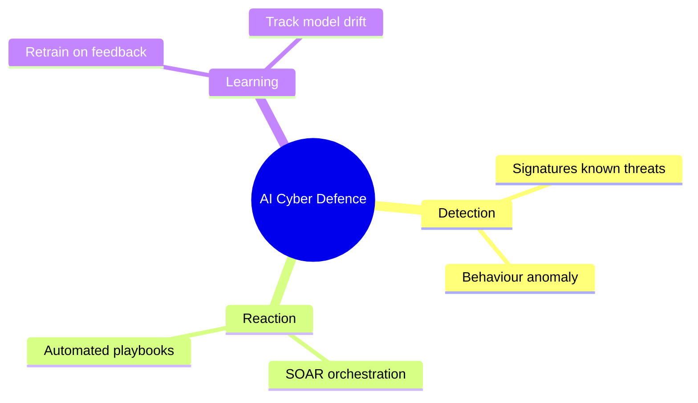
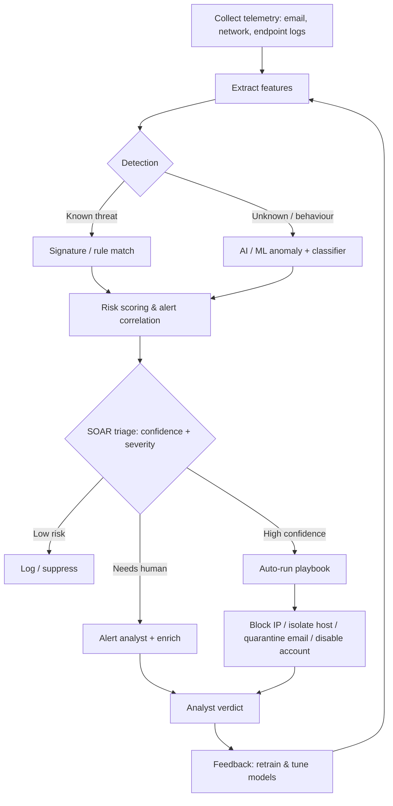
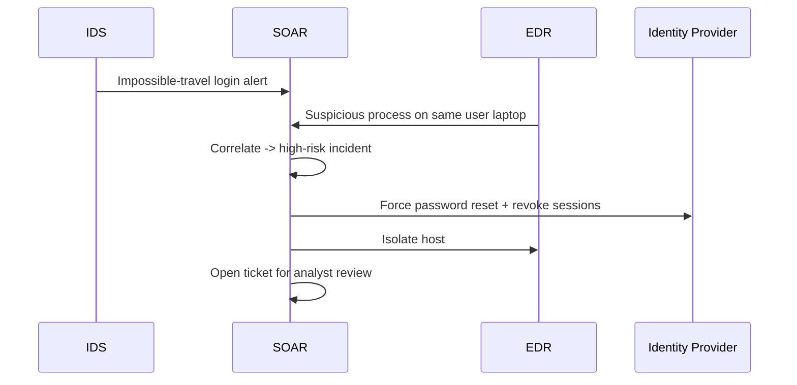

# AI in Cyber Defence Mechanisms

> **What you'll learn:** how AI powers modern *defensive* security — automated incident response (SOAR), smarter firewalls and IDS/IPS, AI-driven endpoint protection (EDR), next-gen antivirus, and phishing detection — and how to build a tiny AI defender yourself.
> **Prerequisites:** basic networking (IP, ports, HTTP), what malware and phishing are, comfort reading a little Python, and a high-level idea of machine learning (a model that learns patterns from data).

| Course | Course code | Module | Level |
|---|---|---|---|
| AI for Cyber Security | SKL-AICS-720 | Module 03 — AI in Cyber Defence Mechanisms | Applied / Machine-Learning |

---

## 1. In Plain English

Picture a large office building with two kinds of security guard plus a dispatcher.

- 📋 **The rulebook guard (signatures).** Works from an exact list: *"No badge at door 4 → stop them."* Fast and precise, but only catches things someone wrote down in advance. A clever intruder doing something *not* in the book walks right through.
- 👁️ **The experienced guard (AI / behaviour).** Has watched the building for years and has a *feel* for normal. Notices: *"It's 3 a.m., this person works in accounting, and they're copying the entire engineering archive — weird,"* even though no rule says so. AI learns the shape of "normal" from huge amounts of past data, then flags what doesn't fit.
- 📞 **The dispatcher (SOAR).** When an alarm fires, it instantly isolates the affected room, calls the right people, pulls the camera footage, and writes the report — in seconds, so no human has to phone every department by hand.

> 🔑 **Key idea:** AI in cyber defence = smarter **detection** (the experienced guard) + faster **reaction** (the dispatcher) + protection that **keeps learning** instead of waiting for a human to update a rulebook.



---

## 2. Core Concepts

### 🧬 Signatures vs. Behaviour (the foundational idea)

A **signature** is a fixed fingerprint of a *known* threat — an exact byte pattern inside a known virus, or a known-bad IP. Fast, almost no false alarms, but blind to anything new (a "zero-day"). **Behavioural / anomaly detection** instead learns what *normal* looks like and flags deviations — catching novel threats at the cost of more false alarms. AI lives mostly on the behavioural side, and the two are layered together.

| Aspect | 📋 Signature-based | 👁️ Behavioural / AI |
|---|---|---|
| Detects | Known threats | Known **and** novel threats |
| Speed | Very fast (lookup) | Slower (scoring) |
| False positives | Very low | Higher |
| Zero-day coverage | ❌ None | ✅ Possible |
| Upkeep | Constant signature updates | Periodic retraining |

> 💡 **Tip:** They're complementary, not rivals. Production stacks run both — signatures catch the obvious instantly, AI catches the unseen.

### 🤖 Machine Learning, briefly

| Type | What it does | Used for |
|---|---|---|
| **Supervised** | Trains on *labelled* examples ("this email is phishing, this one is safe") to predict labels for new data | Spam/phishing detection, malware classification |
| **Unsupervised / anomaly** | No labels — learns the *normal* distribution and flags outliers | Network-traffic anomalies, insider-threat detection |

- **Features:** the measurable inputs a model learns from. For a URL: its length, number of dots, whether it uses a raw IP instead of a domain, presence of words like "login" or "verify".

### 📞 Automated Incident Response (SOAR)

**SOAR** = Security Orchestration, Automation and Response — the "dispatcher" layer on top of detection tools. Three jobs:

- **Orchestration** — connect many tools (firewall, EDR, email gateway, ticketing) so they talk to each other.
- **Automation** — run repeatable actions without a human (disable a user, isolate a host, block an IP).
- **Response** — execute a **playbook**: a predefined, step-by-step recipe for handling a type of incident.

AI's role in SOAR is mainly **triage and enrichment**: scoring how serious an alert is, grouping related alerts into a single "incident", and recommending (or auto-running) the right playbook so analysts aren't drowned in noise.

### 🌐 AI in Firewalls and IDS/IPS

- A **firewall** decides which traffic is allowed. A **Next-Generation Firewall (NGFW)** also inspects the *content* and *application* of traffic, not just ports.
- An **IDS** (Intrusion Detection System) watches traffic and *alerts*. An **IPS** (Intrusion Prevention System) sits inline and can *block*.
- AI learns a baseline of normal network behaviour and flags anomalies — unusual data volumes, rare protocols, beaconing to a command-and-control server — that signature rules miss.

### 💻 AI-Based Endpoint Protection (EDR)

**EDR** = Endpoint Detection and Response. An "endpoint" is any device — laptop, server, phone. EDR agents continuously record what processes do (files opened, registry changes, network connections) and use behavioural models to spot attack patterns like ransomware encrypting files en masse, then **respond** by killing the process or isolating the machine. **XDR** extends this across endpoints, network, email, and cloud.

### 🦠 AI in Antivirus and Anti-Malware (NGAV)

Traditional antivirus relies on signatures. **Next-Generation Antivirus (NGAV)** adds ML classifiers that examine a file's structure and behaviour to decide if it's malicious *before* a signature exists. Two key techniques:

- **Static analysis** — examine the file *without* running it.
- **Dynamic analysis / sandboxing** — run it in a safe, isolated environment and watch what it does.

### 🎣 AI in Phishing Detection

Phishing tricks people into revealing credentials or running malware, usually via email or fake websites. AI models analyse the email's text (**NLP** — Natural Language Processing), sender reputation, embedded URLs, and look-alike domains to predict whether a message is phishing — catching new campaigns that keyword blocklists miss.

> 🖼️ *Suggested image: a side-by-side of a legitimate bank login page vs. a phishing clone, with the look-alike domain in the address bar highlighted.*

---

## 3. How It Works (Step by Step)

A unified, AI-assisted defence pipeline flows like this:

| # | Stage | What happens |
|---|---|---|
| 1 | **Collect** | Agents and sensors gather telemetry: emails, network flows, endpoint process events, logs |
| 2 | **Extract features** | Raw data → numeric features (URL length, process-tree shape, bytes transferred) |
| 3 | **Detect** | Two layers run in parallel — *signature/rule* (known threats, instant) and *AI/behavioural* (anomaly + classifier scoring) |
| 4 | **Score & correlate** | Alerts get a risk score; related alerts group into one incident to cut noise |
| 5 | **Triage (SOAR)** | Decide: ignore, alert a human, or auto-respond — based on confidence + severity |
| 6 | **Respond** | A playbook runs: block IP, isolate endpoint, quarantine email, disable account |
| 7 | **Learn / feedback** | Analyst verdicts (true vs. false positive) retrain and tune the models |



> 💡 **Tip:** The feedback loop (step 7 → step 2) is what keeps the system from going stale as attackers change tactics.

---

## 4. Real-World Examples

**1. 🦠 Ransomware stopped by EDR behavioural detection.**
An employee opens a malicious attachment. A new process rapidly reads and rewrites many files with high entropy (a hallmark of encryption). No signature exists for this brand-new ransomware, but the EDR's behavioural model recognises the *pattern* — mass file modification plus deletion of shadow copies — kills the process, and isolates the host. Damage: a few files instead of the whole share.

**2. 🎣 Phishing campaign caught by NLP.**
A wave of emails impersonates a payroll provider via a look-alike domain like `payroll-secure-update[.]com`, urging urgency ("verify within 24 hours"). A keyword filter misses the slightly reworded text, but an NLP model flags the combination of urgency language + newly-registered look-alike domain + credential-harvesting link, and quarantines the messages before users see them.

**3. 📞 SOAR auto-containment of a compromised account.**
An IDS flags impossible-travel logins (one user, two countries, minutes apart). SOAR correlates this with an EDR alert on the same laptop, scores the incident high, and runs a playbook: force password reset, revoke active sessions, open a ticket — all within seconds, before an analyst reads the alert.



---

## 5. Tools of the Trade

> ⚠️ **Warning:** The commands below are illustrative of typical, documented usage. Always confirm exact flags against the official documentation of the version you run.

| Tool | Category | Role |
|---|---|---|
| **Suricata** | IDS/IPS | Rule-based traffic inspection; runs inline to block |
| **Zeek** | Network monitor | Turns raw traffic into structured logs (great ML features) |
| **YARA** | Malware matching | Analyst-written rules for malware families |
| **ClamAV** | Antivirus | Signature scanning; pairs with ML/NGAV layers |
| **Shuffle / TheHive + Cortex** | SOAR | Connect tools, run automated playbooks |

**Suricata — open-source IDS/IPS.**

```bash
# Run Suricata on a capture file using a ruleset, writing logs to ./logs
suricata -r traffic.pcap -S /etc/suricata/rules/suricata.rules -l ./logs
```
Reads a packet capture (`-r`), applies a rule file (`-S`), writes alerts to the log dir (`-l`). In production it runs live on an interface (`-i eth0`).

**Zeek — network security monitor.**

```bash
# Analyse a pcap and generate structured logs (conn.log, dns.log, http.log, ...)
zeek -r traffic.pcap
```
Zeek's logs are excellent *feature sources* for anomaly models because they summarise behaviour rather than raw bytes.

**YARA — pattern matching for malware.**

```bash
# Scan a directory recursively against a set of YARA rules
yara -r malware_rules.yar /path/to/samples/
```
The `-r` flag recurses into subdirectories; each match prints the rule name and file. Complements ML classifiers.

**ClamAV — open-source antivirus engine.**

```bash
# Update signatures, then recursively scan a folder
freshclam
clamscan -r --infected /home/user/Downloads
```
`freshclam` updates the signature database; `clamscan -r --infected` scans recursively and prints only infected files.

**Open-source SOAR / playbooks (e.g., Shuffle, TheHive + Cortex).** Actions are usually defined in a UI or workflow files; conceptually a playbook step looks like:

```yaml
# Pseudocode playbook step: isolate a host when EDR confidence is high
- name: isolate-host
  if: edr.alert.confidence >= 0.9
  action: edr.isolate
  args:
    host_id: "{{ alert.host_id }}"
  then: notify_analyst
```
*If* the EDR alert confidence is at least 0.9, isolate the host and notify an analyst. SOAR's value: encode such decisions once and run them consistently.

> 🖼️ *Suggested image: screenshot of a SOAR playbook canvas (e.g., Shuffle) showing nodes wired together — trigger → enrich → decision → action.*

---

## 6. Hands-On Lab (Authorized / Lab-Only)

> ⚠️ **Warning:** Use only on your own machine / an authorised lab and public datasets. Never test detection or evasion against systems you do not own or have written permission to assess.

We'll train a small **phishing-URL classifier** — a supervised model that predicts whether a URL is phishing from simple structural features. This mirrors a real feature used inside email gateways and NGFWs.

**Libraries needed:**
```bash
pip install pandas scikit-learn
```

**Suitable public datasets:** the **"Phishing Websites" dataset (UCI ML Repository)** or **PhishTank**-derived URL lists for raw URLs. For network-anomaly equivalents, **NSL-KDD** or **CICIDS2017**. Below we engineer features from raw URLs so the lab is self-contained — just swap the sample URLs for a column from your dataset.

```python
import pandas as pd
from urllib.parse import urlparse
from sklearn.ensemble import RandomForestClassifier
from sklearn.model_selection import train_test_split
from sklearn.metrics import classification_report

# 1) Tiny illustrative dataset. In practice, load thousands of rows:
#    df = pd.read_csv("phishing_urls.csv")  # columns: url, label (1=phishing, 0=safe)
data = [
    ("https://www.paypal.com/signin", 0),
    ("http://192.168.10.5/login-verify-account", 1),
    ("https://accounts.google.com", 0),
    ("http://paypal-secure-update.com/verify", 1),
    ("https://github.com/login", 0),
    ("http://free-gift-card-login.net/confirm", 1),
    ("https://www.amazon.com/ap/signin", 0),
    ("http://bank0famerica-update.com/account", 1),
]
df = pd.DataFrame(data, columns=["url", "label"])

# 2) Feature engineering: turn each URL into numbers the model can learn from.
def extract_features(url: str) -> dict:
    parsed = urlparse(url)
    host = parsed.netloc
    return {
        "url_length": len(url),
        "num_dots": url.count("."),
        "num_hyphens": url.count("-"),
        "has_ip": int(host.replace(".", "").isdigit()),   # IP instead of domain?
        "uses_https": int(parsed.scheme == "https"),
        "has_login_word": int(any(w in url.lower()
                                  for w in ["login", "verify", "secure", "update", "confirm"])),
    }

features = pd.DataFrame([extract_features(u) for u in df["url"]])
X = features
y = df["label"]

# 3) Split into training and test sets so we can measure honest performance.
X_train, X_test, y_train, y_test = train_test_split(
    X, y, test_size=0.25, random_state=42
)

# 4) Train a Random Forest (an ensemble of decision trees — robust, easy to start with).
model = RandomForestClassifier(n_estimators=100, random_state=42)
model.fit(X_train, y_train)

# 5) Evaluate on data the model has never seen.
predictions = model.predict(X_test)
print(classification_report(y_test, predictions, zero_division=0))

# 6) Score a brand-new URL.
new_url = "http://secure-paypal-login.verify-account.com"
score = model.predict_proba(pd.DataFrame([extract_features(new_url)]))[0][1]
print(f"Phishing probability for new URL: {score:.2f}")
```

**What the code does, for a beginner:**

| Step | What it does | Why it matters |
|---|---|---|
| 1 | Load data (URL + label: 1=phishing, 0=safe) | Toy list runs instantly; swap a real CSV for meaningful results |
| 2 | **Feature engineering** — URL → numbers (length, dots, hyphens, raw IP?, HTTPS?, suspicious words) | The most important security-ML skill; the model sees only these numbers, never raw text |
| 3 | Split data so we **test on unseen examples** | Otherwise we'd fool ourselves about accuracy |
| 4 | Train a **Random Forest** (many decision trees) | Good default; resists overfitting |
| 5 | Print precision / recall / F1 | Shows how often it's right and how many phish it catches vs. misses |
| 6 | Score an unseen URL → probability | Exactly like a real gateway producing a risk score |

> 💡 **Tip:** With a tiny dataset the numbers aren't meaningful — the point is the *workflow*: collect → feature-engineer → split → train → evaluate → score. Scale up with a real dataset (UCI Phishing Websites, PhishTank) and you have the core of a production detector.

> 🖼️ *Suggested image: terminal screenshot of the `classification_report` output and the final phishing-probability line.*

---

## 7. Countermeasures & Defenses

Deploying AI defences *well* — and protecting the AI itself — matters as much as turning it on.

**🔍 Detection (deploy robustly)**
- Layer signatures **and** behavioural ML so each covers the other's blind spots (defence in depth).
- Feed models rich, structured telemetry (Zeek logs, EDR process trees) rather than raw bytes — better features beat fancier models.
- Continuously retrain on fresh, labelled data so models track changing attacker behaviour (combat "model drift").

**🛡️ Prevention / hardening**
- Tune thresholds to balance false positives (alert fatigue) against false negatives (missed attacks); track precision and recall, not just accuracy.
- Keep a human in the loop for high-impact automated actions (e.g., require approval before disabling executives' accounts or quarantining production servers).
- Validate and sanitise all data feeding the model — poisoned training data corrupts the detector.

**🎭 Guarding against adversarial evasion (AI-specific threats)**

| Threat | What the attacker does | Mitigation |
|---|---|---|
| **Evasion** | Tweak malware/URLs slightly to slip past a classifier | Adversarial training (include perturbed examples); ensemble models harder to fool at once |
| **Data poisoning** | Inject mislabelled samples into training data | Provenance tracking, anomaly checks on training data, limit who can label |
| **Model theft / inversion** | Probe the model to copy or reverse it | Rate-limit and monitor queries; avoid exposing raw confidence scores publicly |

**🚨 Mitigation / response**
- Pre-build SOAR playbooks for common incidents (phishing, ransomware, account compromise) and test them regularly.
- Log every automated action for audit and rollback.
- Run tabletop and purple-team exercises so humans trust and understand the automation.

---

## 8. Key Terms

| Term | Meaning |
|---|---|
| **SOAR** | Security Orchestration, Automation and Response; connects tools and runs automated incident playbooks |
| **Playbook** | A predefined, step-by-step recipe for responding to a specific incident type |
| **IDS / IPS** | Intrusion Detection System (alerts) / Intrusion Prevention System (blocks inline) |
| **NGFW** | Next-Generation Firewall; inspects application/content, not just ports |
| **EDR / XDR** | Endpoint Detection and Response; XDR extends correlation across endpoints, network, email, cloud |
| **NGAV** | Next-Generation Antivirus; adds ML-based detection to signature scanning |
| **Signature** | A fixed fingerprint of a known threat used for exact matching |
| **Anomaly detection** | Flagging activity that deviates from a learned baseline of "normal" |
| **Supervised learning** | Training a model on labelled examples to predict labels for new data |
| **Feature engineering** | Converting raw data into numeric signals a model can learn from |
| **Sandboxing** | Running a suspicious file in an isolated environment to observe its behaviour safely |
| **NLP** | Natural Language Processing; lets models analyse human-language text (e.g., phishing emails) |
| **Adversarial evasion** | Crafting inputs designed to fool an ML detector |
| **Data poisoning** | Corrupting a model's training data to weaken or bias it |
| **Model drift** | Degradation of model accuracy over time as real-world data shifts |
| **False positive / negative** | A benign item flagged as malicious / a malicious item missed |

---

## 9. Summary & Takeaways

- AI defence adds **behavioural intelligence** on top of fast, exact **signatures** — the two layers together cover more than either alone.
- **SOAR** is the automation layer: it correlates alerts, triages by risk, and runs playbooks so humans focus on real incidents instead of noise.
- **AI in firewalls and IDS/IPS** learns a network baseline and catches anomalies (beaconing, unusual volumes) that static rules miss.
- **EDR/XDR** continuously watches endpoint behaviour and can autonomously kill processes or isolate machines — crucial against fileless and zero-day attacks.
- **NGAV** uses ML plus static and dynamic (sandbox) analysis to flag malware before a signature exists.
- **Phishing detection** uses NLP, sender reputation, and URL features to catch reworded, never-seen-before campaigns.
- **Feature engineering and good data** matter more than model complexity; always test on held-out data and track precision/recall.
- AI defenders are themselves targets — defend against **evasion, poisoning, and drift**, and keep humans in the loop for high-impact actions.

> 🔑 **Key idea:** Defence in depth for AI security means *layered detection* (signatures + behaviour), *automated but supervised response* (SOAR with humans on high-impact actions), and *protecting the model itself* (against evasion, poisoning, drift).

**Further reading:** NIST SP 800-61 (Computer Security Incident Handling Guide) and the NIST AI Risk Management Framework (AI RMF 100-1); MITRE ATT&CK (adversary techniques) and MITRE ATLAS (adversarial threats to AI systems); OWASP Top 10 for Large Language Model Applications; SANS Institute incident-response resources.
