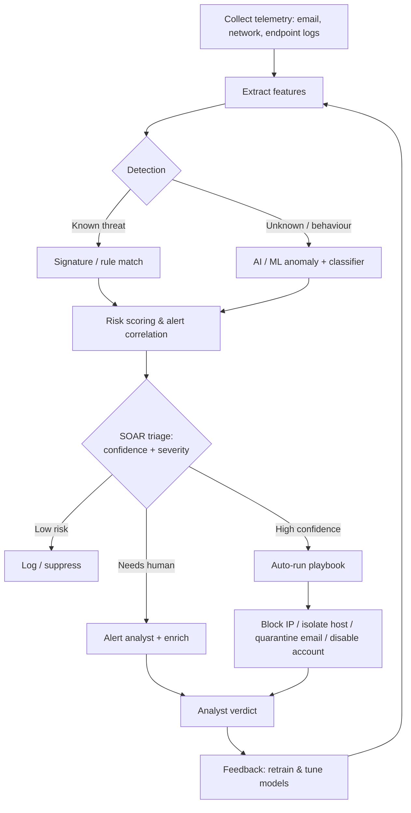

# AI in Cyber Defence Mechanisms

> **What you'll learn:** how artificial intelligence powers modern defensive security — automated incident response (SOAR), smarter firewalls and IDS/IPS, AI-driven endpoint protection (EDR), next-gen antivirus, and phishing detection — and how to build a tiny AI defender yourself.
> **Prerequisites:** basic networking (IP, ports, HTTP), what malware and phishing are, comfort reading a little Python, and a high-level idea of what machine learning is (a model that learns patterns from data).

| Course | Course code | Module | Level |
|---|---|---|---|
| AI for Cyber Security | SKL-AICS-720 | Module 03 — AI in Cyber Defence Mechanisms | Applied / Machine-Learning |

---

## 1. In Plain English

Imagine a large office building protected by security guards. The classic way of guarding works from a *rulebook*: "If someone without a badge tries door 4, stop them." That rulebook is exact and fast, but it only catches things someone thought of in advance. A clever intruder who does something *not* in the book walks right through.

AI-based cyber defence adds a second kind of guard: one who has watched the building for years and has a *feel* for what normal looks like. This guard notices, "It's 3 a.m., this person normally works in accounting, and they're suddenly copying the entire engineering archive — that's weird," even though no rule literally says so. AI learns the shape of "normal" from huge amounts of past data, then flags things that don't fit, or recognises bad things it has seen variations of before.

The third piece is the *dispatcher*. When an alarm goes off, you don't want a human to manually phone every department. A good dispatcher instantly isolates the affected room, calls the right people, pulls up the camera footage, and writes the report — all in seconds. In security, that automated dispatcher is called **SOAR** (Security Orchestration, Automation and Response).

Put together, AI in cyber defence means: smarter detection (the experienced guard), faster reaction (the dispatcher), and protection that keeps learning instead of waiting for someone to update a rulebook. The rest of this note breaks each of these down.

---

## 2. Core Concepts

### Signatures vs. Behaviour (the foundational idea)

A **signature** is a fixed fingerprint of a known threat — for example, the exact byte pattern inside a known virus, or a known-bad IP address. Signature matching is fast and produces almost no false alarms, but it is blind to anything new (a "zero-day").

**Behavioural / anomaly detection** instead learns what *normal* activity looks like and flags deviations. AI is mostly used here. It catches novel threats but can raise more false alarms, so the two approaches are layered together.

### Machine Learning, briefly

- **Supervised learning:** the model is trained on labelled examples ("this email is phishing, this one is safe") and learns to predict the label for new data. Used heavily in spam/phishing detection and malware classification.
- **Unsupervised / anomaly detection:** no labels; the model learns the normal distribution of data and flags outliers. Used for network-traffic anomalies and insider-threat detection.
- **Features:** the measurable inputs a model learns from — e.g., for a URL: its length, number of dots, whether it uses an IP address instead of a domain, presence of words like "login" or "verify".

### Automated Incident Response (SOAR)

**SOAR** = Security Orchestration, Automation and Response. It is the "dispatcher" layer that sits on top of detection tools. Three jobs:

- **Orchestration** — connect many tools (firewall, EDR, email gateway, ticketing) so they can talk to each other.
- **Automation** — run repeatable actions without a human (e.g., disable a user, isolate a host, block an IP).
- **Response** — execute a **playbook**: a predefined, step-by-step recipe for handling a type of incident.

AI's role in SOAR is mainly **triage and enrichment**: scoring how serious an alert is, grouping related alerts into a single "incident", and recommending (or auto-running) the right playbook so analysts aren't drowned in noise.

### AI in Firewalls and IDS/IPS

- A **firewall** decides which network traffic is allowed. A **Next-Generation Firewall (NGFW)** also inspects the *content* and *application* of traffic, not just ports.
- An **IDS** (Intrusion Detection System) watches traffic and *alerts* on suspicious activity. An **IPS** (Intrusion Prevention System) sits inline and can *block* it.
- AI here learns a baseline of normal network behaviour and flags anomalies (unusual data volumes, rare protocols, beaconing to a command-and-control server) that signature rules would miss.

### AI-Based Endpoint Protection (EDR)

**EDR** = Endpoint Detection and Response. An "endpoint" is any device — laptop, server, phone. EDR agents continuously record what processes do (files opened, registry changes, network connections) and use behavioural models to spot attack patterns such as ransomware encrypting files en masse, then **respond** by killing the process or isolating the machine. **XDR** extends this across endpoints, network, email, and cloud.

### AI in Antivirus and Anti-Malware (NGAV)

Traditional antivirus relies on signatures. **Next-Generation Antivirus (NGAV)** adds machine-learning classifiers that examine a file's structure and behaviour to decide if it is malicious *before* a signature exists. Techniques include **static analysis** (examining the file without running it) and **dynamic analysis / sandboxing** (running it in a safe isolated environment and watching what it does).

### AI in Phishing Detection

Phishing tricks people into revealing credentials or running malware, usually via email or fake websites. AI models analyse the email's text (**NLP** — Natural Language Processing), sender reputation, embedded URLs, and look-alike domains to predict whether a message is phishing — catching new campaigns that keyword blocklists miss.

---

## 3. How It Works (Step by Step)

A unified, AI-assisted defence pipeline typically flows like this:

1. **Collect** — agents and sensors gather telemetry: emails, network flows, endpoint process events, logs.
2. **Extract features** — raw data is turned into numeric features a model can use (URL length, process tree shape, bytes transferred, etc.).
3. **Detect** — two layers run in parallel:
   - *Signature/rule layer* catches known threats instantly.
   - *AI/behavioural layer* scores how anomalous or malicious the activity is.
4. **Score & correlate** — alerts are assigned a risk score; related alerts are grouped into a single incident to cut noise.
5. **Triage (SOAR)** — the system decides: ignore, alert a human, or auto-respond, based on confidence and severity.
6. **Respond** — a playbook executes: block the IP at the firewall/IPS, isolate the endpoint via EDR, quarantine the email, disable the account.
7. **Learn / feedback** — analyst verdicts (true vs. false positive) are fed back to retrain and tune the models.



---

## 4. Real-World Examples

**1. Ransomware stopped by EDR behavioural detection.**
An employee opens a malicious attachment. A new process starts rapidly reading and rewriting many files with high entropy (a hallmark of encryption). No signature exists for this brand-new ransomware, but the EDR's behavioural model recognises the *pattern* of mass file modification plus deletion of shadow copies, kills the process, and isolates the host from the network — limiting damage to a few files instead of the whole share.

**2. Phishing campaign caught by NLP.**
A wave of emails impersonates a payroll provider using a look-alike domain like `payroll-secure-update[.]com`. The subject and body urge urgency ("verify within 24 hours"). A signature/keyword filter misses the slightly reworded text, but an NLP model flags the combination of urgency language, a newly-registered look-alike domain, and a credential-harvesting link, and quarantines the messages before users see them.

**3. SOAR auto-containment of a compromised account.**
An IDS flags impossible-travel logins (a user signs in from two countries minutes apart). The SOAR platform correlates this with an EDR alert on the same user's laptop, scores the incident as high, and automatically runs a playbook: it forces a password reset, revokes active sessions, and opens a ticket — all within seconds, before an analyst even reads the alert.

---

## 5. Tools of the Trade

> The commands below are illustrative of typical, documented usage. Always confirm exact flags against the official documentation of the version you run.

**Suricata — open-source IDS/IPS.** Inspects network traffic against rules and can run inline to block.

```bash
# Run Suricata on a capture file using a ruleset, writing logs to ./logs
suricata -r traffic.pcap -S /etc/suricata/rules/suricata.rules -l ./logs
```
This reads a packet capture (`-r`), applies a rule file (`-S`), and writes alerts to the log directory (`-l`). In production it runs live on an interface (`-i eth0`).

**Zeek — network security monitor.** Turns raw traffic into rich, structured logs (connections, DNS, HTTP) that feed ML pipelines.

```bash
# Analyse a pcap and generate structured logs (conn.log, dns.log, http.log, ...)
zeek -r traffic.pcap
```
Zeek's logs are excellent *feature sources* for anomaly-detection models because they summarise behaviour rather than raw bytes.

**YARA — pattern matching for malware.** Lets analysts write rules describing malware families; complements ML classifiers.

```bash
# Scan a directory recursively against a set of YARA rules
yara -r malware_rules.yar /path/to/samples/
```
The `-r` flag recurses into subdirectories; each match prints the rule name and file.

**ClamAV — open-source antivirus engine.** Signature-based scanning, often paired with ML/NGAV layers.

```bash
# Update signatures, then recursively scan a folder
freshclam
clamscan -r --infected /home/user/Downloads
```
`freshclam` updates the signature database; `clamscan -r --infected` scans recursively and prints only infected files.

**Open-source SOAR / playbooks (e.g., Shuffle, TheHive + Cortex).** Connect detection tools and run automated playbooks. SOAR actions are usually defined in a UI or as workflow files; conceptually a playbook step looks like:

```yaml
# Pseudocode playbook step: isolate a host when EDR confidence is high
- name: isolate-host
  if: edr.alert.confidence >= 0.9
  action: edr.isolate
  args:
    host_id: "{{ alert.host_id }}"
  then: notify_analyst
```
This says: *if* the EDR alert confidence is at least 0.9, isolate the host and then notify an analyst. SOAR's value is encoding such decisions once and running them consistently.

---

## 6. Hands-On Lab (Authorized / Lab-Only)

> **Use only on your own machine / an authorised lab and public datasets. Never test detection or evasion against systems you do not own or have written permission to assess.**

We'll train a small **phishing-URL classifier** — a supervised model that predicts whether a URL is phishing based on simple structural features. This mirrors a real feature used inside email gateways and NGFWs.

**Libraries needed:**
```bash
pip install pandas scikit-learn
```

**Suitable public dataset:** the **"Phishing Websites" dataset (UCI Machine Learning Repository)**, or **PhishTank**-derived URL lists for raw URLs. For network anomaly equivalents you could instead use **NSL-KDD** or **CICIDS2017**. Below we engineer features from raw URLs so the lab is self-contained and dataset-agnostic — just replace the sample URLs with a column loaded from your dataset.

```python
import pandas as pd
from urllib.parse import urlparse
from sklearn.ensemble import RandomForestClassifier
from sklearn.model_selection import train_test_split
from sklearn.metrics import classification_report

# 1) Tiny illustrative dataset. In practice, load thousands of rows:
#    df = pd.read_csv("phishing_urls.csv")  # columns: url, label (1=phishing, 0=safe)
data = [
    ("https://www.paypal.com/signin", 0),
    ("http://192.168.10.5/login-verify-account", 1),
    ("https://accounts.google.com", 0),
    ("http://paypal-secure-update.com/verify", 1),
    ("https://github.com/login", 0),
    ("http://free-gift-card-login.net/confirm", 1),
    ("https://www.amazon.com/ap/signin", 0),
    ("http://bank0famerica-update.com/account", 1),
]
df = pd.DataFrame(data, columns=["url", "label"])

# 2) Feature engineering: turn each URL into numbers the model can learn from.
def extract_features(url: str) -> dict:
    parsed = urlparse(url)
    host = parsed.netloc
    return {
        "url_length": len(url),
        "num_dots": url.count("."),
        "num_hyphens": url.count("-"),
        "has_ip": int(host.replace(".", "").isdigit()),   # IP instead of domain?
        "uses_https": int(parsed.scheme == "https"),
        "has_login_word": int(any(w in url.lower()
                                  for w in ["login", "verify", "secure", "update", "confirm"])),
    }

features = pd.DataFrame([extract_features(u) for u in df["url"]])
X = features
y = df["label"]

# 3) Split into training and test sets so we can measure honest performance.
X_train, X_test, y_train, y_test = train_test_split(
    X, y, test_size=0.25, random_state=42
)

# 4) Train a Random Forest (an ensemble of decision trees — robust, easy to start with).
model = RandomForestClassifier(n_estimators=100, random_state=42)
model.fit(X_train, y_train)

# 5) Evaluate on data the model has never seen.
predictions = model.predict(X_test)
print(classification_report(y_test, predictions, zero_division=0))

# 6) Score a brand-new URL.
new_url = "http://secure-paypal-login.verify-account.com"
score = model.predict_proba(pd.DataFrame([extract_features(new_url)]))[0][1]
print(f"Phishing probability for new URL: {score:.2f}")
```

**What the code does, for a beginner:**
- **Step 1** loads data. Each row is a URL and a label (1 = phishing, 0 = safe). The toy list is tiny so it runs instantly; swap in a real CSV for meaningful results.
- **Step 2** is **feature engineering** — the most important security-ML skill. We convert each URL into measurable signals (length, dots, hyphens, whether it uses a raw IP, HTTPS, suspicious words). The model never sees the raw text, only these numbers.
- **Step 3** splits data so we *test on examples the model didn't train on* — otherwise we'd be fooling ourselves.
- **Step 4** trains a **Random Forest**, a good default classifier that combines many decision trees and resists overfitting.
- **Step 5** prints precision/recall/F1 — telling us how often the model is right and how many phishing URLs it catches versus misses.
- **Step 6** scores an unseen URL and returns a probability, exactly like a real gateway producing a risk score.

With a tiny dataset the numbers aren't meaningful — the point is the *workflow*: collect → feature-engineer → split → train → evaluate → score. Scale it up with a real dataset (UCI Phishing Websites, PhishTank) and you have the core of a production detector.

---

## 7. Countermeasures & Defenses

Deploying AI defences *well* — and protecting the AI itself — matters as much as turning it on.

**Detection (deploy robustly)**
- Layer signatures **and** behavioural ML so each covers the other's blind spots (defence in depth).
- Feed models rich, structured telemetry (Zeek logs, EDR process trees) rather than raw bytes — better features beat fancier models.
- Continuously retrain on fresh, labelled data so models track changing attacker behaviour (combat "model drift").

**Prevention / hardening**
- Tune thresholds to balance false positives (alert fatigue) against false negatives (missed attacks); track precision and recall, not just accuracy.
- Keep a human in the loop for high-impact automated actions (e.g., require approval before disabling executives' accounts or quarantining production servers).
- Validate and sanitise all data feeding the model — poisoned training data corrupts the detector.

**Guarding against adversarial evasion (AI-specific threats)**
- **Evasion attacks:** attackers tweak malware or URLs slightly to slip past a classifier. Mitigate with adversarial training (include perturbed examples in training data) and ensemble models that are harder to fool simultaneously.
- **Data poisoning:** attackers inject mislabelled samples into training data. Mitigate with provenance tracking, anomaly checks on training data, and limiting who can label data.
- **Model theft / inversion:** rate-limit and monitor model queries; don't expose raw confidence scores publicly when avoidable.

**Mitigation / response**
- Pre-build SOAR playbooks for common incidents (phishing, ransomware, account compromise) and test them regularly.
- Log every automated action for audit and rollback.
- Run tabletop and purple-team exercises so humans trust and understand the automation.

---

## 8. Key Terms

- **SOAR** — Security Orchestration, Automation and Response; platform that connects tools and runs automated incident playbooks.
- **Playbook** — a predefined, step-by-step recipe for responding to a specific type of incident.
- **IDS / IPS** — Intrusion Detection System (alerts) / Intrusion Prevention System (blocks inline).
- **NGFW** — Next-Generation Firewall; inspects application/content, not just ports.
- **EDR / XDR** — Endpoint Detection and Response; XDR extends correlation across endpoints, network, email, and cloud.
- **NGAV** — Next-Generation Antivirus; adds ML-based detection to signature scanning.
- **Signature** — a fixed fingerprint of a known threat used for exact matching.
- **Anomaly detection** — flagging activity that deviates from a learned baseline of "normal".
- **Supervised learning** — training a model on labelled examples to predict labels for new data.
- **Feature engineering** — converting raw data into numeric signals a model can learn from.
- **Sandboxing** — running a suspicious file in an isolated environment to observe its behaviour safely.
- **NLP** — Natural Language Processing; lets models analyse human-language text (e.g., phishing emails).
- **Adversarial evasion** — crafting inputs designed to fool a machine-learning detector.
- **Data poisoning** — corrupting a model's training data to weaken or bias it.
- **Model drift** — degradation of model accuracy over time as real-world data shifts.
- **False positive / false negative** — a benign item flagged as malicious / a malicious item missed.

---

## 9. Summary & Takeaways

- AI defence adds **behavioural intelligence** on top of fast, exact **signatures** — the two layers together cover more than either alone.
- **SOAR** is the automation layer: it correlates alerts, triages by risk, and runs playbooks so humans focus on real incidents instead of noise.
- **AI in firewalls and IDS/IPS** learns a network baseline and catches anomalies (beaconing, unusual volumes) that static rules miss.
- **EDR/XDR** continuously watches endpoint behaviour and can autonomously kill processes or isolate machines — crucial against fileless and zero-day attacks.
- **NGAV** uses ML plus static and dynamic (sandbox) analysis to flag malware before a signature exists.
- **Phishing detection** uses NLP, sender reputation, and URL features to catch reworded, never-seen-before campaigns.
- **Feature engineering and good data** matter more than model complexity; always test on held-out data and track precision/recall.
- AI defenders are themselves targets — defend against **evasion, poisoning, and drift**, and keep humans in the loop for high-impact actions.

**Further reading:** NIST SP 800-61 (Computer Security Incident Handling Guide) and the NIST AI Risk Management Framework (AI RMF 100-1); MITRE ATT&CK (adversary techniques) and MITRE ATLAS (adversarial threats to AI systems); OWASP Top 10 for Large Language Model Applications; SANS Institute incident-response resources.
