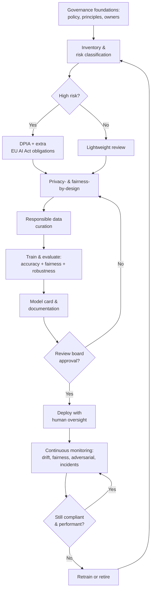

# Ethical & Legal Considerations in AI for Cyber Security

> **What you'll learn:** How to build, deploy, and govern AI systems for cyber security in ways that are ethical, privacy-respecting, fair, legally compliant, and robust against attack.
> **Prerequisites:** Basic understanding of machine learning concepts (training data, models, predictions), familiarity with core cyber-security ideas (threats, detection, controls), and comfort reading short Python snippets.

| Course | Course code | Module | Level |
|--------|-------------|--------|-------|
| AI for Cyber Security | SKL-AICS-720 | Module 04 — Ethical & Legal Considerations in AI for Cyber Security | Applied / Machine Learning |

---

## 1. In Plain English

Imagine you hire a brilliant but inexperienced new security guard. They can watch a thousand cameras at once and spot patterns no human could. But this guard learned everything from old footage of *your* building — so they trust people who "look like" the regulars and get suspicious of newcomers. They also have a perfect memory of everyone's face and habits, which is powerful but a little creepy. And a clever intruder who studies the guard's quirks can dress in a way that slips right past them.

An AI system in cyber security is exactly that guard. It is incredibly capable, but it inherits the blind spots of the data it learned from, it consumes huge amounts of personal information, and it can be tricked. **Ethics and law are the rulebook, training manual, and audit process** that keep this powerful guard honest, fair, respectful of privacy, and accountable.

This module is about that rulebook. We'll cover *ethics* (what is the right thing to do), *privacy and data protection* (how to handle people's data responsibly and legally), *bias and fairness* (making sure the AI doesn't systematically disadvantage groups of people), *legal compliance* (laws like GDPR and the EU AI Act), *governance* (the internal processes that keep everyone in line), and *adversarial machine learning* (how attackers fool AI, and how to defend).

The goal is not to slow you down. It's to make sure that when your AI flags a "threat," blocks a user, or scores someone as risky, that decision is justifiable, explainable, and defensible — to your customers, your regulators, and your conscience.

---

## 2. Core Concepts

### AI Ethics

**AI ethics** is the study and practice of building AI that aligns with human values and avoids harm. It is usually summarized by a handful of principles, drawn from frameworks like the [OECD AI Principles](https://oecd.ai) and the EU's *Ethics Guidelines for Trustworthy AI*:

- **Beneficence / non-maleficence** — the system should do good and avoid harm.
- **Autonomy** — humans should remain in control; AI augments, not replaces, human judgment for consequential decisions.
- **Justice / fairness** — benefits and burdens should be distributed fairly.
- **Transparency / explainability** — people affected by a decision should be able to understand how it was made.
- **Accountability** — a human or organization is responsible for outcomes.

In cyber security these are not abstract. If an AI intrusion-detection system blocks a hospital's network traffic during an emergency because it "looked anomalous," the ethical questions (who is harmed, who is accountable, was there human oversight) become very concrete.

### Privacy and Data Protection

**Privacy** is a person's right to control information about themselves. **Data protection** is the set of legal and technical safeguards that enforce that right.

AI security tools are data-hungry: they ingest logs, packet captures, emails, endpoint telemetry, and user behavior — much of which is **personal data** (anything that can identify a person) or even **special-category data** (health, biometrics, political views). Key data-protection principles, codified in laws like the EU GDPR, include:

- **Lawfulness, fairness, transparency** — you need a legal basis to process data and must tell people you're doing it.
- **Purpose limitation** — data collected for one purpose can't be silently reused for another.
- **Data minimization** — collect only what you need.
- **Storage limitation** — don't keep data longer than necessary.
- **Integrity and confidentiality (security)** — protect the data you hold.
- **Accountability** — you must be able to demonstrate compliance.

### Bias and Fairness in AI Systems

**Bias** is a systematic error that causes a model to treat some groups differently from others. **Fairness** is the goal of avoiding unjustified disparate treatment or impact.

Bias creeps in through:

- **Historical/data bias** — the training data reflects past inequities (e.g., a fraud model trained on data where a certain region was over-investigated).
- **Sampling bias** — some groups are under-represented in the data.
- **Label bias** — the "ground truth" labels were themselves produced by biased human decisions.
- **Proxy features** — a feature like ZIP code or device type acts as a stand-in for a protected attribute like race.

There is no single mathematical definition of fairness; several common metrics often *conflict* with each other:

| Fairness notion | Plain meaning |
|-----------------|---------------|
| **Demographic parity** | Positive prediction rate is equal across groups |
| **Equal opportunity** | True-positive rate is equal across groups |
| **Equalized odds** | Both true-positive and false-positive rates are equal across groups |
| **Predictive parity** | Precision (positive predictive value) is equal across groups |

A well-known mathematical result (the "impossibility of fairness") shows you generally **cannot satisfy all of these at once** — so teams must consciously choose which definition matters for their context.

### Legal Compliance and Standards

These are the externally binding (or widely adopted) rules you must follow.

- **GDPR (EU General Data Protection Regulation, 2016/679):** The benchmark privacy law. Notably, **Article 22** gives individuals the right not to be subject to a decision based *solely* on automated processing that produces legal or similarly significant effects, with safeguards including the right to human intervention and explanation. Penalties can reach up to **€20 million or 4% of global annual turnover**, whichever is higher.
- **EU AI Act (Regulation (EU) 2024/1689):** The first comprehensive AI law. It uses a **risk-based tiering**: *unacceptable risk* (banned, e.g., social scoring), *high risk* (strict obligations — risk management, data governance, logging, human oversight, accuracy/robustness), *limited risk* (transparency duties, e.g., disclosing you're talking to a bot), and *minimal risk*. Many cyber-security and biometric uses fall into high-risk categories.
- **NIST AI Risk Management Framework (AI RMF 1.0, 2023):** A voluntary US framework organized around four functions — **Govern, Map, Measure, Manage** — to identify and reduce AI risks across the lifecycle.
- **ISO/IEC 42001:2023:** An international standard for an **AI Management System (AIMS)** — the AI equivalent of ISO 27001 for security management.
- **Sector and regional laws:** HIPAA (US health data), the proposed/various US state privacy laws (e.g., CCPA/CPRA in California), and India's **Digital Personal Data Protection Act, 2023 (DPDP Act)**.

> Note: Always confirm current statutory text and effective dates — laws are amended and phased in over time (the EU AI Act, for instance, applies in staged deadlines).

### AI Governance and Policy

**AI governance** is the internal system of policies, roles, processes, and controls that ensures AI is built and used responsibly and in line with the law. Where ethics says "what's right" and law says "what's required," governance is "how we actually make it happen, every day, and prove it."

Typical elements: an AI policy, a risk-classification process, an **AI use-case inventory/register**, model documentation requirements, an approval/review board, monitoring and incident response, and clear accountability (often a designated owner per model).

### Adversarial Machine Learning

**Adversarial ML** is the field studying how attackers manipulate AI systems, and how to defend them. The main attack categories:

- **Evasion attacks (inference time):** Crafting inputs that fool a deployed model — e.g., subtly modifying malware so a classifier labels it "benign," or perturbing a phishing email to slip past a filter.
- **Poisoning attacks (training time):** Injecting malicious data into the training set so the model learns the wrong thing (including stealthy **backdoors/trojans** triggered by a specific pattern).
- **Model extraction/stealing:** Querying a model repeatedly to reconstruct a copy of it or its training data.
- **Membership inference / model inversion:** Determining whether a specific record was in the training data, or reconstructing sensitive training inputs — a **privacy** attack as much as a security one.

Adversarial ML is where security and ethics intersect most sharply: the same model that protects you is itself an attack surface.

---

## 3. How It Works (Step by Step)

Here's how a mature organization operationalizes responsible-AI governance for a security ML system, end to end:

1. **Establish governance foundations.** Write an AI policy, define principles, assign accountable owners, and stand up a review board. Map obligations to applicable laws (GDPR, EU AI Act, sector rules).
2. **Inventory and risk-classify the use case.** Register the proposed model (e.g., "ML phishing detector") and classify its risk tier. High-risk uses trigger extra obligations.
3. **Run a Data Protection Impact Assessment (DPIA).** Where processing is likely high-risk to individuals, GDPR Article 35 may require a DPIA before you build. Identify the legal basis, data flows, and minimization opportunities.
4. **Design for privacy and fairness up front.** Apply privacy-by-design (minimization, pseudonymization, differential privacy) and define which fairness metric matters for this use case.
5. **Curate data responsibly.** Document data sources, check for bias and representativeness, record provenance, and confirm consent/legal basis.
6. **Train and evaluate.** Measure not just accuracy but **fairness metrics** and **robustness** (including adversarial testing). Document everything in a **model card**.
7. **Independent review and approval.** The review board checks documentation, fairness, privacy, and security before deployment sign-off.
8. **Deploy with human oversight.** Ensure consequential automated decisions have a human-in-the-loop and an appeals/override path (supporting GDPR Article 22 rights).
9. **Monitor continuously.** Watch for data drift, fairness regression, adversarial activity, and incidents. Keep audit logs.
10. **Review, retire, or retrain.** Periodically reassess; decommission models that no longer meet standards.



---

## 4. Real-World Examples

**Example 1 — Bias in an automated decision system.** In 2018, Amazon scrapped an internal experimental recruiting tool after discovering it systematically down-ranked résumés containing the word "women's" (as in "women's chess club"). The model had learned from a decade of mostly-male technical résumés and encoded that historical imbalance. The lesson for security teams: a "risk-scoring" or "insider-threat" model trained on historical investigation data can similarly bake in and amplify past bias against particular groups.

**Example 2 — Privacy regulation enforcement.** Regulators have issued very large GDPR fines for unlawful data handling, including a **€1.2 billion fine against Meta in 2023** over EU–US data transfers. Facial-recognition vendor **Clearview AI** has been fined by multiple European data-protection authorities for scraping billions of face images without a lawful basis. For AI security tools that ingest personal data (emails, behavioral biometrics, location), the takeaway is that "we needed it for security" is not, by itself, a free pass — you still need a lawful basis, transparency, and minimization.

**Example 3 — Adversarial evasion of an ML classifier.** Researchers have repeatedly shown that small, carefully crafted perturbations fool ML models: adding an imperceptible noise pattern flips an image classifier's label, and physical stickers on a stop sign can cause a vision model to misread it. In the security domain, attackers append benign-looking bytes or restructure malware features to push a malware classifier's score below its detection threshold — an **evasion attack**. This is why adversarial robustness testing (not just clean-data accuracy) is essential before deployment.

---

## 5. Tools of the Trade

| Need | Tool / framework | What it does |
|------|------------------|--------------|
| Fairness measurement & mitigation | **IBM AI Fairness 360 (AIF360)**, **Fairlearn**, Google's What-If Tool | Compute fairness metrics and apply bias-mitigation algorithms |
| Privacy | **Differential privacy** libraries: Google/PyTorch **Opacus**, **TensorFlow Privacy**, **OpenDP** | Train models with mathematical privacy guarantees |
| Adversarial robustness | **Adversarial Robustness Toolbox (ART)**, **CleverHans**, **Foolbox** | Generate attacks and apply/evaluate defenses |
| Documentation & governance | **Model Cards**, **Datasheets for Datasets**, model registries (e.g., MLflow) | Standardized transparency and audit trails |
| Explainability | **SHAP**, **LIME** | Explain individual model predictions |

**Sample usage — Fairlearn to measure disparity:**

```python
# pip install fairlearn scikit-learn
from fairlearn.metrics import MetricFrame, demographic_parity_difference
from sklearn.metrics import accuracy_score

# y_true: actual labels, y_pred: model predictions,
# sensitive: the protected attribute per row (e.g., "group_A"/"group_B")
mf = MetricFrame(
    metrics=accuracy_score,
    y_true=y_true,
    y_pred=y_pred,
    sensitive_features=sensitive,
)

print("Accuracy per group:\n", mf.by_group)        # spot accuracy gaps
print("Overall accuracy:", mf.overall)

# A single number summarizing how unequal the positive-prediction rate is.
# 0.0 means perfect demographic parity; larger means more disparity.
dp_gap = demographic_parity_difference(
    y_true, y_pred, sensitive_features=sensitive
)
print("Demographic parity difference:", dp_gap)
```

**What this does:** `MetricFrame` slices any metric (here, accuracy) by a sensitive attribute so you can *see* whether the model performs worse for one group. `demographic_parity_difference` condenses the disparity in positive-prediction rates into one number you can track over time and set thresholds against in CI.

---

## 6. Hands-On Lab (Authorized / Lab-Only)

> **Reminder:** Run this only on your own machine or an authorized lab environment, using public datasets you are permitted to use.

In this lab we measure **fairness metrics** on a classic public dataset to see bias in action.

- **Dataset:** UCI **Adult / Census Income** dataset (predicts whether income > $50K). It's a standard fairness benchmark; `sex` is commonly used as the sensitive attribute. (Fetched here via OpenML, ID 1590.)
- **Libraries:** `scikit-learn`, `fairlearn`, `pandas`.

```python
# pip install scikit-learn fairlearn pandas
import pandas as pd
from sklearn.datasets import fetch_openml
from sklearn.model_selection import train_test_split
from sklearn.linear_model import LogisticRegression
from sklearn.preprocessing import OneHotEncoder
from sklearn.compose import ColumnTransformer
from sklearn.pipeline import Pipeline
from fairlearn.metrics import (
    MetricFrame, selection_rate,
    demographic_parity_difference, equalized_odds_difference,
)
from sklearn.metrics import accuracy_score

# 1. Load the public Adult dataset
data = fetch_openml("adult", version=2, as_frame=True)
X = data.data
y = (data.target == ">50K").astype(int)          # 1 = high income

sensitive = X["sex"]                              # protected attribute

# 2. Split, keeping the sensitive column aligned with the test set
X_tr, X_te, y_tr, y_te, s_tr, s_te = train_test_split(
    X, y, sensitive, test_size=0.3, random_state=42, stratify=y
)

# 3. Simple model: one-hot encode categoricals, then logistic regression
cat_cols = X.select_dtypes(include="category").columns.tolist()
num_cols = [c for c in X.columns if c not in cat_cols]
pre = ColumnTransformer([
    ("cat", OneHotEncoder(handle_unknown="ignore"), cat_cols),
    ("num", "passthrough", num_cols),
])
clf = Pipeline([("pre", pre),
                ("lr", LogisticRegression(max_iter=1000))])
clf.fit(X_tr, y_tr)
y_pred = clf.predict(X_te)

# 4. Measure performance AND fairness
mf = MetricFrame(
    metrics={"accuracy": accuracy_score, "selection_rate": selection_rate},
    y_true=y_te, y_pred=y_pred, sensitive_features=s_te,
)
print("Per-group metrics:\n", mf.by_group, "\n")
print("Demographic parity difference:",
      demographic_parity_difference(y_te, y_pred, sensitive_features=s_te))
print("Equalized odds difference:",
      equalized_odds_difference(y_te, y_pred, sensitive_features=s_te))
```

**Beginner walkthrough:**

1. **Load data (step 1).** We pull the Adult dataset and turn income into a binary target (`1` if > $50K). `sex` becomes our sensitive attribute.
2. **Split (step 2).** We split into train/test sets while keeping the sensitive column lined up with the test rows — essential, because fairness is measured on predictions for known groups.
3. **Train a model (step 3).** Nothing fancy: encode text categories into numbers and fit a logistic-regression classifier. The point isn't a great model — it's to expose disparity in an ordinary one.
4. **Measure fairness (step 4).** `MetricFrame` reports accuracy *and* selection rate (how often each group is predicted high-income) **per group**. The two difference metrics summarize the gap: you will typically see a noticeably higher selection rate for one group — that's measurable bias, even though we never told the model to discriminate. The numbers give you something concrete to monitor and to drive mitigation (e.g., Fairlearn's `ExponentiatedGradient` reductions).

The takeaway: bias is the default, not the exception. You only know it's there if you measure it.

---

## 7. Countermeasures & Defenses

**Privacy-by-design**
- Minimize: collect and retain only the fields the model truly needs.
- Pseudonymize/anonymize and aggregate where possible; separate identifiers from telemetry.
- Use **differential privacy** (e.g., Opacus) for training on sensitive data.
- Define and enforce retention limits; honor data-subject rights (access, erasure).

**Bias audits & fairness**
- Test representativeness of training data before training.
- Choose an explicit fairness definition appropriate to the use case and document the trade-off.
- Measure fairness metrics on every release; set thresholds and gate deployment on them.
- Apply mitigation (re-sampling, re-weighting, post-processing) and keep humans in the loop for consequential decisions.

**Adversarial hardening**
- Adversarial testing/red-teaming with ART, CleverHans, or Foolbox before deployment.
- **Adversarial training** (train on perturbed examples), input validation/sanitization, and ensemble or randomized defenses.
- Defend training-time risks: vet and provenance-track data to resist **poisoning**; rate-limit and monitor queries to resist **model extraction** and **membership inference**.
- Monitor for distribution drift and anomalous query patterns in production.

**Documentation & governance**
- Maintain **model cards** and **datasheets** for every model and dataset.
- Keep an AI use-case register and run **DPIAs** where required.
- Require independent review-board sign-off; log decisions and keep audit trails.
- Map controls to standards (NIST AI RMF, ISO/IEC 42001) and review periodically.

---

## 8. Key Terms

- **AI ethics** — Practice of building AI aligned with human values (fairness, transparency, accountability, non-maleficence).
- **Personal data** — Any information relating to an identified or identifiable person (GDPR definition).
- **DPIA (Data Protection Impact Assessment)** — A structured assessment of privacy risks required for high-risk processing under GDPR Article 35.
- **Bias** — A systematic error causing a model to treat groups differently in an unjustified way.
- **Demographic parity** — Fairness notion: equal positive-prediction rate across groups.
- **Equalized odds** — Fairness notion: equal true-positive and false-positive rates across groups.
- **GDPR** — EU General Data Protection Regulation; the benchmark data-protection law.
- **EU AI Act** — EU regulation governing AI on a risk-based tiering (unacceptable/high/limited/minimal risk).
- **NIST AI RMF** — Voluntary US framework (Govern, Map, Measure, Manage) for AI risk management.
- **ISO/IEC 42001** — International standard for an AI Management System.
- **AI governance** — Internal policies, roles, and processes that ensure responsible, compliant AI.
- **Adversarial ML** — Study of attacks on (and defenses for) machine-learning systems.
- **Evasion attack** — Manipulating inputs at inference time to fool a deployed model.
- **Poisoning attack** — Corrupting training data so the model learns the wrong thing.
- **Membership inference** — An attack that determines whether a record was in the training data.
- **Differential privacy** — A mathematical guarantee that a model's output reveals little about any single training record.
- **Model card** — A standardized document describing a model's purpose, performance, limitations, and fairness.

---

## 9. Summary & Takeaways

- AI security tools are powerful but inherit data blind spots, consume personal data, and are themselves attackable — ethics and law exist to keep them honest and accountable.
- Privacy and data protection require a lawful basis, minimization, transparency, and demonstrable accountability; GDPR Article 22 limits purely automated consequential decisions.
- Bias is the default, not the exception — you must *measure* fairness (multiple, often-conflicting metrics) and consciously choose which one fits the use case.
- Key standards to know: **GDPR**, the **EU AI Act** (risk-based tiers), **NIST AI RMF** (Govern/Map/Measure/Manage), and **ISO/IEC 42001**.
- Governance turns principles into practice: use-case inventories, DPIAs, model cards, review boards, human oversight, and continuous monitoring.
- Adversarial ML (evasion, poisoning, extraction, membership inference) means clean-data accuracy is not enough — test robustness and harden accordingly.
- Build it in from the start: privacy-by-design, bias audits, adversarial hardening, and thorough documentation are cheaper and safer than retrofitting.
- Defensible AI is the goal: every consequential decision should be justifiable, explainable, and auditable.

**Further reading:** NIST AI Risk Management Framework (AI RMF 1.0); EU AI Act (Regulation (EU) 2024/1689); EU GDPR (Regulation (EU) 2016/679); OECD AI Principles; ISO/IEC 42001:2023; NIST adversarial-ML taxonomy (NIST AI 100-2).
