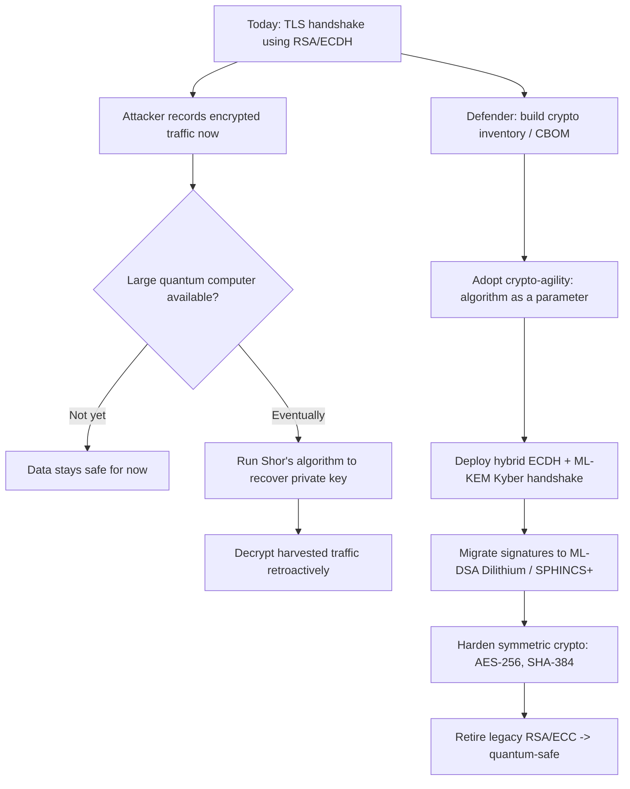

# Emerging Trends & Future of AI in Cyber Security

> **What you'll learn:** how AI is reshaping the security frontier — blockchain protection, the quantum/post-quantum race, IoT defense, and the dual use of AI in advanced persistent threats — plus the challenges and opportunities ahead.
> **Prerequisites:** basic understanding of cryptography (public/private keys, hashing), machine learning fundamentals (training, inference, classification), and core security concepts (threats, vulnerabilities, detection).

| Course | Course code | Module | Level |
|---|---|---|---|
| AI for Cyber Security | SKL-AICS-720 | Emerging Trends & Future of AI in Cyber Security | Applied / Machine-Learning |

---

## 1. In Plain English

Imagine your home security has improved over decades: first a simple lock, then an alarm, then cameras, and now a smart system that *learns* what "normal" looks like and flags anything odd. Cyber security is going through the same evolution, but with two twists. First, the same intelligent tools that protect you can be used by burglars to pick better locks — AI is a tool for both defenders and attackers. Second, a new kind of "master key" is being invented (quantum computers) that could one day open many of today's locks instantly, so we are quietly swapping in new locks that even that master key cannot open.

The "emerging trends" in this module are simply the places where these forces meet. AI is being bolted onto blockchains to watch for fraud the way a fraud-detection team watches a bank's transactions. AI is being placed inside the tiny brains of internet-connected devices (your doorbell camera, a factory sensor) because there are billions of them and humans cannot watch them all. And AI is increasingly the engine behind the most patient, well-funded attackers — the so-called Advanced Persistent Threats — on *both* sides of the fight.

The honest truth is that nobody has finished this race. The technology is moving fast, the defenders and attackers are leapfrogging each other, and the rules (regulation, standards, ethics) are still being written. That is exactly why understanding these trends matters: you are learning the map of a territory that is still being explored.

---

## 2. Core Concepts

### 2.1 AI + Blockchain for Enhanced Security

A **blockchain** is a shared, append-only ledger: a chain of "blocks" of transactions, where each block is cryptographically linked to the previous one (via a hash), and copies are distributed across many participants so no single party can secretly rewrite history. This gives strong *integrity* and *transparency* guarantees.

Blockchains are not magically secure, though. The weak points are usually the **smart contracts** (programs that run on the chain), the wallets, the exchanges, and the human behavior around them. This is where AI helps:

- **Anomaly detection on transactions:** ML models learn the normal pattern of an address or token and flag laundering, rug pulls, or flash-loan attacks in near real time.
- **Smart-contract auditing:** AI-assisted static analysis and large language models help review Solidity code for known vulnerability classes (re-entrancy, integer overflow, unchecked external calls).
- **Threat intelligence graphs:** AI clusters wallet addresses to deanonymize fraud rings and trace stolen funds.

Conversely, **blockchain can also strengthen AI** by providing a tamper-evident audit trail for AI decisions, model provenance, and training-data integrity — useful when you must prove *what* model made a decision and on *what* data.

### 2.2 Quantum Computing, AI, and Post-Quantum Cryptography

A **quantum computer** uses quantum bits (qubits) that can represent superpositions of states, enabling certain algorithms to be dramatically faster than on classical machines. Two algorithms matter for security:

- **Shor's algorithm** can efficiently factor large integers and compute discrete logarithms. This breaks **RSA**, **Diffie-Hellman**, and **elliptic-curve cryptography (ECC)** — the public-key crypto that secures most of today's TLS, VPNs, and code signing.
- **Grover's algorithm** gives a quadratic speedup on brute-force search, effectively halving symmetric-key strength. The practical fix is simply to double key/hash sizes (e.g., use AES-256 instead of AES-128).

A large, fault-tolerant quantum computer capable of running Shor's algorithm at scale does **not yet exist publicly**, but the threat is real today because of **"harvest now, decrypt later"**: adversaries record encrypted traffic now and decrypt it once quantum hardware arrives.

**Post-Quantum Cryptography (PQC)** is the answer: new public-key algorithms built on math problems (lattices, hashes, codes) that are believed hard even for quantum computers. In 2024 NIST published the first standards:

| Standard | Algorithm | Purpose |
|---|---|---|
| FIPS 203 (ML-KEM) | **CRYSTALS-Kyber** | Key encapsulation (key exchange) |
| FIPS 204 (ML-DSA) | **CRYSTALS-Dilithium** | Digital signatures |
| FIPS 205 (SLH-DSA) | **SPHINCS+** | Hash-based digital signatures |
| FIPS 206 (FN-DSA, draft) | **Falcon** | Compact lattice signatures |

Where does AI fit? AI helps in **cryptanalysis research** (searching for weaknesses in lattice schemes), in **automating the migration inventory** (finding every place RSA/ECC is used across a large estate), and in **quantum-enhanced optimization/ML** more broadly. The headline, though, is the migration challenge itself.

### 2.3 AI for IoT Security

The **Internet of Things (IoT)** is the universe of network-connected devices that are not traditional computers: sensors, cameras, smart locks, medical implants, industrial controllers. They share three painful properties: there are *enormous numbers* of them, they are *resource-constrained* (little CPU, memory, battery), and they are often *rarely patched*.

AI is well-suited here because the volume and variety of IoT telemetry exceed human capacity:

- **Behavioral anomaly detection:** a model learns each device's normal traffic profile (a thermostat that suddenly scans the network is compromised). This is how botnets like **Mirai** can be spotted early.
- **Device fingerprinting & classification:** ML identifies device type/firmware from network behavior, enabling automatic segmentation.
- **Edge/TinyML:** lightweight models run *on* the device or gateway so detection works even with intermittent connectivity and without shipping sensitive data to the cloud.

The flip side: attackers use AI to fuzz firmware, discover vulnerabilities, and orchestrate large botnets adaptively.

### 2.4 AI-Powered Advanced Persistent Threats (Offensive & Defensive)

An **Advanced Persistent Threat (APT)** is a stealthy, well-resourced adversary (often nation-state or organized crime) that gains a foothold and stays hidden for months, slowly pursuing a specific objective. The lifecycle maps to the **MITRE ATT&CK** framework: reconnaissance → initial access → execution → persistence → privilege escalation → lateral movement → exfiltration.

**Offensive AI** supercharges several stages:
- **Reconnaissance & social engineering:** LLMs draft flawless, personalized phishing; **deepfake** audio/video impersonates executives ("CEO fraud").
- **Adaptive malware:** polymorphic code and AI that changes tactics to evade detection.
- **Vulnerability discovery:** AI-assisted fuzzing finds bugs faster.

**Defensive AI** counters with:
- **UEBA (User and Entity Behavior Analytics):** baselining normal behavior and flagging deviations (impossible travel, unusual data access).
- **AI-assisted threat hunting & SOAR:** correlating millions of events, surfacing weak signals, and automating response in **SIEM/XDR** platforms.
- **Alert triage:** reducing analyst fatigue by ranking the few real incidents out of thousands of alerts.

The central idea: APT detection is a needle-in-a-haystack problem, and AI is the magnet.

### 2.5 Future Challenges

- **Adversarial ML:** attackers poison training data or craft inputs that fool models (evasion). Defensive AI is itself an attack surface.
- **Explainability & trust:** a black-box model that says "this is malware" without a reason is hard to act on or audit.
- **Talent and regulation gap:** the technology outpaces skills, laws, and ethics frameworks (EU AI Act, etc.).
- **The quantum clock:** migration to PQC must finish *before* cryptographically relevant quantum computers arrive — a years-long effort.

---

## 3. How It Works (Step by Step)

**Chosen trend: how a quantum threat breaks today's crypto, and how a post-quantum migration works.**

Today, when your browser connects to a bank, it performs a **TLS handshake** that uses public-key crypto (e.g., ECDH) to agree on a shared secret, then uses fast symmetric crypto (AES) to encrypt the actual data. The public-key step is the vulnerable part.

**Step 1 — Capture (the attack precondition).** An adversary records the encrypted handshake and traffic today. They cannot read it yet. This is "harvest now, decrypt later."

**Step 2 — Quantum break.** When a large fault-tolerant quantum computer becomes available, the attacker runs **Shor's algorithm** against the recorded ECDH/RSA handshake, recovering the private key and therefore the shared secret — then decrypts all the captured data retroactively.

**Step 3 — Inventory (defensive migration begins).** The organization builds a **cryptographic bill of materials (CBOM)**: every library, certificate, protocol, and device using RSA/ECC. AI tooling accelerates discovery across sprawling codebases and network estates.

**Step 4 — Crypto-agility.** Systems are refactored so the algorithm is a swappable parameter, not hard-wired. This lets you change algorithms without rewriting applications.

**Step 5 — Hybrid deployment.** Migrate to a **hybrid handshake** that runs a classical key exchange (ECDH) *and* a post-quantum KEM (**ML-KEM / Kyber**) together, combining both shared secrets. If either holds, the session is safe — protecting against both quantum attacks and any undiscovered flaw in the new PQC scheme.

**Step 6 — Full PQC & symmetric hardening.** Replace signatures with **ML-DSA (Dilithium)** or **SPHINCS+**, and bump symmetric crypto to AES-256 / SHA-384 to neutralize Grover's speedup. Validate, then retire the legacy algorithms.



---

## 4. Real-World Examples

**1. NIST Post-Quantum Cryptography Standardization.** Starting in 2016, NIST ran a multi-year, public competition to select quantum-resistant algorithms. In **August 2024** it finalized the first standards: **FIPS 203 (ML-KEM / Kyber)**, **FIPS 204 (ML-DSA / Dilithium)**, and **FIPS 205 (SLH-DSA / SPHINCS+)**. Browsers and cloud providers (e.g., Chrome and Cloudflare) have already begun deploying **hybrid Kyber** key exchange in TLS — a concrete, deployed example of Step 5 above.

**2. AI-assisted threat hunting against APTs.** Modern SOCs use XDR/SIEM platforms with behavioral analytics to detect lateral movement. Rather than relying on signatures of known malware, the system baselines normal account and host behavior and flags anomalies — e.g., a service account suddenly authenticating to dozens of hosts at 3 a.m. This is how stealthy, "living-off-the-land" intrusions (using legitimate tools like PowerShell) get caught, mapped to **MITRE ATT&CK** techniques.

**3. Deepfake-enabled social engineering.** In a widely reported 2024 incident, an employee at a multinational was tricked into transferring funds after joining a video call in which deepfaked, AI-generated likenesses impersonated the CFO and colleagues. It is a vivid demonstration of offensive AI collapsing the trust we place in seeing and hearing a familiar face — and why verification procedures (call-backs, code words) matter more than ever.

---

## 5. Tools of the Trade

| Tool / Framework | Category | What it does |
|---|---|---|
| **liboqs / Open Quantum Safe (OQS)** | PQC | C library + language wrappers implementing Kyber, Dilithium, SPHINCS+, etc.; integrates into OpenSSL/BoringSSL forks |
| **`oqs-python`** | PQC | Python bindings to liboqs for prototyping KEMs and signatures |
| **AWS-LC / BoringSSL / OpenSSL 3.x providers** | PQC | TLS stacks adding hybrid PQC key exchange |
| **MITRE ATT&CK / CALDERA** | APT defense & emulation | Knowledge base of adversary TTPs; CALDERA automates adversary emulation |
| **Slither / Mythril** | Blockchain | Static analysis for Solidity smart-contract vulnerabilities |
| **Elastic / Splunk / Microsoft Sentinel (UEBA)** | AI threat hunting | SIEM/XDR with ML-driven anomaly detection and SOAR automation |

**Sample usage — generating a post-quantum keypair with `oqs-python`:**

```python
# pip install oqs-python   (requires liboqs installed; see Open Quantum Safe docs)
import oqs

# Choose a NIST-standardized KEM. "ML-KEM-768" is the FIPS 203 name for Kyber-768.
kem_alg = "ML-KEM-768"

with oqs.KeyEncapsulation(kem_alg) as kem:
    public_key = kem.generate_keypair()          # public key shared openly
    # A peer encapsulates a shared secret to our public key:
    ciphertext, secret_sender = kem.encap_secret(public_key)
    # We decapsulate using our private key (held inside the kem object):
    secret_receiver = kem.decap_secret(ciphertext)

    assert secret_sender == secret_receiver       # both sides now share a secret
    print(f"{kem_alg}: shared secret established, {len(secret_sender)} bytes")
```

**Explanation:** A **KEM (Key Encapsulation Mechanism)** is the modern way to do quantum-safe key exchange. The receiver publishes a public key; the sender uses it to *encapsulate* a freshly generated shared secret into a ciphertext; the receiver *decapsulates* it with the private key. Both sides end up with the same secret without ever transmitting it directly — and because Kyber/ML-KEM is lattice-based, a quantum computer cannot derive that secret from the public data.

---

## 6. Hands-On Lab (Authorized / Lab-Only)

> **Reminder:** Run this only on systems and accounts you own or are explicitly authorized to use, in an isolated lab environment.

**Goal:** Demonstrate a full post-quantum key exchange end to end and confirm both parties derive the identical secret — the building block of quantum-safe TLS.

**Libraries/data needed:**
- `liboqs` (the C library — install from the Open Quantum Safe project)
- `oqs-python` (`pip install oqs-python`)
- No external dataset required.

```python
import oqs
import secrets
from hashlib import sha256

KEM_ALG = "ML-KEM-768"  # FIPS 203 standardized (Kyber-768)

def derive_session_key(shared_secret: bytes) -> str:
    """Turn the raw KEM secret into a usable symmetric key (demo KDF)."""
    return sha256(shared_secret).hexdigest()

# --- Bob: the receiver, generates a long-term keypair ---
bob = oqs.KeyEncapsulation(KEM_ALG)
bob_public_key = bob.generate_keypair()

# --- Alice: the sender, encapsulates a secret to Bob's public key ---
alice = oqs.KeyEncapsulation(KEM_ALG)
ciphertext, alice_secret = alice.encap_secret(bob_public_key)

# --- Bob: decapsulates with his private key ---
bob_secret = bob.decap_secret(ciphertext)

# --- Verify both sides agree, then derive a session key ---
assert alice_secret == bob_secret, "KEM failed: secrets differ!"
session_key = derive_session_key(alice_secret)

print(f"Algorithm           : {KEM_ALG}")
print(f"Public key size     : {len(bob_public_key)} bytes")
print(f"Ciphertext size     : {len(ciphertext)} bytes")
print(f"Shared secret match : {alice_secret == bob_secret}")
print(f"Derived session key : {session_key[:16]}... (truncated)")

# Cleanup
alice.free()
bob.free()
```

**What's happening, for a beginner:**
1. **Bob** creates a keypair and publishes only the *public* key (safe to share).
2. **Alice** uses Bob's public key to `encap_secret`, producing a *ciphertext* (sent over the wire) and her copy of the *shared secret* (kept private).
3. **Bob** runs `decap_secret` on the ciphertext using his private key and recovers the *same* shared secret.
4. We hash the raw secret into a **session key** that AES could then use to encrypt real traffic.

The `assert` proves the magic: two parties agreed on a secret without ever sending it, using math that resists quantum attack. Try swapping `KEM_ALG` to `"sntrup761"` or another supported algorithm and observe how key/ciphertext sizes change — a real engineering trade-off in PQC migration (PQC keys are generally larger than RSA/ECC).

---

## 7. Countermeasures & Defenses

**Crypto-agility & PQC migration**
- Build a **cryptographic bill of materials (CBOM)**: inventory every use of RSA/ECC.
- Design systems so algorithms are **configurable, not hard-coded**.
- Adopt **hybrid** key exchange (classical + PQC) during transition.
- Bump symmetric crypto to **AES-256** and hashes to **SHA-384/512** against Grover.
- Prioritize long-lived secrets (root CAs, archived data) first — they are most exposed to "harvest now, decrypt later."

**Securing AI/ML pipelines**
- Defend against **data poisoning** with provenance tracking and input validation.
- Test models against **adversarial/evasion** inputs; use robust training.
- Demand **explainability** so analysts can trust and audit model outputs.
- Protect models and training data as sensitive assets (access control, integrity checks — optionally on a tamper-evident ledger).

**IoT hardening**
- Eliminate default credentials; enforce unique, rotatable secrets.
- **Network segmentation** so a compromised sensor cannot reach critical systems.
- Deploy **edge/TinyML anomaly detection** for devices that are rarely patched.
- Maintain a device inventory and secure, signed firmware-update channels.

**Preparing for AI-enabled threats**
- Train staff against **deepfakes**; enforce out-of-band verification for high-value actions (call-backs, code words).
- Use **behavioral analytics (UEBA)** and AI-assisted threat hunting mapped to **MITRE ATT&CK**.
- Combine AI triage with **human-in-the-loop** decision-making for response.
- Run **adversary emulation** (e.g., CALDERA) to test detection before real attackers do.

---

## 8. Key Terms

- **Blockchain** — a distributed, append-only ledger of cryptographically linked blocks providing integrity and transparency.
- **Smart contract** — self-executing code on a blockchain; a common attack surface (re-entrancy, overflow bugs).
- **Qubit** — a quantum bit that can hold a superposition of states, enabling quantum speedups.
- **Shor's algorithm** — a quantum algorithm that efficiently breaks RSA/ECC by factoring/discrete log.
- **Grover's algorithm** — a quantum search algorithm that halves effective symmetric-key strength.
- **Post-Quantum Cryptography (PQC)** — classical-computer algorithms believed secure against quantum attack.
- **CRYSTALS-Kyber / ML-KEM (FIPS 203)** — standardized lattice-based key encapsulation mechanism.
- **CRYSTALS-Dilithium / ML-DSA (FIPS 204)** — standardized lattice-based digital signature scheme.
- **SPHINCS+ / SLH-DSA (FIPS 205)** — standardized stateless hash-based signature scheme.
- **KEM (Key Encapsulation Mechanism)** — protocol for securely establishing a shared secret using public keys.
- **Crypto-agility** — system design where cryptographic algorithms can be swapped without re-engineering.
- **Harvest now, decrypt later** — recording encrypted data today to decrypt once quantum computers exist.
- **IoT** — network of resource-constrained connected devices (sensors, cameras, controllers).
- **TinyML / edge AI** — running ML inference on small, low-power devices or gateways.
- **APT (Advanced Persistent Threat)** — a stealthy, well-resourced, long-dwell-time adversary.
- **MITRE ATT&CK** — a knowledge base of real-world adversary tactics, techniques, and procedures (TTPs).
- **UEBA** — User and Entity Behavior Analytics; baselining behavior to detect anomalies.
- **Deepfake** — AI-generated synthetic audio/video impersonating real people.
- **Adversarial ML** — attacks that poison training data or craft inputs to fool models.

---

## 9. Summary & Takeaways

- **AI is dual-use:** the same models that hunt threats also empower attackers (phishing, deepfakes, adaptive malware). Defense must assume offense has the same tools.
- **The quantum threat is a "now" problem** because of harvest-now-decrypt-later, even though scalable quantum computers do not yet exist publicly.
- **PQC is real and standardized:** migrate toward **ML-KEM (Kyber)**, **ML-DSA (Dilithium)**, and **SPHINCS+**, and double symmetric key/hash sizes against Grover.
- **Crypto-agility is the strategy** — build an inventory (CBOM), make algorithms swappable, and deploy hybrid handshakes during transition.
- **AI suits blockchain and IoT** because both produce more telemetry than humans can monitor; anomaly detection and edge ML are the workhorses.
- **APT detection is a needle-in-haystack problem** where behavioral analytics (UEBA) and AI-assisted threat hunting, mapped to MITRE ATT&CK, provide the magnet.
- **The AI defenses are themselves attack surfaces** — guard against data poisoning and adversarial evasion, and insist on explainability and human-in-the-loop.
- **The biggest gaps are people, process, and policy** — skills, regulation, and ethics are racing to catch up with the technology.

**Further reading:** NIST Post-Quantum Cryptography project and FIPS 203/204/205; NIST SP 1800-38 (Migration to PQC); ENISA reports on AI security and post-quantum readiness; the MITRE ATT&CK framework and MITRE ATLAS (adversarial threats to ML systems); the Open Quantum Safe project documentation; OWASP smart-contract and IoT security guidance.
