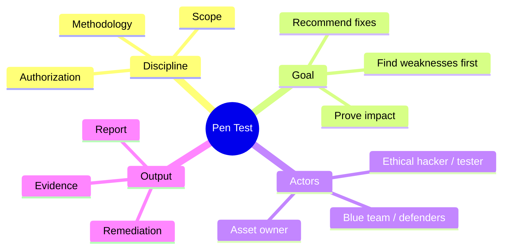
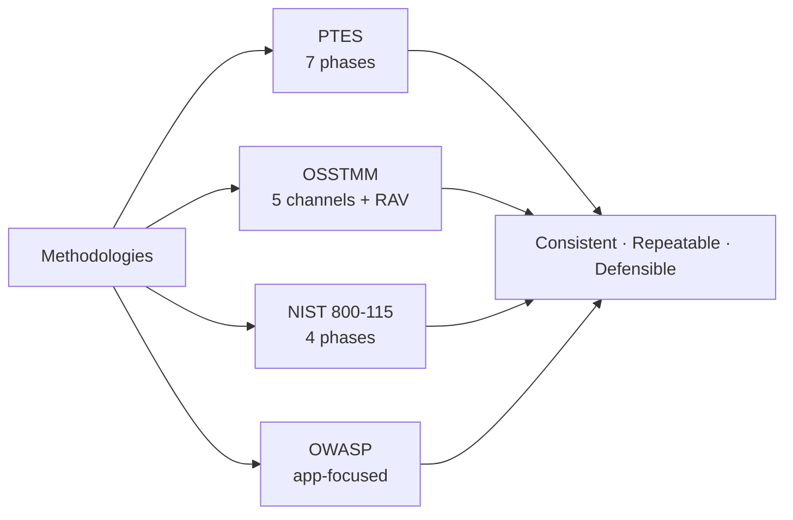
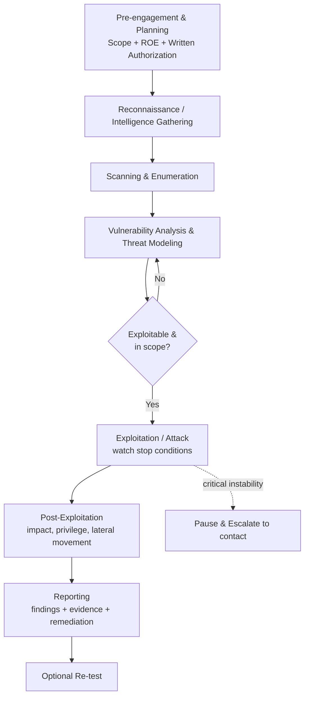
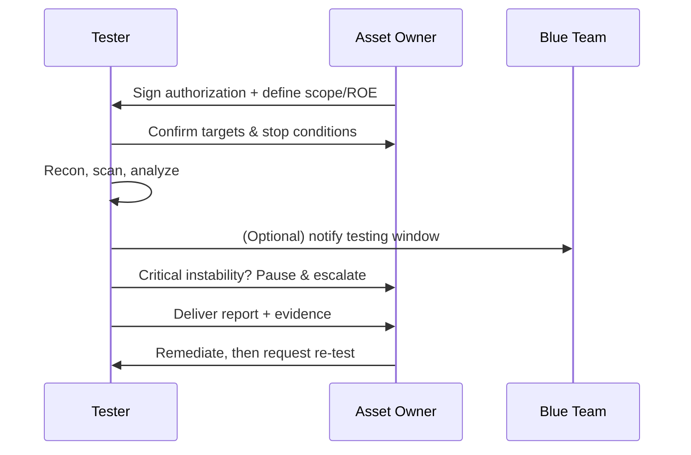
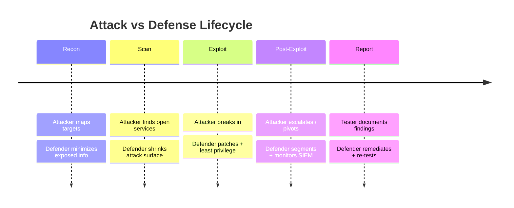

# Penetration Testing Concepts

> 🎯 **What you'll learn:** the major penetration-testing methodologies (PTES, OSSTMM, NIST 800-115, OWASP), how to plan and scope a test responsibly, and how to manage the legal and operational risks involved.
> 📋 **Prerequisites:** basic networking (IP, ports, HTTP), basic OS literacy (Linux/Windows CLI), and an understanding that all techniques here are for **authorized, lawful testing only**.

| Field | Value |
|-------|-------|
| 📚 Course | Penetration Testing |
| 🔖 Course code | SKL-PEN-712 |
| 🧩 Module | Module 02 — Penetration Testing Concepts |
| 🎚️ Level | pentest |

---

> 📺 **Watch — top video on this topic:** [](https://www.youtube.com/watch?v=TbJL_CayTds) [Penetration Testing Methodologies — NIST / OWASP / OSSTMM](https://www.youtube.com/watch?v=TbJL_CayTds)

---

## 1. In Plain English

Hire a locksmith to break into your own house — not to steal, but to find which doors and windows a burglar could slip through. You give written permission, agree which buildings they may try, and ask for a report of every weakness and how to fix it. **Penetration testing** ("pen testing") is exactly that, but for computers, networks, and applications.

A **penetration test** is an authorized, simulated attack against a system to find security weaknesses before a real attacker does. The **ethical hacker** doing it uses the same tools and tricks as criminals — but with permission and a goal of improving security.

Why care? Almost everything we rely on — banking apps, hospitals, power grids, your email — runs on software that can have flaws. A pen test is the most direct way an organization learns whether its defenses actually hold up, instead of assuming they do.

> 🔑 **Key idea:** Doing this *properly* is mostly discipline, not hacking skill. You need a **methodology** (a repeatable way of working), a clear **scope** (what you may and may not touch), and **legal authorization** (written permission). Get those wrong and the same activity that makes you a professional could make you a criminal.



---

## 2. Core Concepts

### What a Penetration Test Actually Is

A penetration test is a **goal-oriented, time-boxed, authorized security assessment** that exploits vulnerabilities to demonstrate real-world impact. Compare it to its neighbors:

| Activity | Question it answers | Exploits? | Scope |
|----------|--------------------|-----------|-------|
| 🔍 **Vulnerability assessment** | "What *could* be wrong?" | ❌ No (lists weaknesses, often via scanners) | Broad, automated |
| 🎯 **Penetration test** | "What can an attacker *actually* do?" | ✅ Yes (proves exploitability) | Defined, time-boxed |
| 🥷 **Red teaming** | "Can we be breached and not notice?" | ✅ Yes, stealthily | People + process + tech, weeks-long |

### Why Methodologies Matter

A **methodology** is a structured framework describing *how* to conduct a test so results are consistent, repeatable, and defensible. Without one, two testers could examine the same system and produce wildly different results. Methodologies provide phases, checklists, and reporting expectations. The four most cited are below.



### 🧪 PTES — Penetration Testing Execution Standard

A community-driven standard breaking an engagement into seven phases. Popular because it covers the *whole* lifecycle, not just the hacking:

1. **Pre-engagement Interactions** — scoping, goals, rules of engagement, legal paperwork.
2. **Intelligence Gathering** — reconnaissance; collecting info about the target.
3. **Threat Modeling** — identifying likely attackers and the assets they'd want.
4. **Vulnerability Analysis** — finding weaknesses in discovered systems.
5. **Exploitation** — attempting to break in using those weaknesses.
6. **Post-Exploitation** — determining the value of compromised systems (what data, what further access).
7. **Reporting** — communicating findings and remediation guidance.

### 📏 OSSTMM — Open Source Security Testing Methodology Manual

Maintained by ISECOM, a peer-reviewed methodology focused on *measurable* security. Its distinguishing feature is rigor and metrics: it tests across five **channels** and produces a quantified "operational security" score called the **RAV (Risk Assessment Value)**. Valued where audit-grade, repeatable measurement is needed.

| OSSTMM Channel | Covers |
|----------------|--------|
| 🧑 Human | Social engineering, awareness |
| 🏢 Physical | Locks, facilities, physical access |
| 📶 Wireless | Wi-Fi, RF, Bluetooth |
| ☎️ Telecommunications | Phone systems, VoIP |
| 🌐 Data Networks | Hosts, services, infrastructure |

### 🏛️ NIST SP 800-115

The *Technical Guide to Information Security Testing and Assessment* — a U.S. government standard widely used as a neutral reference. Its clean four-phase model:

1. **Planning** — define rules, goals, and approvals.
2. **Discovery** — gather information and identify vulnerabilities.
3. **Attack** — verify vulnerabilities by exploiting them (gaining access, escalating privileges).
4. **Reporting** — document findings and recommendations.

It also distinguishes review techniques, target identification/analysis, and target vulnerability validation. Being vendor-neutral and freely published, it's often referenced in contracts and compliance.

### 🕸️ OWASP — Web Application Security

The **Open Worldwide Application Security Project (OWASP)** focuses on **application** (especially web and API) security. Key outputs:

- **OWASP Web Security Testing Guide (WSTG)** — a category-by-category methodology for testing web apps (authentication, session management, input validation, business logic, etc.).
- **OWASP Top 10** — a periodically updated awareness list of the most critical web app risks (broken access control, injection, security misconfiguration, etc.). It is a *priority list*, not a complete methodology, but it shapes what testers look for first.
- **ASVS (Application Security Verification Standard)** and **MASVS/MASTG** for mobile apps.

> 💡 **Tip:** The Top 10 is for *awareness and prioritization*; the WSTG is the *actual test methodology*. Don't confuse the two.

### Choosing and Combining Methodologies

In practice, testers blend these — e.g., **PTES** for overall structure, **NIST 800-115** language for compliance reporting, **OWASP WSTG** for the web-app portion, and **OSSTMM** ideas where measurable scoring is required.

| Methodology | Best for | Distinctive feature |
|-------------|----------|---------------------|
| 🧪 PTES | Full-lifecycle infrastructure tests | 7 phases incl. threat modeling & post-exploitation |
| 📏 OSSTMM | Audit-grade, measurable assessments | 5 channels + RAV metric |
| 🏛️ NIST 800-115 | Compliance / government / neutral baseline | 4 phases, vendor-neutral |
| 🕸️ OWASP (WSTG/Top 10/ASVS) | Web, API, and mobile applications | Deep app-specific test cases |

### Guidelines and Recommendations

Regardless of methodology, professional testing shares good practices:

- **Define clear objectives** first ("test the customer portal for OWASP Top 10 risks," not "hack us").
- **Get written authorization** signed by someone with authority over the assets.
- **Agree on rules of engagement (ROE)** — scope, timing, allowed techniques, escalation contacts.
- **Minimize harm** — avoid destructive tests on production unless explicitly approved; prefer maintenance windows.
- **Protect collected data** — engagement data often contains real secrets; encrypt it and destroy it per agreement.
- **Reproduce and evidence findings** so the client can verify and fix them.
- **Stay within scope** at all times — scope creep can become a legal problem.

### ⚠️ Understanding and Managing Risk

A pen test *intentionally* pokes at live systems, so it carries real operational risk.

| Risk | What can go wrong | How it's managed |
|------|------------------|------------------|
| 💥 Service disruption | Scans/exploits crash fragile services, fill logs/disks | Test in non-prod or maintenance windows |
| 🗃️ Data exposure/corruption | Exploitation reads, alters, or deletes data | Take backups/snapshots beforehand |
| 🔗 Triggering other parties | Touching cloud/shared infra violates provider rules | Confirm third-party permission first |
| 📡 Detection noise | Heavy testing overwhelms monitoring | Coordinate with blue team; keep an escalation contact |
| 🧯 Critical instability | A key system becomes unstable | Define **stop conditions**; pause & escalate |

> ⚠️ **Warning:** Always **log every action with timestamps**. If an incident occurs, logs prove it traces back to authorized testing — not a real breach.

### ⚖️ Legal Authorization and Scoping

This is the concept that separates a professional from a criminal. **Authorization** must be **explicit, written, and granted by someone who owns or controls the target.**

- **Scope** — the exact systems, IP ranges, domains, URLs, applications, accounts, and (sometimes) physical locations you may test. Anything not listed is **out of scope** and off-limits.
- **Third-party assets** — if the target uses a cloud provider or SaaS, you may also need *their* permission; you can only authorize what you own.
- **Authorization letter ("get-out-of-jail" letter)** — signed proof you're allowed to test, carried by the tester, naming dates, scope, and an authorizing signatory.
- **Relevant laws** — e.g., the U.S. **Computer Fraud and Abuse Act (CFAA)**, the UK **Computer Misuse Act**, India's **IT Act**, and the EU's **GDPR** for data handling. Unauthorized access — even "to help" — can be a crime.

> ⚠️ **Warning:** Always confirm with legal counsel. This module is educational, **not legal advice**.

> 🖼️ *Suggested image: a sample one-page "Authorization to Test" letter with scope, dates, and signatory fields highlighted.*

---

## 3. How It Works (Step by Step)

A well-run engagement flows like this, mapping loosely to PTES and NIST 800-115. Note that **nothing technical happens until planning and authorization are complete.**

1. **Pre-engagement / Planning** — Define goals, scope, ROE, timing, emergency contacts. Sign authorization and any NDA.
2. **Reconnaissance (Intelligence Gathering)** — Passively (open sources) and actively (light probing) learn about in-scope targets: hostnames, services, technologies.
3. **Scanning & Enumeration** — Identify open ports, running services, and software versions; map the attack surface.
4. **Vulnerability Analysis / Threat Modeling** — Match discovered services to known weaknesses; decide which are worth attempting.
5. **Exploitation (Attack)** — Attempt to gain access using validated vulnerabilities — carefully, watching stop conditions.
6. **Post-Exploitation** — Assess impact: reachable data, privilege escalation, lateral movement. Demonstrate business impact without causing damage.
7. **Reporting** — Write findings with severity, evidence, and remediation. Present to stakeholders.
8. **Re-test (optional)** — After fixes, verify the issues are actually resolved.



Here is the same engagement viewed as a conversation between tester, asset owner, and blue team:



---

## 4. Real-World Examples

**🛒 Authorized retail web-app test.** A retailer hires a firm to test its e-commerce portal under OWASP WSTG. Scope is limited to two domains and a staging environment. The tester finds a broken-access-control flaw: one logged-in user can view another's order history by changing an ID in the URL. Because it's authorized and scoped, the tester documents it with screenshots, reports it as **High** severity, and the retailer fixes it before any customer data leaks. This mirrors the "Broken Access Control" category that has topped the OWASP Top 10.

**⚖️ Why scope and authorization matter — a cautionary pattern.** There are well-known cases where researchers reported flaws they discovered but faced legal threats because they had **no prior written authorization**. The lesson is consistent: good intentions are not a legal defense. **Bug-bounty programs** exist precisely to give researchers explicit, scoped permission ("safe harbor") so testing stays lawful.

**📜 Methodology in compliance contexts.** Payment-card security (PCI DSS) and many government contracts *require* penetration tests and frequently reference neutral standards like **NIST SP 800-115** for approach and **OWASP** for application testing. Knowing the methodologies isn't academic — it's contractual.

---

## 5. Tools of the Trade

> ⚠️ **Warning:** The commands below are illustrative and meant for **authorized lab/owned systems only.**

| Tool | Category | Primary use case |
|------|----------|------------------|
| 🗺️ **Nmap** | Network scanner | Host discovery, port/service/version detection |
| 🕷️ **OWASP ZAP** | Web scanner/proxy | Automated + manual web vuln testing (free) |
| 🧰 **Burp Suite** | Web testing proxy | Intercept/modify HTTP(S), test app logic |
| 💣 **Metasploit** | Exploitation framework | Validate vulns with modules/payloads |
| 📋 **Nikto** | Web server scanner | Quick misconfiguration/known-issue checks |

### 🗺️ Nmap — network discovery and port scanning

Maps which hosts are alive and which services/ports are exposed.

```bash
nmap -sV -p- 10.10.10.5
```
Scans all 65,535 TCP ports (`-p-`) and attempts service/version detection (`-sV`). The output tells you the attack surface to investigate.

### 🕷️ OWASP ZAP — web application scanner/proxy

An intercepting proxy that finds common web vulnerabilities, supports manual and automated testing, and is free/open-source.

```bash
zap.sh -cmd -quickurl https://lab.example.local -quickout /tmp/zap-report.html
```
Runs ZAP headlessly against a lab URL and writes an HTML report of findings.

### 🧰 Burp Suite — web testing proxy

Industry-standard tool for intercepting, inspecting, and modifying HTTP/HTTPS traffic to test app logic and inputs. Typically driven through its GUI: configure the browser to proxy through Burp (default `127.0.0.1:8080`), then capture and replay requests in the Repeater tab.

> 🖼️ *Suggested image: screenshot of Burp Suite's Proxy → Intercept tab showing a captured HTTP request.*

### 💣 Metasploit Framework — exploitation framework

A framework of exploit modules, payloads, and post-exploitation tools used to validate vulnerabilities.

```bash
msfconsole -q -x "use auxiliary/scanner/smb/smb_version; set RHOSTS 10.10.10.5; run; exit"
```
Launches Metasploit quietly and runs an SMB version-detection module against a lab host — a *non-destructive* enumeration step, not an exploit.

### 📋 Nikto — web server scanner

Quickly checks a web server for common misconfigurations and known issues.

```bash
nikto -h https://lab.example.local
```
Probes the target web server and reports outdated software, risky files, and misconfigurations.

---

## 6. Hands-On Lab (Authorized / Lab-Only)

> ⚠️ **Warning:** Perform these activities only on systems you own or have explicit written authorization to test (a dedicated lab, a deliberately vulnerable VM, or a scoped engagement).

This lab is about **engagement discipline**, not a single tool. Set up a safe practice environment — e.g., an intentionally vulnerable VM on an isolated host-only network — and walk through the professional workflow end to end.

| Step | Action |
|------|--------|
| 1️⃣ Define scope | List exactly which VM IPs, hostnames, and apps are in scope, and which techniques are off-limits (e.g., no DoS). |
| 2️⃣ Draft ROE | Use the checklist below. |
| 3️⃣ Execute methodically | Recon → scan → analyze → (carefully) exploit, recording every command + timestamp. |
| 4️⃣ Collect evidence | Save command output, screenshots, and request/response pairs proving each finding. Store securely. |
| 5️⃣ Write the report | Use the skeleton below. |

> 🖼️ *Suggested image: isolated host-only lab network diagram (attacker Kali VM + vulnerable target VM on a private vSwitch).*

### ✅ Sample Rules-of-Engagement Checklist

- [ ] Written authorization signed by asset owner, with start/end dates.
- [ ] In-scope targets explicitly listed (IPs, domains, apps, accounts).
- [ ] Out-of-scope items explicitly listed (third-party, production DB, etc.).
- [ ] Allowed vs prohibited techniques defined (e.g., no DoS, no social engineering).
- [ ] Testing window / time zone agreed.
- [ ] Primary and emergency escalation contacts (name + 24/7 phone).
- [ ] Stop conditions defined (pause if a critical service degrades).
- [ ] Data-handling rules: encryption, storage location, retention, secure destruction.
- [ ] Evidence/logging requirement: timestamped record of all actions.
- [ ] Reporting format, deliverable date, and re-test arrangement agreed.

### 📄 Penetration-Test Report Skeleton

1. **Cover & Confidentiality Notice** — client, dates, classification.
2. **Executive Summary** — plain-language risk overview for management.
3. **Scope & Authorization** — what was tested, what wasn't, who approved it.
4. **Methodology** — standards followed (PTES / NIST 800-115 / OWASP WSTG).
5. **Findings** — each with: title, severity (e.g., CVSS-based rating), affected asset, description, evidence, business impact, and remediation.
6. **Risk Summary Table** — counts by severity, prioritized.
7. **Remediation Roadmap** — recommended fixes and rough effort/priority.
8. **Appendices** — tool output, raw evidence, methodology details.

---

## 7. Countermeasures & Defenses

The blue team should treat pen-test findings as a roadmap. Defensive practices map cleanly to **Prevent → Detect → Respond**:

| Phase | Practices |
|-------|-----------|
| 🛡️ **Prevent** | Patch promptly; remove unused services to shrink attack surface • Enforce least privilege & strong access control (the #1 web risk) • Validate/sanitize all input to block injection • Use secure config baselines; disable default credentials • Apply MFA and strong session management |
| 👁️ **Detect** | Centralize and monitor logs (SIEM) • Alert on port scans, repeated failed logins, privilege escalation • Coordinate with testers so legit testing is distinguishable from real attacks |
| 🧯 **Respond** | Maintain backups & tested recovery before high-risk testing • Keep an incident-response plan and escalation path • Segment networks so one compromise can't reach everything • Re-test after remediation to confirm fixes work |



---

## 8. Key Terms

| Term | Definition |
|------|-----------|
| 🎯 **Penetration test** | Authorized, simulated attack to find and *prove* exploitable weaknesses. |
| 🔍 **Vulnerability assessment** | Identifying weaknesses without necessarily exploiting them. |
| 🥷 **Red teaming** | Broad, stealthy, objective-driven adversary simulation testing people, process, and tech. |
| 📐 **Methodology** | A structured, repeatable framework for conducting a test. |
| 🧪 **PTES** | Penetration Testing Execution Standard; a seven-phase lifecycle framework. |
| 📏 **OSSTMM** | Open Source Security Testing Methodology Manual; measurable, channel-based testing with the RAV metric. |
| 🏛️ **NIST SP 800-115** | U.S. technical guide; four-phase (plan, discover, attack, report) assessment standard. |
| 🕸️ **OWASP** | Open Worldwide Application Security Project; web/app security resources incl. WSTG, Top 10, ASVS. |
| 🗂️ **Scope** | The explicit set of systems and techniques permitted in an engagement. |
| 📜 **Rules of Engagement (ROE)** | Agreed terms governing how the test is carried out. |
| ✍️ **Authorization letter** | Signed proof a tester is permitted to test, with scope and dates. |
| 🛑 **Stop condition** | A predefined trigger to pause testing (e.g., critical instability). |
| 🪜 **Post-exploitation** | Assessing the impact and reach after gaining access. |

---

## 9. Summary & Takeaways

- 🎯 A pen test is an **authorized** simulated attack that *proves* exploitability — going beyond a vulnerability assessment.
- 📐 **Methodologies** (PTES, OSSTMM, NIST 800-115, OWASP) make tests consistent, repeatable, and defensible; professionals often combine them.
- 🧭 **PTES** covers the full seven-phase lifecycle; **NIST 800-115** offers a neutral four-phase model; **OSSTMM** adds measurable metrics; **OWASP** specializes in applications.
- ⚖️ **Scoping and written authorization are non-negotiable** — they make the work legal rather than criminal.
- 🧯 **Risk management** (stop conditions, backups, escalation contacts, action logging) keeps live testing safe.
- 📄 **Documentation and evidence** turn a test into something a client can act on; the report is the real deliverable.
- 🚫 Good intentions don't replace permission — test only owned/authorized systems.
- 🛡️ Defenders should consume findings to prevent, detect, and mitigate, then verify fixes with a re-test.

> 📖 **Further reading:** PTES (pentest-standard.org), OSSTMM by ISECOM, NIST Special Publication 800-115, the OWASP Web Security Testing Guide and OWASP Top 10, and MITRE ATT&CK for adversary tactics and techniques.
