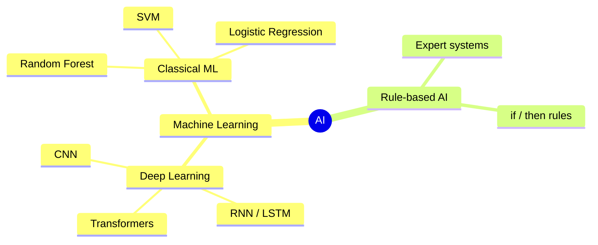
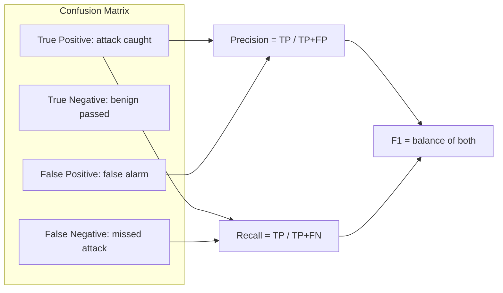
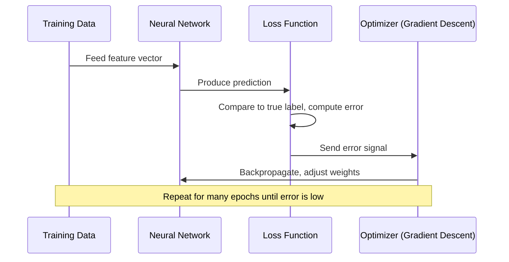
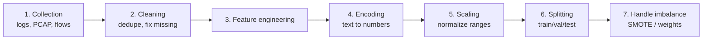
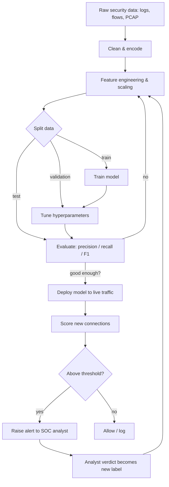

# Fundamentals of AI in Cyber Security

> **What you'll learn:** how AI and machine learning actually work, the main algorithm families, how raw security data becomes useful features, what neural networks add, and which tools (scikit-learn, TensorFlow, PyTorch) practitioners use to build defensive models.
> **Prerequisites:** basic Python, comfort with the command line, and high-school math (no calculus required). No prior security or ML experience needed.

| Field | Value |
|-------|-------|
| 📚 Course | AI for Cyber Security |
| 🔖 Course code | SKL-AICS-720 |
| 🧩 Module | 01 — Fundamentals of AI in Cyber Security |
| 🎯 Level | ai |

---

> 📺 **Watch — top video on this topic:** [](https://www.youtube.com/watch?v=uPSgfNhd2qY) [Machine Learning Fundamentals for Cybersecurity Pros](https://www.youtube.com/watch?v=uPSgfNhd2qY)

---

## 1. In Plain English

Picture the front desk of a large building. Thousands of people walk in daily — mostly employees and visitors, but occasionally someone with a stolen badge. You can't inspect everyone, so you learn patterns: the 9 a.m. regulars, the sound of the badge reader, what "normal" looks like. When something is *off* — a badge used in two cities minutes apart — your instincts fire.

> 🔑 **Key idea:** **Artificial Intelligence (AI)** is the attempt to give computers that pattern-spotting instinct. **Machine Learning (ML)** is the most successful way we currently teach it.

In cyber security the "building" is your network, and the "people" are connections, logins, emails, files, and user actions — millions per day, far too many for humans to review. AI lets defenders learn what normal traffic looks like and flag the suspicious. Attackers use the same techniques to write convincing phishing, guess passwords, and evade filters.

Almost every modern security product has ML inside it:

| Product | What the ML does |
|---------|------------------|
| 📧 Spam filter | Classifies email as spam / not spam |
| 🛡️ Antivirus / EDR | Flags malicious files and behavior |
| 💳 Fraud detection | Scores transactions as risky / safe |
| 🚨 Intrusion detection | Flags abnormal network activity |

If you understand *how the model decides*, you can tell when it's wrong, why it raised an alert, and how an attacker might fool it. This module builds that foundation from zero.

---

## 2. Core Concepts

### 🧠 AI vs ML vs Deep Learning

These three terms nest inside one another like Russian dolls — they are **not** synonyms.

- **Artificial Intelligence (AI)** — the broad goal of making machines do tasks that normally need human intelligence (recognizing faces, understanding language, deciding).
- **Machine Learning (ML)** — a subset of AI where the machine *learns rules automatically from examples (data)* instead of a programmer writing them. Show it thousands of labeled emails and it figures out what "spam" looks like.
- **Deep Learning (DL)** — a subset of ML using **neural networks** with many layers. Powers image recognition, large language models, and modern malware classifiers.



> 💡 **Tip:** All deep learning is ML; all ML is AI; but **not** all AI is ML. Older "expert systems" used hand-written `if/then` rules — that is AI *without* learning.

### ⚙️ What a "Model" Is

A **model** is the mathematical object a learning algorithm produces — think of a recipe with adjustable knobs called **parameters** (or **weights**). **Training** = turning the knobs until the recipe's predictions match the known answers in your data. Once trained, you feed it *new* data and it predicts. In security a model might take features of a connection and output a probability that it's an attack.

### 🎯 Features and Labels

| Term | Meaning | Example |
|------|---------|---------|
| **Feature** | A single measurable input property | bytes sent, duration, dest port, protocol |
| **Label** | The correct output you want to predict | `attack` or `benign` |
| **Feature vector** | The list of features for one example | `[1500 bytes, 0.3s, port 443, TCP]` |

### 🏷️ Supervised Learning

**Supervised learning** trains on data where every example already has the correct label, learning the mapping from features to labels.

- **Classification** — predict a *category*. "Phishing or not?" (binary), "Which malware family?" (multi-class). Most intrusion detectors are classifiers.
- **Regression** — predict a *number*. "How many failed logins next hour?"

| Algorithm | Idea in one line | Security use |
|-----------|------------------|--------------|
| Logistic Regression | Weighted line separating two classes | Baseline phishing/spam detection |
| Decision Tree | A flowchart of yes/no questions | Explainable malware triage |
| Random Forest | Many trees voting together | Intrusion detection (robust, popular) |
| Support Vector Machine (SVM) | Finds the widest gap between classes | Small, clean datasets |
| Gradient Boosting (XGBoost) | Trees built sequentially to fix prior errors | Fraud and anomaly scoring |

### 🔍 Unsupervised Learning

**Unsupervised learning** works on data *without labels* and finds structure on its own. Critical in security because brand-new attacks have no labels yet — you can only say "this looks different from normal."

| Technique | What it does | Security example |
|-----------|--------------|------------------|
| **Clustering** (K-Means) | Groups similar items | Tiny weird clusters of sessions may be attacks |
| **Anomaly detection** (Isolation Forest, One-Class SVM) | Learns "normal," flags deviations | Backbone of behavioral intrusion detection |
| **Dimensionality reduction** (PCA) | Squeezes many features into a few | Visualize traffic, speed up other models |

> 💡 **Tip:** Also exists: **semi-supervised** (few labels + lots of unlabeled data) and **reinforcement learning** (an agent learns from trial-and-error rewards, used in automated-response research). But supervised and unsupervised are the two you must know cold.

### 📉 Overfitting, Underfitting, Generalization

| Concept | Meaning | Analogy |
|---------|---------|---------|
| **Overfitting** | Memorizes training data + its noise, fails on new data | Student who memorizes past answers but can't solve new problems |
| **Underfitting** | Too simple to capture the pattern at all | Student who didn't study |
| **Generalization** ✅ | The goal: good performance on *unseen* data | Student who actually understands |

> ⚠️ **Warning:** Guard against overfitting by splitting data into **training / validation / test** sets and using **cross-validation** (rotating which slice is held out). A model that aces training but flops in production is worse than useless — it gives false confidence.

### 📊 Evaluating a Model (Why Accuracy Lies)

In security, attacks are rare — maybe 1 in 1000 connections. A model that always says "benign" is **99.9% accurate** and **completely useless**. Use better metrics:



| Metric | Question it answers | Failure if low |
|--------|---------------------|----------------|
| **Precision** | Of everything flagged, how many were real? | Alert fatigue |
| **Recall (Sensitivity)** | Of all real attacks, how many did we catch? | Missed breaches |
| **F1 score** | Balance of precision and recall | — |
| **ROC / AUC** | How well classes separate across all thresholds | Poor discrimination |

### 🕸️ Neural Networks and Deep Learning

A **neural network** is loosely inspired by brain cells. It's built from **neurons (nodes)** arranged in **layers**:

- **Input layer** — receives the feature vector.
- **Hidden layers** — each neuron computes a weighted sum of inputs, adds a **bias**, then applies an **activation function** (a nonlinear function like **ReLU** or **sigmoid** that lets the network learn curves, not just straight lines).
- **Output layer** — produces the prediction (e.g. probability of "malware").

> 🖼️ *Suggested image: a simple feed-forward neural network diagram showing input, two hidden layers, and one output node with weighted connections.*

The network learns by **backpropagation**: predict → measure error with a **loss function** → use calculus (**gradient descent**) to nudge every weight slightly toward less error. Repeat over many passes called **epochs**.



**Deep learning** just means many hidden layers. Specialized architectures matter in security:

| Architecture | Strength | Security use |
|--------------|----------|--------------|
| **CNN** (Convolutional) | Spatial patterns | Classify malware by turning a binary into an "image" |
| **RNN / LSTM** | Sequences | Log-sequence analysis, unusual command patterns |
| **Transformers** | Long-range context | Analyzing code, logs, NL phishing (powers LLMs) |

> 🔑 **Key idea:** Deep learning shines with *huge data* and *complex raw patterns* (bytes, payloads, text). For small tabular datasets, classic models like Random Forest often **win** and are easier to explain.

### 🧹 Data Processing and Analysis

Models are only as good as their data. The typical pipeline:



| Step | Why | Techniques |
|------|-----|-----------|
| Collection | Get raw material | logs, PCAPs, flow records, alerts |
| Cleaning | Garbage in = garbage out | remove duplicates, fix missing/corrupt rows |
| Feature engineering | Make data meaningful | "connections/min", "ratio of unusual ports" |
| Encoding | Models do math, not words | label encoding, one-hot encoding |
| Scaling | "bytes" (millions) shouldn't drown "duration" (seconds) | standardization (mean 0, std 1), min-max |
| Splitting | Honest evaluation | train/val/test, **stratified** so rare attacks appear in each |
| Handling imbalance | Attacks are rare | oversample (**SMOTE**), undersample, class weights |

---

## 3. How It Works (Step by Step)

End-to-end flow of building and using an ML-based intrusion detector — the defensive workhorse of AI security.

1. **Ingest data** — collect labeled network flows (benign vs attack).
2. **Preprocess** — clean, encode categoricals, scale numerics.
3. **Split** — carve out a held-out test set the model never sees in training.
4. **Train** — fit a classifier (say Random Forest) on the training set.
5. **Validate & tune** — check metrics on validation data; adjust **hyperparameters** (settings chosen *before* training, like tree depth).
6. **Test** — measure precision/recall on the untouched test set.
7. **Deploy** — run on live traffic.
8. **Score & alert** — for each connection the model outputs a probability; above a threshold it alerts.
9. **Feedback loop** — analysts confirm true/false alerts; verdicts become new labels to **retrain** and fight model drift.



> ⚠️ **Warning:** **Model drift** is inevitable — the world changes, attackers adapt, and last year's "normal" is wrong today. A deployed model without a retraining loop slowly decays into noise.

---

## 4. Real-World Examples

**1. 📧 Spam and phishing filters (Gmail, Microsoft 365).** Providers have used ML classifiers for over a decade. Features: sender reputation, link structure, header anomalies, message text. Google states its ML blocks the large majority of spam and phishing reaching Gmail. Supervised classification at planet scale, retrained constantly as attackers adapt.

**2. 💳 Credit-card fraud detection.** Payment networks score every transaction in milliseconds using models trained on billions of past transactions. Features like amount, location, merchant type, and time-since-last-purchase feed a model (often gradient boosting) that decides approve / decline / challenge — the most mature, commercially proven use of ML for security-adjacent fraud.

**3. 🧪 Research datasets — KDD Cup '99 and NSL-KDD.** The 1999 DARPA/KDD intrusion-detection dataset became the most widely used benchmark for network attack classification. Researchers released **NSL-KDD** to fix duplicate-record problems in the original. Countless papers and student projects (including the lab below) build on it.

> ⚠️ **Warning:** NSL-KDD is also a cautionary tale — models that score 99% on it often fail on modern traffic, a textbook lesson in overfitting and dataset drift.

---

## 5. Tools of the Trade

| Tool | Type | Best for |
|------|------|----------|
| 🐼 **pandas** | Data wrangling | Loading, cleaning, exploring tables |
| 🔬 **scikit-learn** | Classical ML | Tabular security data, fast prototyping |
| 🔶 **TensorFlow / Keras** | Deep learning | Production neural nets, beginner-friendly API |
| 🔥 **PyTorch** | Deep learning | Research, flexibility |
| 📓 **Jupyter Notebook** | Environment | Interactive exploration |

### scikit-learn — classical ML (no deep learning)

```python
from sklearn.ensemble import RandomForestClassifier
clf = RandomForestClassifier(n_estimators=200, random_state=42)
clf.fit(X_train, y_train)          # learn from labeled data
preds = clf.predict(X_test)        # predict on unseen data
```
*What it does:* builds 200 decision trees that vote, trains on `X_train`/`y_train`, then classifies new samples. `random_state` makes results reproducible.

### pandas — the data-wrangling library

```python
import pandas as pd
df = pd.read_csv("nsl_kdd.csv")
print(df["label"].value_counts())   # how many attacks vs benign?
```
*What it does:* reads a CSV into a DataFrame (a table) and counts each label so you can see class imbalance.

### TensorFlow / Keras — Google's deep-learning framework

```python
import tensorflow as tf
model = tf.keras.Sequential([
    tf.keras.layers.Dense(64, activation="relu", input_shape=(41,)),
    tf.keras.layers.Dense(1, activation="sigmoid"),
])
model.compile(optimizer="adam", loss="binary_crossentropy", metrics=["accuracy"])
```
*What it does:* defines a small net with one hidden layer of 64 ReLU neurons and a single sigmoid output (probability of "attack"), then sets the training recipe.

### PyTorch — Meta's deep-learning framework

```python
import torch.nn as nn
net = nn.Sequential(
    nn.Linear(41, 64), nn.ReLU(),
    nn.Linear(64, 1), nn.Sigmoid(),
)
```
*What it does:* defines the same shape of network using PyTorch's module style.

### Jupyter Notebook — interactive workspace

```bash
pip install jupyter && jupyter notebook
```
*What it does:* installs and launches the notebook server in your browser.

> 🖼️ *Suggested image: screenshot of a Jupyter notebook cell showing a classification_report output with precision/recall columns.*

---

## 6. Hands-On Lab (Authorized / Lab-Only)

> ⚠️ **Warning:** Run this only on your own machine or an authorized training lab. Use public, openly licensed datasets — never live production traffic or data you aren't permitted to use.

**Goal:** train a simple intrusion-detection classifier on the **NSL-KDD** dataset (a public network-intrusion benchmark) and measure how well it catches attacks.

**Libraries needed:** `pandas`, `scikit-learn`.

```bash
pip install pandas scikit-learn
```

**Dataset:** NSL-KDD (`KDDTrain+` / `KDDTest+`), freely available from academic mirrors. Each row is a connection with 41 features plus a label naming the attack type (or `normal`).

```python
import pandas as pd
from sklearn.preprocessing import LabelEncoder, StandardScaler
from sklearn.ensemble import RandomForestClassifier
from sklearn.metrics import classification_report

# 1. Column names for NSL-KDD (41 features + label + difficulty)
cols = [
    "duration","protocol_type","service","flag","src_bytes","dst_bytes",
    "land","wrong_fragment","urgent","hot","num_failed_logins","logged_in",
    "num_compromised","root_shell","su_attempted","num_root","num_file_creations",
    "num_shells","num_access_files","num_outbound_cmds","is_host_login",
    "is_guest_login","count","srv_count","serror_rate","srv_serror_rate",
    "rerror_rate","srv_rerror_rate","same_srv_rate","diff_srv_rate",
    "srv_diff_host_rate","dst_host_count","dst_host_srv_count",
    "dst_host_same_srv_rate","dst_host_diff_srv_rate","dst_host_same_src_port_rate",
    "dst_host_srv_diff_host_rate","dst_host_serror_rate","dst_host_srv_serror_rate",
    "dst_host_rerror_rate","dst_host_srv_rerror_rate","label","difficulty",
]

train = pd.read_csv("KDDTrain+.txt", names=cols)
test  = pd.read_csv("KDDTest+.txt",  names=cols)

# 2. Turn the multi-class label into a simple binary target: attack vs normal
for df in (train, test):
    df["target"] = (df["label"] != "normal").astype(int)

# 3. Encode text categorical features into numbers
cat_cols = ["protocol_type", "service", "flag"]
for c in cat_cols:
    le = LabelEncoder()
    # fit on combined values so train/test share the same encoding
    le.fit(pd.concat([train[c], test[c]]))
    train[c] = le.transform(train[c])
    test[c]  = le.transform(test[c])

# 4. Separate features (X) from the answer (y); drop non-feature columns
drop = ["label", "difficulty", "target"]
X_train, y_train = train.drop(columns=drop), train["target"]
X_test,  y_test  = test.drop(columns=drop),  test["target"]

# 5. Scale numeric features to a comparable range
scaler = StandardScaler().fit(X_train)
X_train = scaler.transform(X_train)
X_test  = scaler.transform(X_test)

# 6. Train a Random Forest classifier
clf = RandomForestClassifier(n_estimators=200, random_state=42, n_jobs=-1)
clf.fit(X_train, y_train)

# 7. Evaluate with precision / recall / F1 — NOT just accuracy
preds = clf.predict(X_test)
print(classification_report(y_test, preds, target_names=["normal", "attack"]))
```

**Reading the code as a beginner:**

| Step | What it does |
|------|--------------|
| 1 | Names the 41 columns so pandas can label the table |
| 2 | Collapses dozens of attack names into one yes/no `target` (1 = attack) |
| 3 | Converts words like `tcp`/`http` into numbers (fit on train+test so the same word maps to the same number everywhere) |
| 4 | Separates inputs from the answer |
| 5 | Rescales features so large-valued ones don't dominate |
| 6 | Trains the forest of 200 voting trees (`n_jobs=-1` uses all CPU cores) |
| 7 | Prints precision, recall, F1 per class — the honest scoreboard for imbalanced data |

> 💡 **Tip:** Scores are usually lower than on the training set because `KDDTest+` deliberately contains attack types the model never saw — a built-in lesson on generalization and why real models need constant retraining.

---

## 7. Countermeasures & Defenses

### 🛡️ Building trustworthy ML defenses
- Train on **representative, up-to-date data**; retrain regularly to counter drift.
- Track **precision and recall**, not accuracy, given class imbalance.
- Keep a **human in the loop** — analysts confirm/reject alerts and feed verdicts back.
- Prefer **explainable models** (or add tools like SHAP) so analysts understand *why* an alert fired.

### ⚔️ Defending the model itself (adversarial ML)

| Attack | What the attacker does | Defense |
|--------|------------------------|---------|
| **Adversarial examples** | Tweak inputs slightly to fool the model (e.g. padding a malware file) | Adversarial training, input sanitization |
| **Data poisoning** | Slip malicious samples into training data | Data-provenance controls, anomaly checks on training set, pipeline access control |
| **Model evasion / extraction** | Probe the model to copy or bypass it | Rate-limit queries, monitor probing, don't expose raw confidence scores |

> 🔑 **Key idea:** The MITRE ATLAS framework catalogs these adversarial-ML tactics the way ATT&CK catalogs network attacks — worth bookmarking.

### 🧰 Operational hygiene
- **Defense in depth:** ML augments, never replaces, firewalls, signatures, MFA, and patching.
- **Baseline normal behavior** so anomaly detectors have an accurate reference.
- **Validate inputs** at every boundary; never trust external data.
- **Protect training data and secrets** (no hardcoded credentials in pipelines).
- **Monitor model performance in production** and alert when metrics degrade.

---

## 8. Key Terms

| Term | Definition |
|------|------------|
| **Artificial Intelligence (AI)** | Machines performing tasks that normally require human intelligence |
| **Machine Learning (ML)** | AI that learns rules from data instead of hand-coded rules |
| **Deep Learning (DL)** | ML using multi-layer neural networks |
| **Feature / Label** | A measurable input property / the correct output answer |
| **Supervised learning** | Learning from labeled examples (classification or regression) |
| **Unsupervised learning** | Finding structure in unlabeled data (clustering, anomaly detection) |
| **Model** | The trained mathematical object that makes predictions |
| **Overfitting** | Memorizing training data and failing on new data |
| **Neural network** | Layered network of weighted neurons with nonlinear activations |
| **Backpropagation** | The algorithm that adjusts weights to reduce prediction error |
| **Precision / Recall / F1** | Metrics for performance on imbalanced data |
| **False positive / negative** | A false alarm / a missed attack |
| **Hyperparameter** | A setting chosen before training (e.g. number of trees) |
| **Adversarial example** | An input crafted to fool a model |
| **Data poisoning** | Corrupting training data to sabotage a model |

---

## 9. Summary & Takeaways

- 🪆 AI is the goal; ML learns rules from data; deep learning is ML with deep neural networks — they **nest**, they aren't synonyms.
- 🏷️ **Supervised learning** needs labels and predicts known categories; **unsupervised learning** finds structure and is essential for spotting *novel* attacks.
- 🧹 Good data work — cleaning, encoding, scaling, balancing — matters more than fancy algorithms.
- 📊 In security, **accuracy is misleading**; judge by precision, recall, and F1 because attacks are rare.
- 🕸️ **Neural networks** learn complex raw patterns via backpropagation; classic models like Random Forest still win on small tabular data and are easier to explain.
- 🧰 **scikit-learn + pandas** cover classical ML; **TensorFlow** and **PyTorch** cover deep learning.
- ⚔️ ML models are themselves attackable (adversarial examples, poisoning) — defend the model, keep humans in the loop, layer with traditional controls.
- ✅ Always work on authorized systems and public datasets; never on data you aren't permitted to use.

**Further reading:** NIST AI Risk Management Framework (AI RMF 1.0); MITRE ATLAS (adversarial threat landscape for AI systems); OWASP Machine Learning Security Top 10; the scikit-learn, TensorFlow, and PyTorch official documentation.
