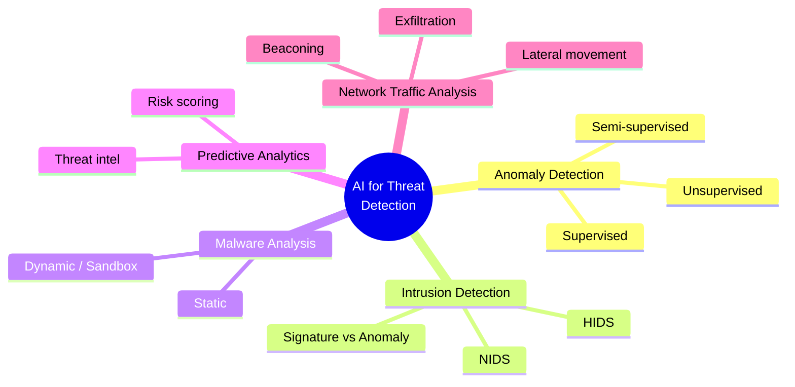
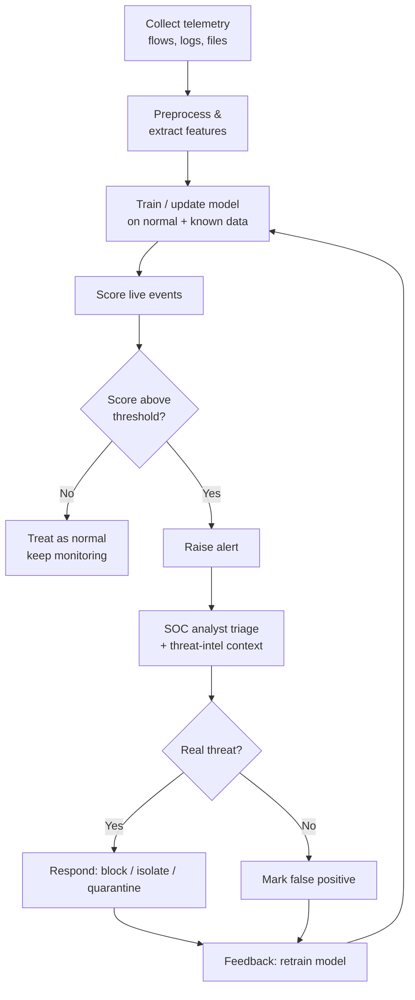
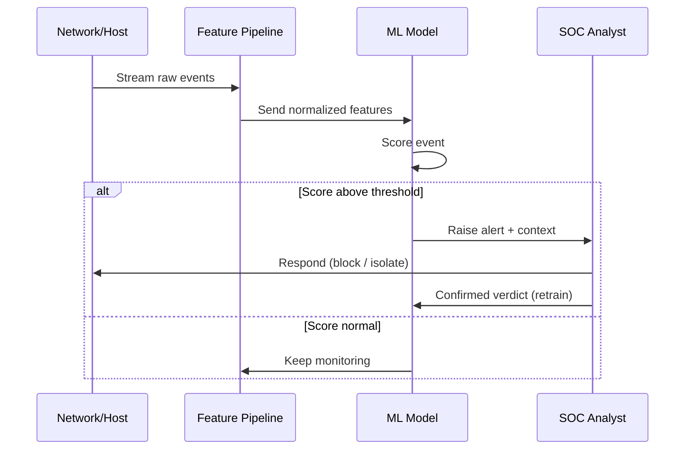
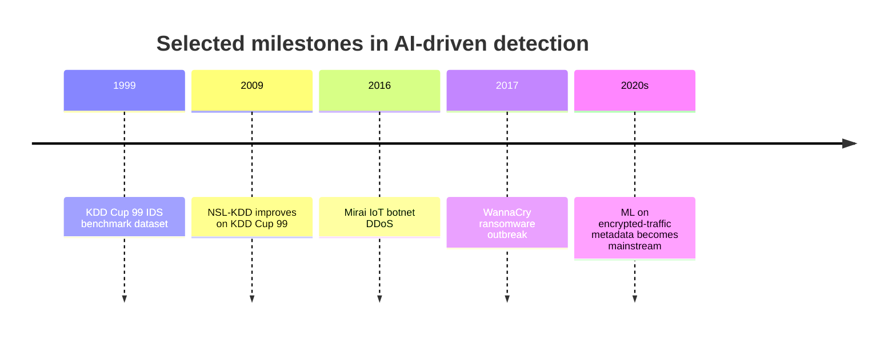

# AI for Threat Detection and Analysis 🛡️🤖

> **What you'll learn:** How AI and machine learning spot cyber attacks — from weird network behavior to brand-new malware — faster and at bigger scale than humans can. **Prerequisites:** basic comfort with computers and networks, a little Python, and curiosity. No prior ML experience required.

| | |
|---|---|
| 📘 **Course** | AI for Cyber Security |
| 🔖 **Course code** | SKL-AICS-720 |
| 🧩 **Module** | AI for Threat Detection and Analysis |
| 🎚️ **Level** | ai |

---

> 📺 **Watch — top video on this topic:** [](https://www.youtube.com/watch?v=eiRb32cYbf4) [AI in Cybersecurity Explained: Smarter Threat Detection & Real Risks](https://www.youtube.com/watch?v=eiRb32cYbf4)

---

## 1. In Plain English 🗣️

Picture a brand-new security guard at a huge office building. On day one they know no one. But after a few weeks they learn the rhythms — who arrives at 8 a.m., which doors get used, what a normal delivery looks like. So when someone climbs through a back window at 3 a.m., the guard *instantly* knows something is wrong. Not because they have a photo of that burglar, but because the behavior is **abnormal**. That learned intuition is exactly what AI brings to cybersecurity.

Traditional tools work like a bouncer with a printed list of banned faces: if you're not on the list, you walk right in — so attackers just change disguises. **Machine Learning (ML)** — the branch of AI where computers learn patterns from data instead of being explicitly programmed — flips the problem. Instead of memorizing every known bad thing, it learns what *good* looks like and flags whatever doesn't fit, or learns the subtle fingerprints bad things share even in new disguises.

> 🔑 **Key idea:** Old way = "block everything on the bad list." AI way = "learn normal, then flag anything that deviates — or recognize the family resemblance of bad."

Why should a beginner care? Because today's volume is impossible to watch by hand — a medium-sized company can produce **billions of log events per day**. AI is the tireless, pattern-hungry assistant that reads all of it, raises its hand when something looks off, and lets human analysts focus on the few events that truly matter.



---

## 2. Core Concepts 🧠

### 🔍 Anomaly Detection

**Anomaly detection** learns what "normal" looks like, then flags anything that deviates significantly. An **anomaly** (or **outlier**) is a data point that doesn't fit the established pattern.

| Style | Trained on | Catches unknown attacks? | False alarms | Notes |
|---|---|---|---|---|
| 🎯 **Supervised** | Labeled normal **and** attack | ❌ Only known types | Low | Accurate, but needs lots of labels |
| 🌫️ **Unsupervised** | Unlabeled data | ✅ Yes | High | Finds points far from the crowd |
| ⚖️ **Semi-supervised** | "Normal" data only | ✅ Yes | Medium | Most common real-world setup |

Common techniques:

- **Statistical thresholds** — e.g., alert if a value is >3 standard deviations from the mean.
- **Clustering** — group similar points; loners are suspicious.
- **Isolation Forest** — isolates outliers by randomly splitting data; anomalies get isolated in *fewer* splits.
- **Autoencoders** — neural nets that compress and rebuild normal data; abnormal data rebuilds poorly, producing a high **reconstruction error**.

### 🚨 Intrusion Detection Systems (IDS)

An **IDS** is software that monitors a network or host for malicious activity. An **IPS (Intrusion Prevention System)** can also *block* the traffic, not just alert.

| Dimension | Options |
|---|---|
| **Where it watches** | 🌐 **NIDS** (network traffic between machines) vs 💻 **HIDS** (one machine: files, processes, logs) |
| **How it decides** | 🗂️ **Signature-based** (match known patterns — fast, precise, blind to new) vs 📈 **Anomaly-based** (flag deviations — catches novel attacks, more false positives) |

> 💡 **Tip:** AI mainly improves the *anomaly-based* side, cutting the flood of false alarms that historically made these systems painful to operate.

### 🦠 Machine Learning for Malware Analysis

**Malware** is any software written to harm, spy on, or take control of a system (viruses, worms, ransomware, trojans). **Malware analysis** figures out whether a file is malicious and what it does.

| Mode | What it means | Example features |
|---|---|---|
| 🧊 **Static** | Examine the file **without running it** | Byte patterns, imported functions, strings, PE-header fields, **entropy** (randomness — packed/encrypted malware runs high) |
| 🔥 **Dynamic** | **Run** the file in a **sandbox** (safe, isolated) and watch behavior | Files touched, network connections made, registry keys edited |

A trained classifier learns benign vs malicious from thousands of examples, so it can flag a *never-before-seen* file that merely *resembles* known malware.

> ⚠️ **Warning:** Attackers fight back with **polymorphic** malware (rewrites itself each run) and **adversarial examples** (tiny tweaks designed to fool the model). It's an ongoing arms race.

### 🔮 Predictive Analytics for Cyber Threats

**Predictive analytics** uses historical data and ML models to forecast *future* risk instead of just reacting. Examples: predicting which servers are most likely to be attacked next, scoring the probability a login is fraudulent, or forecasting a spike in an attack type from **threat intelligence**. The goal: shift the blue team from **reactive** ("clean up after the breach") to **proactive** ("harden the likely target first").

### 🌐 AI in Network Traffic Analysis (NTA)

**NTA** inspects the flow of data across a network — who talks to whom, how much, how often. A key concept is the **flow**: a summary of a conversation between two endpoints (source/dest IP and port, protocol, byte/packet counts, duration), exported in formats like **NetFlow** or **IPFIX**.

AI excels here because traffic is huge, high-dimensional, and full of subtle patterns:

| Pattern | What it looks like |
|---|---|
| 📡 **Beaconing** | Malware "phoning home" at regular intervals |
| 📤 **Data exfiltration** | Unusually large outbound transfers |
| 🪜 **Lateral movement** | Attacker hopping machine-to-machine inside the network |
| 🌊 **DDoS** | Coordinated traffic floods |

> 🔑 **Key idea:** Much modern traffic is **encrypted**, so AI increasingly relies on **metadata and behavior** (timing, sizes, frequency) rather than reading packet contents.

---

## 3. How It Works (Step by Step) ⚙️

The typical life cycle of an AI threat-detection pipeline, from raw data to a human decision:

1. **Collect** — Gather raw telemetry: network flows, packet captures, system logs, file samples, auth events.
2. **Preprocess & extract features** — Clean data and turn it into **features** (numeric/categorical attributes), e.g., bytes-per-second, connection count, file entropy. Normalize so no single feature dominates.
3. **Train the model** — Fit a model on historical data. For semi-supervised anomaly detection, train only on "known good" so the model learns normality.
4. **Score new data** — Feed live events through; each gets a score (anomaly score or "malicious" probability).
5. **Decide & alert** — Compare score to a threshold; if crossed, raise an **alert**. Tuning the threshold balances sensitivity vs false alarms.
6. **Triage (human + AI)** — A **SOC (Security Operations Center)** analyst reviews high-priority alerts, enriched with context (threat intel, asset value).
7. **Respond** — Block the IP, isolate the host, quarantine the file, or escalate.
8. **Feedback loop** — Confirmed verdicts retrain and improve the model. Models drift as behavior changes, so retraining is continuous.



Below is the same loop viewed as a conversation between the live system, the model, and the analyst:



> 🖼️ *Suggested image: a SOC dashboard showing live alerts ranked by anomaly score, with a triage queue.*

---

## 4. Real-World Examples 🌍

**1. 🤖 The Mirai botnet (2016).** Mirai infected huge numbers of poorly secured IoT devices (cameras, routers) and used them to launch one of the largest **DDoS (Distributed Denial of Service)** attacks ever recorded, knocking major sites offline. The devices generated sudden, coordinated, repetitive connections — patterns anomaly-based NTA flags well, even though each device looked ordinary. A textbook case for behavior-based detection over signature matching.

**2. 🔒 Ransomware encryption bursts.** Modern ransomware (e.g., WannaCry-style worms in 2017, and many since) reveals itself through behavior: rapidly opening and rewriting large numbers of files. ML-based HIDS and endpoint tools watch for that abnormal file-access burst and can halt the process mid-encryption — catching never-before-seen strains because the *behavior*, not the signature, is the giveaway.

**3. 💳 Credit-card and login fraud detection.** Banks have used ML anomaly detection for decades. The model learns your normal spending/location pattern; a sudden high-value purchase abroad spikes the anomaly score and triggers a verification text. The same approach now scores enterprise logins — **"impossible travel"** (two logins from distant cities minutes apart) catches account takeover.



---

## 5. Tools of the Trade 🧰

| Tool | Category | Best for |
|---|---|---|
| 🦓 **Zeek** | Network analysis framework | Turning raw traffic into rich structured logs (feature source) |
| 🐉 **Suricata** | IDS/IPS | Signature + anomaly detection, JSON event stream |
| 🦈 **Wireshark / tshark** | Packet inspector | Deep packet inspection; CLI feature extraction |
| 🟨 **YARA** | Pattern matching | Classifying/labeling malware by byte/string rules |
| 🐍 **scikit-learn** | Python ML library | Building anomaly detectors and classifiers |

### 🦓 Zeek (formerly Bro)
Turns raw traffic into rich, structured logs (connections, DNS, HTTP) — ideal feature source for ML.
```bash
zeek -r capture.pcap
```
Reads a saved capture (`capture.pcap`) and produces logs like `conn.log` and `dns.log` summarizing every connection.

### 🐉 Suricata
High-performance IDS/IPS doing both signature and anomaly-style detection, emitting structured JSON.
```bash
suricata -r capture.pcap -l ./logs/
```
Analyzes a capture (`-r`) and writes alerts and flow records into `./logs/` (`-l`), including an `eve.json` event stream for analytics.

### 🦈 Wireshark / tshark
The classic packet inspector; `tshark` is its command-line version, great for feature extraction.
```bash
tshark -r capture.pcap -T fields -e ip.src -e ip.dst -e frame.len
```
Prints, per packet, source IP, destination IP, and frame length as tab-separated fields — a quick feature table.

### 🟨 YARA
A pattern-matching engine to identify and classify malware via rules describing byte/string patterns.
```bash
yara malware_rules.yar /path/to/samples/
```
Scans every file in `/path/to/samples/` against `malware_rules.yar` and reports matches — useful for labeling data before training.

### 🐍 scikit-learn
The go-to Python library for classical ML (used in the lab below); provides ready-made anomaly detectors and classifiers.
```bash
pip install scikit-learn pandas
```
Installs scikit-learn and pandas so you can build and run ML models in Python.

---

## 6. Hands-On Lab (Authorized / Lab-Only) 🧪

> ⚠️ **Warning:** Run this only on your own machine or an authorized lab, using public datasets. Never test detection tooling against systems you don't own or have explicit written permission to test.

**Goal:** Train an unsupervised **Isolation Forest** to flag anomalous network connections, using **NSL-KDD** — a widely used public intrusion-detection benchmark (an improved KDD Cup '99). Each row is a network connection with features like duration, protocol, bytes sent, and a label (`normal` or an attack name).

**Libraries needed:** `pandas`, `scikit-learn`.

```python
import pandas as pd
from sklearn.ensemble import IsolationForest
from sklearn.preprocessing import StandardScaler

# 1. Load NSL-KDD. Download KDDTrain+.txt from the public NSL-KDD dataset.
#    The file has no header, so we name a few columns we care about.
cols = [
    "duration", "protocol_type", "service", "flag", "src_bytes",
    "dst_bytes", "land", "wrong_fragment", "urgent", "hot",
    # ... (NSL-KDD has 41 features + label + difficulty)
]
df = pd.read_csv("KDDTrain+.txt", header=None)
df.columns = [f"f{i}" for i in range(df.shape[1] - 2)] + ["label", "difficulty"]

# 2. Keep only numeric features for this simple demo.
numeric = df.select_dtypes(include="number").drop(columns=["difficulty"])

# 3. Scale features so large-valued columns (like byte counts)
#    don't dominate the model.
X = StandardScaler().fit_transform(numeric)

# 4. Train Isolation Forest. 'contamination' is our rough guess of the
#    fraction of anomalies (here ~10%). The model learns "normal" structure
#    and isolates outliers.
model = IsolationForest(contamination=0.1, random_state=42)
model.fit(X)

# 5. Predict: -1 means anomaly, 1 means normal.
df["prediction"] = model.predict(X)
df["is_anomaly"] = df["prediction"] == -1

# 6. Compare predictions to the true labels to sanity-check.
df["is_attack"] = df["label"] != "normal"
print(df.groupby("is_attack")["is_anomaly"].mean())
```

**What the code does, step by step:**

| Step | Action | Why |
|---|---|---|
| 1️⃣ | **Load** the dataset into a pandas **DataFrame** | A table of rows and columns to work with |
| 2️⃣ | **Select numeric features** | Isolation Forest needs numbers; drop text for this demo (real projects one-hot encode them) |
| 3️⃣ | **Scale** with `StandardScaler` | Put every feature on a comparable scale |
| 4️⃣ | **Train** the `IsolationForest` | Builds random trees; quickly-isolated points are likely anomalies. `contamination=0.1` expects ~10% outliers |
| 5️⃣ | **Predict** | Labels each connection `-1` (anomaly) or `1` (normal) |
| 6️⃣ | **Evaluate** | NSL-KDD has real labels, so the `groupby` shows whether attacks were flagged more than normal traffic — your first taste of measuring detection quality |

> 💡 **Tip:** Try changing `contamination`, or swap in an **autoencoder** later to compare approaches.

> 🖼️ *Suggested image: scatter plot of two scaled features colored by Isolation Forest prediction (normal vs anomaly).*

---

## 7. Countermeasures & Defenses 🛡️

The table contrasts what attackers do with how AI-assisted defenses respond:

| 🗡️ Attacker move | 🛡️ AI-assisted defense |
|---|---|
| Novel/zero-day attack with no signature | Anomaly-based IDS/IPS flags deviations from baseline |
| Lateral movement after one compromise | Least privilege + segmentation contain blast radius |
| Ransomware encryption burst | EDR with behavioral ML halts process mid-encryption |
| Polymorphic / adversarial samples | Validate training inputs, monitor model performance |
| Data poisoning of training data | Vet data sources; track accuracy over time |

**🔎 Detect**
- Deploy anomaly-based IDS/IPS (Suricata, Zeek + ML) alongside signature tools to catch both known and novel attacks.
- Establish a **baseline** of normal behavior per host/user/network segment; alert on meaningful deviations.
- Feed alerts into a **SIEM (Security Information and Event Management)** platform for cross-source correlation.

**🧱 Prevent / Harden**
- Apply **least privilege** and network segmentation so one compromise can't move laterally.
- Patch and update; many flagged attacks exploit known, unpatched flaws.
- Use **EDR (Endpoint Detection and Response)** agents with behavioral ML to stop ransomware bursts early.

**🎯 Reduce false positives & keep models honest**
- Continuously **retrain** to counter **model drift** as normal behavior evolves.
- Tune thresholds and use human-in-the-loop triage; never auto-block on a raw anomaly score alone.
- Defend models against **adversarial examples** and **data poisoning** by validating training inputs and monitoring performance.

**📋 Process**
- Maintain an incident-response plan and run tabletop exercises.
- Enrich alerts with **threat intelligence** (MITRE ATT&CK mapping) so analysts grasp attacker intent, not just a score.

---

## 8. Key Terms 📚

| Term | Meaning |
|---|---|
| **Anomaly / Outlier** | A data point that deviates significantly from learned normal |
| **Anomaly detection** | Finding such deviations, often without labeled attack data |
| **IDS / IPS** | Intrusion Detection (alerts) / Prevention (alerts **and** blocks) |
| **NIDS / HIDS** | Network-based vs host-based intrusion detection |
| **Signature-based detection** | Matching against a database of known-bad patterns |
| **Feature** | A measurable data attribute used as model input (e.g., bytes/sec) |
| **Isolation Forest** | Flags outliers by how quickly random splits isolate them |
| **Autoencoder** | Neural net that rebuilds normal data; high reconstruction error = anomaly |
| **Sandbox** | Isolated environment for safely running suspicious files (dynamic analysis) |
| **Entropy** | A randomness measure; high entropy often = packed/encrypted malware |
| **Flow / NetFlow / IPFIX** | A summarized network-conversation record and its export formats |
| **Beaconing** | Malware contacting its server at regular intervals |
| **Lateral movement** | An attacker spreading from one internal machine to others |
| **Predictive analytics** | Forecasting future risk from historical data |
| **Threat intelligence** | Collected knowledge about attacker tactics, tools, infrastructure |
| **SOC / SIEM / EDR** | Security Operations Center / event management / endpoint detection |
| **Model drift** | Accuracy degrading as real-world behavior changes over time |
| **Adversarial example** | Input deliberately crafted to fool an ML model |

---

## 9. Summary & Takeaways ✅

- 🔑 AI shifts security from "memorize every known bad thing" to "learn normal, flag deviations" — essential at modern data scale.
- 🔍 **Anomaly detection** (supervised, unsupervised, semi-supervised) is the backbone; Isolation Forest and autoencoders are common techniques.
- 🚨 AI strengthens **IDS/IPS**, especially the anomaly side, catching novel attacks signatures miss.
- 🦠 **ML malware analysis** uses static features (entropy, imports) and dynamic sandbox behavior to flag never-before-seen samples.
- 🔮 **Predictive analytics** moves teams from reactive cleanup to proactive hardening.
- 🌐 **Network traffic analysis** spots beaconing, exfiltration, lateral movement, and DDoS — increasingly via metadata, since traffic is encrypted.
- ♻️ Models need continuous **retraining**, careful **threshold tuning**, a **human-in-the-loop**, and defenses against adversarial manipulation.
- 🧰 Tools like Zeek, Suricata, Wireshark/tshark, YARA, and scikit-learn turn raw data into detections.

> **Further reading:** NIST SP 800-94 (Guide to Intrusion Detection and Prevention Systems); the MITRE ATT&CK framework; the OWASP Machine Learning Security Top 10; and the official scikit-learn docs on outlier/novelty detection.
