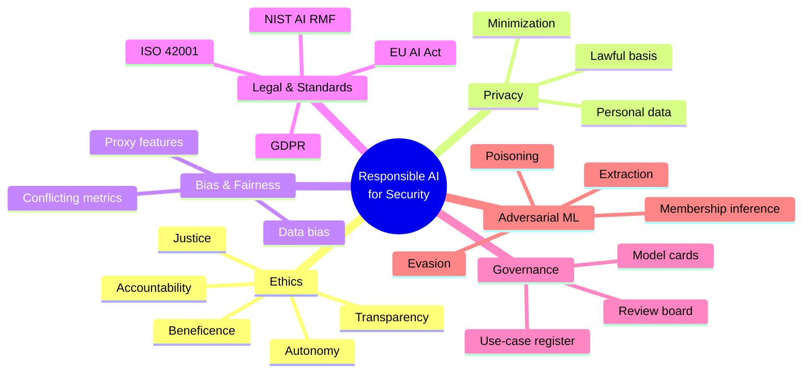
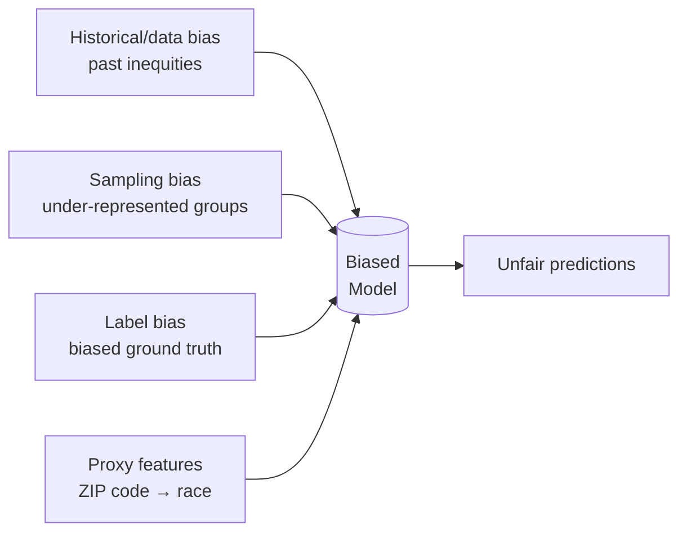
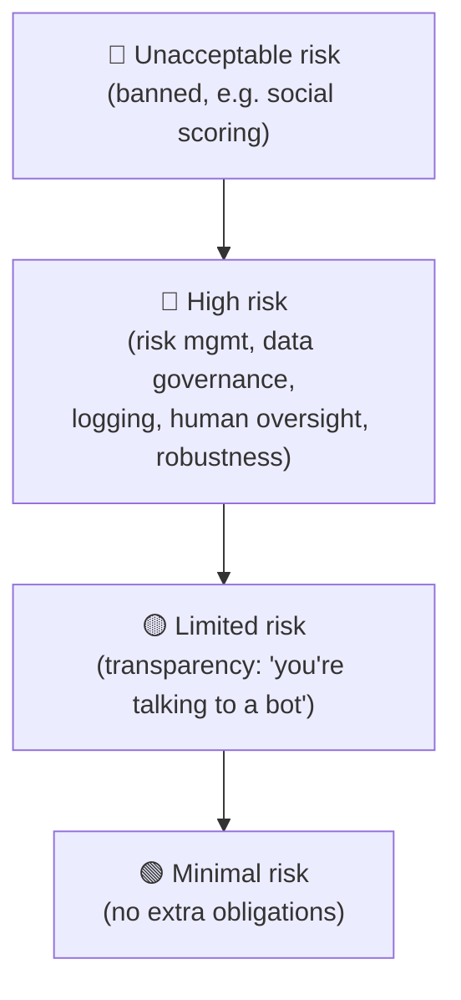
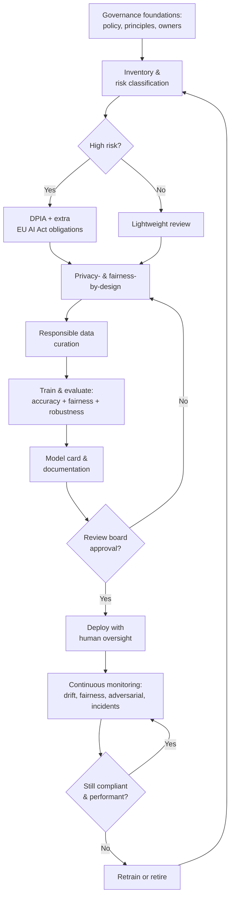
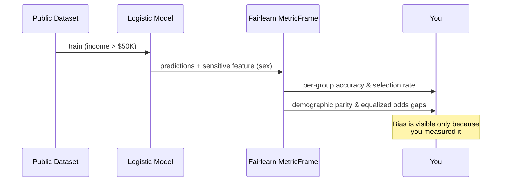

# Ethical & Legal Considerations in AI for Cyber Security

> **What you'll learn:** How to build, deploy, and govern AI systems for cyber security in ways that are ethical, privacy-respecting, fair, legally compliant, and robust against attack.
> **Prerequisites:** Basic ML concepts (training data, models, predictions), core cyber-security ideas (threats, detection, controls), and comfort reading short Python snippets.

| Course | Course code | Module | Level |
|--------|-------------|--------|-------|
| AI for Cyber Security | SKL-AICS-720 | Module 04 — Ethical & Legal Considerations in AI for Cyber Security | Applied / Machine Learning |

---

> 📺 **Watch — top video on this topic:** [](https://www.youtube.com/watch?v=QCNEylVuZU4) [Ethical Considerations in AI-Driven Cybersecurity](https://www.youtube.com/watch?v=QCNEylVuZU4)

---

## 1. In Plain English 🧭

Imagine you hire a brilliant but inexperienced security guard. They watch a thousand cameras at once and spot patterns no human could — but they learned everything from old footage of *your* building. So they trust people who "look like" the regulars, get suspicious of newcomers, and remember everyone's face and habits (powerful, but creepy). A clever intruder who studies the guard's quirks can dress to slip right past them.

An AI system in cyber security **is** that guard: incredibly capable, but it inherits the blind spots of its data, consumes huge amounts of personal information, and can be tricked.

> 🔑 **Key idea:** Ethics and law are the **rulebook, training manual, and audit process** that keep this powerful guard honest, fair, privacy-respecting, and accountable.

This module covers that rulebook across six themes:

| Theme | The question it answers |
|-------|-------------------------|
| ⚖️ **Ethics** | What is the *right* thing to do? |
| 🔒 **Privacy & data protection** | How do we handle people's data responsibly and legally? |
| 🎯 **Bias & fairness** | Does the AI systematically disadvantage groups? |
| 📜 **Legal compliance** | What do laws (GDPR, EU AI Act) *require*? |
| 🏛️ **Governance** | How do we make it happen daily — and prove it? |
| 🥷 **Adversarial ML** | How do attackers fool AI, and how do we defend? |

The goal isn't to slow you down. It's to ensure that when your AI flags a "threat," blocks a user, or scores someone as risky, that decision is **justifiable, explainable, and defensible** — to customers, regulators, and your conscience.

---

## 2. Core Concepts 🧱



### ⚖️ AI Ethics

**AI ethics** is the study and practice of building AI that aligns with human values and avoids harm. It is usually summarized by a handful of principles, drawn from frameworks like the [OECD AI Principles](https://oecd.ai) and the EU's *Ethics Guidelines for Trustworthy AI*:

- **Beneficence / non-maleficence** — do good, avoid harm.
- **Autonomy** — humans stay in control; AI augments, not replaces, human judgment for consequential decisions.
- **Justice / fairness** — benefits and burdens distributed fairly.
- **Transparency / explainability** — affected people can understand how a decision was made.
- **Accountability** — a human or organization is responsible for outcomes.

These aren't abstract in security. If an AI intrusion-detection system blocks a hospital's network traffic during an emergency because it "looked anomalous," the questions — who is harmed, who is accountable, was there human oversight — become very concrete.

### 🔒 Privacy and Data Protection

**Privacy** is a person's right to control information about themselves. **Data protection** is the set of legal and technical safeguards that enforce that right.

AI security tools are data-hungry: they ingest logs, packet captures, emails, endpoint telemetry, and user behavior — much of it **personal data** (anything that can identify a person) or even **special-category data** (health, biometrics, political views). Key GDPR data-protection principles:

| Principle | Meaning |
|-----------|---------|
| **Lawfulness, fairness, transparency** | Have a legal basis; tell people you're processing their data |
| **Purpose limitation** | Don't silently reuse data collected for one purpose |
| **Data minimization** | Collect only what you need |
| **Storage limitation** | Don't keep data longer than necessary |
| **Integrity & confidentiality** | Protect the data you hold |
| **Accountability** | Be able to *demonstrate* compliance |

> 💡 **Tip:** "We needed it for security" is **not** a free pass. You still need a lawful basis, transparency, and minimization.

### 🎯 Bias and Fairness in AI Systems

**Bias** is a systematic error that causes a model to treat groups differently. **Fairness** is the goal of avoiding unjustified disparate treatment or impact.



- **Historical/data bias** — training data reflects past inequities (e.g., a fraud model trained where one region was over-investigated).
- **Sampling bias** — some groups are under-represented.
- **Label bias** — the "ground truth" labels came from biased human decisions.
- **Proxy features** — a feature like ZIP code or device type stands in for a protected attribute like race.

There is no single mathematical definition of fairness — and several common metrics often *conflict*:

| Fairness notion | Plain meaning | Equalizes |
|-----------------|---------------|-----------|
| **Demographic parity** | Positive prediction rate equal across groups | Selection rate |
| **Equal opportunity** | True-positive rate equal across groups | TPR |
| **Equalized odds** | TP *and* FP rates equal across groups | TPR + FPR |
| **Predictive parity** | Precision (PPV) equal across groups | Precision |

> ⚠️ **Warning:** The "impossibility of fairness" result shows you generally **cannot satisfy all of these at once**. Teams must consciously choose which definition fits their context.

### 📜 Legal Compliance and Standards

These are the externally binding (or widely adopted) rules you must follow.

| Standard / Law | Type | Core idea | Teeth |
|----------------|------|-----------|-------|
| **GDPR** (EU 2016/679) | Binding law | Benchmark privacy law; **Art. 22** limits *solely* automated consequential decisions | Up to **€20M or 4%** of global turnover |
| **EU AI Act** (EU 2024/1689) | Binding law | Risk-based tiers; high-risk AI faces strict obligations | Phased deadlines; significant fines |
| **NIST AI RMF 1.0** (2023) | Voluntary (US) | Four functions: **Govern, Map, Measure, Manage** | Reputational / contractual |
| **ISO/IEC 42001:2023** | Standard | AI Management System (AIMS) — like ISO 27001 for AI | Certification |
| **Sector / regional** | Binding | HIPAA (US health), CCPA/CPRA (California), India **DPDP Act 2023** | Varies |

**GDPR Article 22** in detail: individuals have the right *not* to be subject to a decision based *solely* on automated processing producing legal or similarly significant effects, with safeguards including the right to **human intervention and explanation**.

**EU AI Act risk tiers:**



Many cyber-security and biometric uses fall into the **high-risk** category.

> 💡 **Tip:** Always confirm current statutory text and effective dates — laws are amended and phased in over time. The EU AI Act applies in *staged* deadlines.

### 🏛️ AI Governance and Policy

**AI governance** is the internal system of policies, roles, processes, and controls that ensures AI is built and used responsibly and lawfully.

> 🔑 **Key idea:** Ethics says *"what's right,"* law says *"what's required,"* governance is *"how we actually make it happen, every day, and prove it."*

Typical elements: an AI policy, a risk-classification process, an **AI use-case inventory/register**, model documentation requirements, an approval/review board, monitoring and incident response, and clear accountability (a designated owner per model).

### 🥷 Adversarial Machine Learning

**Adversarial ML** studies how attackers manipulate AI systems, and how to defend them.

| Attack | Phase | What happens | Also a privacy attack? |
|--------|-------|--------------|------------------------|
| **Evasion** | Inference | Craft inputs that fool a deployed model (malware tweaked to look benign) | No |
| **Poisoning** | Training | Inject malicious data so the model learns wrong (incl. stealthy **backdoors/trojans**) | No |
| **Model extraction/stealing** | Inference | Query repeatedly to reconstruct the model or its data | Partly |
| **Membership inference / model inversion** | Inference | Determine if a record was in training data, or reconstruct sensitive inputs | ✅ Yes |

> 🔑 **Key idea:** Adversarial ML is where security and ethics intersect most sharply — the same model that protects you is itself an attack surface.

---

## 3. How It Works (Step by Step) 🔄

Here's how a mature organization operationalizes responsible-AI governance for a security ML system, end to end:

1. **Establish governance foundations.** Write an AI policy, define principles, assign accountable owners, stand up a review board. Map obligations to applicable laws (GDPR, EU AI Act, sector rules).
2. **Inventory and risk-classify the use case.** Register the model (e.g., "ML phishing detector") and classify its risk tier. High-risk uses trigger extra obligations.
3. **Run a DPIA.** Where processing is likely high-risk to individuals, GDPR Article 35 may require a **Data Protection Impact Assessment** before you build. Identify legal basis, data flows, and minimization opportunities.
4. **Design for privacy and fairness up front.** Apply privacy-by-design (minimization, pseudonymization, differential privacy) and define which fairness metric matters here.
5. **Curate data responsibly.** Document sources, check bias and representativeness, record provenance, confirm consent/legal basis.
6. **Train and evaluate.** Measure not just accuracy but **fairness metrics** and **robustness** (including adversarial testing). Document in a **model card**.
7. **Independent review and approval.** The review board checks documentation, fairness, privacy, and security before sign-off.
8. **Deploy with human oversight.** Ensure consequential automated decisions have a human-in-the-loop and an appeals/override path (supporting GDPR Article 22 rights).
9. **Monitor continuously.** Watch for data drift, fairness regression, adversarial activity, and incidents. Keep audit logs.
10. **Review, retire, or retrain.** Periodically reassess; decommission models that no longer meet standards.



> 🖼️ *Suggested image: a one-page "Responsible AI lifecycle" infographic poster matching the 10 steps above, suitable for a team wiki.*

---

## 4. Real-World Examples 🌍

**Example 1 — Bias in an automated decision system.** In 2018, Amazon scrapped an internal experimental recruiting tool after discovering it systematically down-ranked résumés containing the word "women's" (as in "women's chess club"). The model had learned from a decade of mostly-male technical résumés and encoded that imbalance.
> 💡 **Security takeaway:** A "risk-scoring" or "insider-threat" model trained on historical investigation data can similarly bake in and amplify past bias against particular groups.

**Example 2 — Privacy regulation enforcement.** Regulators have issued very large GDPR fines for unlawful data handling, including a **€1.2 billion fine against Meta in 2023** over EU–US data transfers. Facial-recognition vendor **Clearview AI** has been fined by multiple European data-protection authorities for scraping billions of face images without a lawful basis.
> 💡 **Security takeaway:** For AI tools that ingest personal data (emails, behavioral biometrics, location), "we needed it for security" is not a free pass — you still need a lawful basis, transparency, and minimization.

**Example 3 — Adversarial evasion of an ML classifier.** Researchers have repeatedly shown that small, carefully crafted perturbations fool ML models: imperceptible noise flips an image classifier's label, and physical stickers on a stop sign can cause a vision model to misread it. In security, attackers append benign-looking bytes or restructure malware features to push a malware classifier's score below its detection threshold — an **evasion attack**.
> ⚠️ **Warning:** This is why adversarial robustness testing — not just clean-data accuracy — is essential before deployment.

> 🖼️ *Suggested image: a side-by-side of a stop sign with adversarial stickers and the model's misclassification label, illustrating physical-world evasion.*

---

## 5. Tools of the Trade 🧰

| Need | Tool / framework | What it does |
|------|------------------|--------------|
| 🎯 Fairness measurement & mitigation | **IBM AI Fairness 360 (AIF360)**, **Fairlearn**, Google What-If Tool | Compute fairness metrics, apply bias-mitigation algorithms |
| 🔒 Privacy | **Opacus** (PyTorch DP), **TensorFlow Privacy**, **OpenDP** | Train models with mathematical privacy guarantees |
| 🥷 Adversarial robustness | **Adversarial Robustness Toolbox (ART)**, **CleverHans**, **Foolbox** | Generate attacks, apply/evaluate defenses |
| 📋 Documentation & governance | **Model Cards**, **Datasheets for Datasets**, MLflow registry | Standardized transparency and audit trails |
| 🔍 Explainability | **SHAP**, **LIME** | Explain individual model predictions |

**Sample usage — Fairlearn to measure disparity:**

```python
# pip install fairlearn scikit-learn
from fairlearn.metrics import MetricFrame, demographic_parity_difference
from sklearn.metrics import accuracy_score

# y_true: actual labels, y_pred: model predictions,
# sensitive: the protected attribute per row (e.g., "group_A"/"group_B")
mf = MetricFrame(
    metrics=accuracy_score,
    y_true=y_true,
    y_pred=y_pred,
    sensitive_features=sensitive,
)

print("Accuracy per group:\n", mf.by_group)        # spot accuracy gaps
print("Overall accuracy:", mf.overall)

# A single number summarizing how unequal the positive-prediction rate is.
# 0.0 means perfect demographic parity; larger means more disparity.
dp_gap = demographic_parity_difference(
    y_true, y_pred, sensitive_features=sensitive
)
print("Demographic parity difference:", dp_gap)
```

**What this does:** `MetricFrame` slices any metric (here, accuracy) by a sensitive attribute so you can *see* whether the model performs worse for one group. `demographic_parity_difference` condenses the disparity in positive-prediction rates into one number you can track over time and gate on in CI.

---

## 6. Hands-On Lab (Authorized / Lab-Only) 🧪

> ⚠️ **Reminder:** Run this only on your own machine or an authorized lab environment, using public datasets you are permitted to use.

We measure **fairness metrics** on a classic public dataset to see bias in action.

- **Dataset:** UCI **Adult / Census Income** (predicts income > $50K). A standard fairness benchmark; `sex` is commonly the sensitive attribute. (Fetched via OpenML.)
- **Libraries:** `scikit-learn`, `fairlearn`, `pandas`.

```python
# pip install scikit-learn fairlearn pandas
import pandas as pd
from sklearn.datasets import fetch_openml
from sklearn.model_selection import train_test_split
from sklearn.linear_model import LogisticRegression
from sklearn.preprocessing import OneHotEncoder
from sklearn.compose import ColumnTransformer
from sklearn.pipeline import Pipeline
from fairlearn.metrics import (
    MetricFrame, selection_rate,
    demographic_parity_difference, equalized_odds_difference,
)
from sklearn.metrics import accuracy_score

# 1. Load the public Adult dataset
data = fetch_openml("adult", version=2, as_frame=True)
X = data.data
y = (data.target == ">50K").astype(int)          # 1 = high income

sensitive = X["sex"]                              # protected attribute

# 2. Split, keeping the sensitive column aligned with the test set
X_tr, X_te, y_tr, y_te, s_tr, s_te = train_test_split(
    X, y, sensitive, test_size=0.3, random_state=42, stratify=y
)

# 3. Simple model: one-hot encode categoricals, then logistic regression
cat_cols = X.select_dtypes(include="category").columns.tolist()
num_cols = [c for c in X.columns if c not in cat_cols]
pre = ColumnTransformer([
    ("cat", OneHotEncoder(handle_unknown="ignore"), cat_cols),
    ("num", "passthrough", num_cols),
])
clf = Pipeline([("pre", pre),
                ("lr", LogisticRegression(max_iter=1000))])
clf.fit(X_tr, y_tr)
y_pred = clf.predict(X_te)

# 4. Measure performance AND fairness
mf = MetricFrame(
    metrics={"accuracy": accuracy_score, "selection_rate": selection_rate},
    y_true=y_te, y_pred=y_pred, sensitive_features=s_te,
)
print("Per-group metrics:\n", mf.by_group, "\n")
print("Demographic parity difference:",
      demographic_parity_difference(y_te, y_pred, sensitive_features=s_te))
print("Equalized odds difference:",
      equalized_odds_difference(y_te, y_pred, sensitive_features=s_te))
```

**Beginner walkthrough:**

1. **Load data (step 1).** Pull the Adult dataset and turn income into a binary target (`1` if > $50K). `sex` becomes our sensitive attribute.
2. **Split (step 2).** Split into train/test while keeping the sensitive column lined up with the test rows — essential, because fairness is measured on predictions for known groups.
3. **Train a model (step 3).** Nothing fancy: encode text categories into numbers and fit logistic regression. The point isn't a great model — it's to expose disparity in an ordinary one.
4. **Measure fairness (step 4).** `MetricFrame` reports accuracy *and* selection rate **per group**. The two difference metrics summarize the gap: you'll typically see a noticeably higher selection rate for one group — measurable bias, even though we never told the model to discriminate. These numbers drive monitoring and mitigation (e.g., Fairlearn's `ExponentiatedGradient` reductions).



> 🔑 **Key idea:** Bias is the **default, not the exception**. You only know it's there if you measure it.

---

## 7. Countermeasures & Defenses 🛡️

The defenses below map directly to the risks in Section 2 — attack/concern on the left, defense on the right.

| Concern | Defense |
|---------|---------|
| 🔒 Excess personal data | Minimize fields; pseudonymize/aggregate; separate identifiers from telemetry |
| 🔒 Sensitive training data | **Differential privacy** (e.g., Opacus); retention limits; honor access/erasure rights |
| 🎯 Unfair outcomes | Test representativeness; pick an explicit fairness definition; gate releases on fairness thresholds |
| 🎯 Consequential errors | Mitigation (re-sampling, re-weighting, post-processing) + human-in-the-loop |
| 🥷 Evasion | Adversarial red-teaming (ART/CleverHans/Foolbox); **adversarial training**; input validation; ensemble/randomized defenses |
| 🥷 Poisoning | Vet and provenance-track training data |
| 🥷 Extraction / membership inference | Rate-limit and monitor queries |
| 📋 Auditability | Model cards, datasheets, use-case register, DPIAs, review-board sign-off, audit trails |

**Privacy-by-design**
- Minimize: collect and retain only the fields the model truly needs.
- Pseudonymize/anonymize and aggregate where possible; separate identifiers from telemetry.
- Use **differential privacy** (e.g., Opacus) for training on sensitive data.
- Define and enforce retention limits; honor data-subject rights (access, erasure).

**Bias audits & fairness**
- Test representativeness of training data before training.
- Choose an explicit fairness definition appropriate to the use case and document the trade-off.
- Measure fairness metrics on every release; set thresholds and gate deployment on them.
- Apply mitigation (re-sampling, re-weighting, post-processing) and keep humans in the loop for consequential decisions.

**Adversarial hardening**
- Adversarial testing/red-teaming with ART, CleverHans, or Foolbox before deployment.
- **Adversarial training** (train on perturbed examples), input validation/sanitization, ensemble or randomized defenses.
- Defend training-time risks: vet and provenance-track data to resist **poisoning**; rate-limit and monitor queries to resist **model extraction** and **membership inference**.
- Monitor for distribution drift and anomalous query patterns in production.

**Documentation & governance**
- Maintain **model cards** and **datasheets** for every model and dataset.
- Keep an AI use-case register and run **DPIAs** where required.
- Require independent review-board sign-off; log decisions and keep audit trails.
- Map controls to standards (NIST AI RMF, ISO/IEC 42001) and review periodically.

---

## 8. Key Terms 📚

| Term | Definition |
|------|------------|
| **AI ethics** | Building AI aligned with human values (fairness, transparency, accountability, non-maleficence) |
| **Personal data** | Any information relating to an identified or identifiable person (GDPR) |
| **DPIA** | Structured assessment of privacy risks required for high-risk processing (GDPR Art. 35) |
| **Bias** | Systematic error causing a model to treat groups differently in an unjustified way |
| **Demographic parity** | Fairness: equal positive-prediction rate across groups |
| **Equalized odds** | Fairness: equal true-positive *and* false-positive rates across groups |
| **GDPR** | EU General Data Protection Regulation; benchmark data-protection law |
| **EU AI Act** | EU regulation governing AI on risk-based tiers (unacceptable/high/limited/minimal) |
| **NIST AI RMF** | Voluntary US framework (Govern, Map, Measure, Manage) for AI risk management |
| **ISO/IEC 42001** | International standard for an AI Management System |
| **AI governance** | Internal policies, roles, and processes ensuring responsible, compliant AI |
| **Adversarial ML** | Study of attacks on (and defenses for) ML systems |
| **Evasion attack** | Manipulating inputs at inference time to fool a deployed model |
| **Poisoning attack** | Corrupting training data so the model learns the wrong thing |
| **Membership inference** | Attack determining whether a record was in the training data |
| **Differential privacy** | Mathematical guarantee that output reveals little about any single training record |
| **Model card** | Standardized document describing a model's purpose, performance, limitations, and fairness |

---

## 9. Summary & Takeaways ✅

- 🤖 AI security tools are powerful but inherit data blind spots, consume personal data, and are themselves attackable — ethics and law keep them honest and accountable.
- 🔒 Privacy requires a lawful basis, minimization, transparency, and demonstrable accountability; **GDPR Article 22** limits purely automated consequential decisions.
- 🎯 Bias is the default — you must *measure* fairness (multiple, often-conflicting metrics) and consciously choose which fits the use case.
- 📜 Key standards: **GDPR**, the **EU AI Act** (risk-based tiers), **NIST AI RMF** (Govern/Map/Measure/Manage), and **ISO/IEC 42001**.
- 🏛️ Governance turns principles into practice: use-case inventories, DPIAs, model cards, review boards, human oversight, continuous monitoring.
- 🥷 Adversarial ML (evasion, poisoning, extraction, membership inference) means clean-data accuracy is not enough — test robustness and harden accordingly.
- 🏗️ Build it in from the start: privacy-by-design, bias audits, adversarial hardening, and documentation are cheaper and safer than retrofitting.

> 🔑 **Key idea:** Defensible AI is the goal — every consequential decision should be **justifiable, explainable, and auditable**.

**Further reading:** NIST AI Risk Management Framework (AI RMF 1.0); EU AI Act (Regulation (EU) 2024/1689); EU GDPR (Regulation (EU) 2016/679); OECD AI Principles; ISO/IEC 42001:2023; NIST adversarial-ML taxonomy (NIST AI 100-2).
