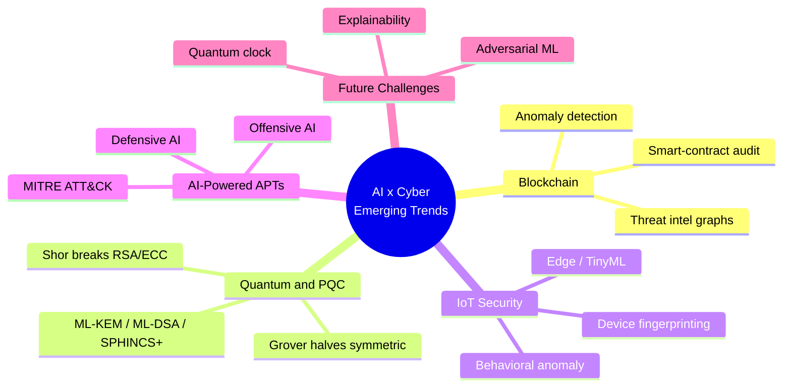
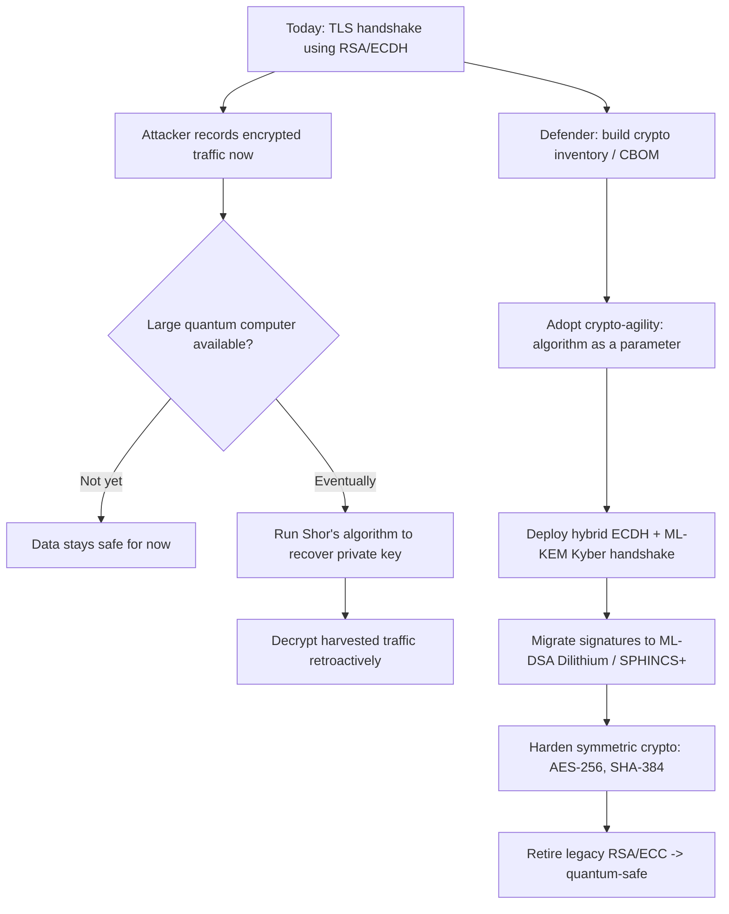
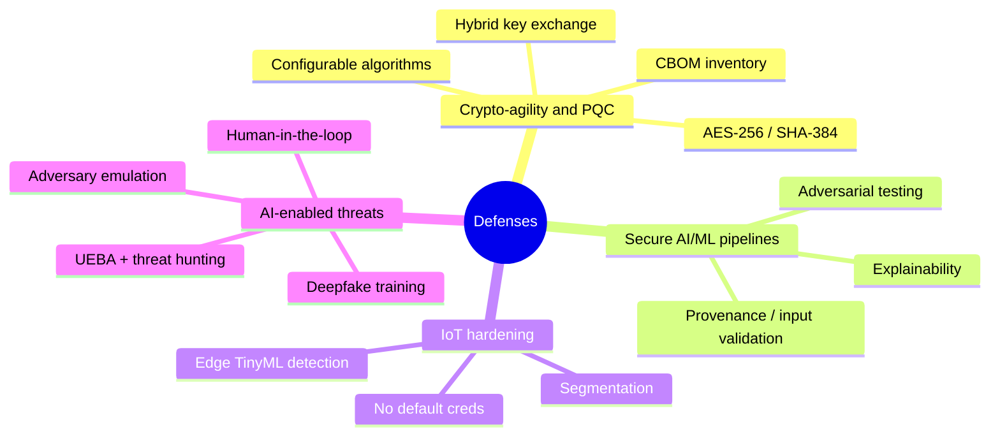

# Emerging Trends & Future of AI in Cyber Security

> **What you'll learn:** how AI is reshaping the security frontier — blockchain protection, the quantum / post-quantum race, IoT defense, and the dual use of AI in advanced persistent threats — plus the challenges and opportunities ahead.
> **Prerequisites:** basic cryptography (public/private keys, hashing), ML fundamentals (training, inference, classification), and core security concepts (threats, vulnerabilities, detection).

| Course | Course code | Module | Level |
|---|---|---|---|
| AI for Cyber Security | SKL-AICS-720 | Emerging Trends & Future of AI in Cyber Security | Applied / Machine-Learning |

---

> 📺 **Watch — top video on this topic:** [](https://www.youtube.com/watch?v=k0TTcGaVFSw) [The Rise of Autonomous AI-Powered Cyber Defense — The Future of AI in Cybersecurity](https://www.youtube.com/watch?v=k0TTcGaVFSw)

---

## 1. In Plain English

Think of how home security evolved: a lock → an alarm → cameras → a smart system that *learns* what "normal" looks like and flags anything odd. Cyber security is on the same path, but with two twists:

- 🔁 **AI is dual-use.** The same intelligent tools that protect you can help burglars pick better locks. AI serves defenders *and* attackers.
- 🔑 **A "master key" is coming.** Quantum computers could one day open many of today's locks instantly — so we are quietly swapping in new locks even that master key can't open.

The "emerging trends" in this module are simply the places where these forces collide:

- **Blockchain** gets AI bolted on to watch for fraud, the way a bank's fraud team watches transactions.
- **IoT** gets AI placed inside billions of tiny device brains (doorbell cameras, factory sensors) because humans can't watch them all.
- **APTs** increasingly run on AI — on *both* sides of the fight.

> 🔑 **Key idea:** Nobody has finished this race. The tech moves fast, attackers and defenders leapfrog each other, and the rules (regulation, standards, ethics) are still being written. You're learning the map of a territory still being explored.

---

## 2. Core Concepts



### 2.1 AI + Blockchain for Enhanced Security 🔗

A **blockchain** is a shared, append-only ledger: a chain of transaction "blocks," each cryptographically linked to the previous one via a hash, with copies distributed across many participants so no one can secretly rewrite history. This gives strong **integrity** and **transparency**.

But blockchains aren't magically secure. The weak points are usually **smart contracts** (programs that run on the chain), wallets, exchanges, and human behavior. That's where AI helps:

| AI capability | What it does | Catches |
|---|---|---|
| 🚨 **Anomaly detection** | Learns the normal pattern of an address/token | Laundering, rug pulls, flash-loan attacks (near real time) |
| 🔍 **Smart-contract auditing** | AI static analysis + LLMs review Solidity | Re-entrancy, integer overflow, unchecked external calls |
| 🕸️ **Threat-intel graphs** | Clusters wallet addresses | Fraud rings, stolen-fund tracing (deanonymization) |

> 💡 **Tip:** It works both ways — **blockchain can also strengthen AI** by providing a tamper-evident audit trail for AI decisions, model provenance, and training-data integrity. Useful when you must prove *what* model decided, on *what* data.

### 2.2 Quantum Computing, AI, and Post-Quantum Cryptography ⚛️

A **quantum computer** uses quantum bits (**qubits**) that can represent superpositions of states, letting certain algorithms run dramatically faster than on classical machines. Two algorithms matter for security:

| Algorithm | Effect | Breaks / Weakens | Fix |
|---|---|---|---|
| **Shor's** | Efficiently factors integers & computes discrete logs | RSA, Diffie-Hellman, ECC (most TLS/VPN/code-signing public-key crypto) | Migrate to PQC |
| **Grover's** | Quadratic speedup on brute-force search → halves symmetric strength | AES-128, short hashes | Double sizes (AES-256, SHA-384) |

A large, fault-tolerant quantum computer capable of running Shor's at scale does **not yet exist publicly** — but the threat is real *today*:

> ⚠️ **Warning — "Harvest now, decrypt later":** Adversaries record encrypted traffic now and decrypt it once quantum hardware arrives. Anything with a long secrecy lifetime (medical records, state secrets, root keys) is already at risk.

**Post-Quantum Cryptography (PQC)** is the answer: new public-key algorithms built on math problems (lattices, hashes, codes) believed hard even for quantum computers. NIST published the first standards in 2024:

| Standard | Algorithm | Purpose |
|---|---|---|
| FIPS 203 (ML-KEM) | **CRYSTALS-Kyber** | Key encapsulation (key exchange) |
| FIPS 204 (ML-DSA) | **CRYSTALS-Dilithium** | Digital signatures |
| FIPS 205 (SLH-DSA) | **SPHINCS+** | Hash-based digital signatures |
| FIPS 206 (FN-DSA, draft) | **Falcon** | Compact lattice signatures |

**Where AI fits:** cryptanalysis research (hunting weaknesses in lattice schemes), automating the **migration inventory** (finding every place RSA/ECC is used across a large estate), and quantum-enhanced optimization/ML more broadly. The headline, though, is the migration challenge itself.

> 🖼️ *Suggested image: diagram of a classical vs. quantum bit (0/1 vs. superposition on a Bloch sphere).*

### 2.3 AI for IoT Security 📡

The **Internet of Things (IoT)** is the universe of network-connected devices that aren't traditional computers: sensors, cameras, smart locks, medical implants, industrial controllers. They share three painful properties:

- 🔢 **Enormous numbers** of them
- 🪫 **Resource-constrained** (little CPU, memory, battery)
- 🩹 **Rarely patched**

AI fits because the volume and variety of IoT telemetry exceed human capacity:

| Technique | How it works | Benefit |
|---|---|---|
| **Behavioral anomaly detection** | Learns each device's normal traffic profile | Spots compromise (a thermostat suddenly scanning the network) — e.g. early **Mirai** botnet detection |
| **Device fingerprinting & classification** | ML identifies device type/firmware from behavior | Enables automatic network segmentation |
| **Edge / TinyML** | Lightweight models run *on* the device or gateway | Works with intermittent connectivity; keeps sensitive data local |

> ⚠️ **Warning:** The flip side — attackers use AI to fuzz firmware, discover vulnerabilities, and orchestrate large botnets adaptively.

### 2.4 AI-Powered Advanced Persistent Threats (Offensive & Defensive) 🎯

An **Advanced Persistent Threat (APT)** is a stealthy, well-resourced adversary (often nation-state or organized crime) that gains a foothold and stays hidden for months, slowly pursuing a specific objective. The lifecycle maps to the **MITRE ATT&CK** framework.


AI supercharges both sides of this lifecycle:

| Stage / Goal | ⚔️ Offensive AI | 🛡️ Defensive AI |
|---|---|---|
| Recon & social engineering | LLM-crafted flawless phishing; **deepfake** audio/video ("CEO fraud") | **UEBA** baselines normal behavior (impossible travel, odd data access) |
| Malware & evasion | Polymorphic code; AI that changes tactics to dodge detection | AI-assisted **threat hunting & SOAR** in SIEM/XDR correlate millions of events |
| Vulnerability discovery | AI-assisted fuzzing finds bugs faster | **Alert triage** ranks the few real incidents out of thousands |

> 🔑 **Key idea:** APT detection is a needle-in-a-haystack problem — and AI is the magnet.

### 2.5 Future Challenges 🧭

- 🧪 **Adversarial ML:** attackers poison training data or craft inputs that fool models (evasion). Defensive AI is itself an attack surface.
- 🔦 **Explainability & trust:** a black-box model that says "this is malware" without a reason is hard to act on or audit.
- 👥 **Talent & regulation gap:** the technology outpaces skills, laws, and ethics frameworks (EU AI Act, etc.).
- ⏳ **The quantum clock:** PQC migration must finish *before* cryptographically relevant quantum computers arrive — a years-long effort.

---

## 3. How It Works (Step by Step)

**Chosen trend: how a quantum threat breaks today's crypto, and how a post-quantum migration works.**

When your browser connects to a bank, it performs a **TLS handshake**: public-key crypto (e.g., ECDH) agrees on a shared secret, then fast symmetric crypto (AES) encrypts the actual data. **The public-key step is the vulnerable part.**

| Step | Phase | What happens |
|---|---|---|
| 1 | ⚔️ Capture | Adversary records the encrypted handshake & traffic today. Can't read it yet — "harvest now, decrypt later." |
| 2 | ⚔️ Quantum break | A large fault-tolerant quantum computer runs **Shor's** against the recorded ECDH/RSA handshake, recovers the private key → shared secret → decrypts everything retroactively. |
| 3 | 🛡️ Inventory | Org builds a **cryptographic bill of materials (CBOM)**: every library, cert, protocol, device using RSA/ECC. AI accelerates discovery. |
| 4 | 🛡️ Crypto-agility | Systems refactored so the algorithm is a swappable parameter, not hard-wired. |
| 5 | 🛡️ Hybrid deploy | **Hybrid handshake** runs classical ECDH *and* PQC KEM (**ML-KEM / Kyber**) together, combining both secrets. If *either* holds, the session is safe. |
| 6 | 🛡️ Full PQC + hardening | Move signatures to **ML-DSA (Dilithium)** / **SPHINCS+**; bump symmetric to AES-256 / SHA-384 against Grover. Validate, then retire legacy algorithms. |

> 💡 **Tip:** The hybrid handshake (Step 5) protects against *two* risks at once — quantum attacks **and** any undiscovered flaw in the brand-new PQC scheme itself.



The KEM-based key exchange at the heart of Step 5 looks like this — note that only public data ever crosses the wire:

```mermaid
sequenceDiagram
    participant A as Alice (sender)
    participant B as Bob (receiver)
    B->>B: generate_keypair()
    B->>A: public key
    A->>A: encap_secret(public key) -> ciphertext + secret
    A->>B: ciphertext
    B->>B: decap_secret(ciphertext) -> same secret
    Note over A,B: Both share an identical secret;<br/>it was never transmitted directly
```

---

## 4. Real-World Examples

**1. NIST Post-Quantum Cryptography Standardization.** From 2016, NIST ran a multi-year public competition to select quantum-resistant algorithms. In **August 2024** it finalized the first standards: **FIPS 203 (ML-KEM / Kyber)**, **FIPS 204 (ML-DSA / Dilithium)**, and **FIPS 205 (SLH-DSA / SPHINCS+)**. Browsers and cloud providers (e.g., Chrome and Cloudflare) already deploy **hybrid Kyber** key exchange in TLS — a concrete, live example of Step 5 above.

**2. AI-assisted threat hunting against APTs.** Modern SOCs use XDR/SIEM platforms with behavioral analytics to detect lateral movement. Instead of relying on known-malware signatures, the system baselines normal account/host behavior and flags anomalies — e.g., a service account suddenly authenticating to dozens of hosts at 3 a.m. This is how stealthy, "living-off-the-land" intrusions (abusing legitimate tools like PowerShell) get caught and mapped to **MITRE ATT&CK** techniques.

**3. Deepfake-enabled social engineering.** In a widely reported 2024 incident, an employee at a multinational was tricked into transferring funds after joining a video call where deepfaked, AI-generated likenesses impersonated the CFO and colleagues. A vivid demonstration of offensive AI collapsing the trust we place in seeing and hearing a familiar face — and why verification procedures (call-backs, code words) matter more than ever.

> 🖼️ *Suggested image: screenshot of a SIEM/XDR anomaly-detection dashboard flagging unusual authentication activity.*

---

## 5. Tools of the Trade

| Tool / Framework | Category | What it does |
|---|---|---|
| **liboqs / Open Quantum Safe (OQS)** | 🔐 PQC | C library + language wrappers implementing Kyber, Dilithium, SPHINCS+, etc.; integrates into OpenSSL/BoringSSL forks |
| **`oqs-python`** | 🔐 PQC | Python bindings to liboqs for prototyping KEMs and signatures |
| **AWS-LC / BoringSSL / OpenSSL 3.x providers** | 🔐 PQC | TLS stacks adding hybrid PQC key exchange |
| **MITRE ATT&CK / CALDERA** | 🎯 APT defense & emulation | Knowledge base of adversary TTPs; CALDERA automates adversary emulation |
| **Slither / Mythril** | 🔗 Blockchain | Static analysis for Solidity smart-contract vulnerabilities |
| **Elastic / Splunk / Microsoft Sentinel (UEBA)** | 🛡️ AI threat hunting | SIEM/XDR with ML-driven anomaly detection and SOAR automation |

**Sample usage — generating a post-quantum keypair with `oqs-python`:**

```python
# pip install oqs-python   (requires liboqs installed; see Open Quantum Safe docs)
import oqs

# Choose a NIST-standardized KEM. "ML-KEM-768" is the FIPS 203 name for Kyber-768.
kem_alg = "ML-KEM-768"

with oqs.KeyEncapsulation(kem_alg) as kem:
    public_key = kem.generate_keypair()          # public key shared openly
    # A peer encapsulates a shared secret to our public key:
    ciphertext, secret_sender = kem.encap_secret(public_key)
    # We decapsulate using our private key (held inside the kem object):
    secret_receiver = kem.decap_secret(ciphertext)

    assert secret_sender == secret_receiver       # both sides now share a secret
    print(f"{kem_alg}: shared secret established, {len(secret_sender)} bytes")
```

> 🔑 **Key idea — what a KEM is:** A **Key Encapsulation Mechanism** is the modern way to do quantum-safe key exchange. The receiver publishes a public key; the sender uses it to *encapsulate* a freshly generated shared secret into a ciphertext; the receiver *decapsulates* it with the private key. Both sides end up with the same secret without ever transmitting it — and because Kyber/ML-KEM is lattice-based, a quantum computer cannot derive that secret from the public data.

---

## 6. Hands-On Lab (Authorized / Lab-Only)

> ⚠️ **Reminder:** Run this only on systems and accounts you own or are explicitly authorized to use, in an isolated lab environment.

**Goal:** Demonstrate a full post-quantum key exchange end to end and confirm both parties derive the identical secret — the building block of quantum-safe TLS.

**Libraries / data needed:**
- `liboqs` (the C library — install from the Open Quantum Safe project)
- `oqs-python` (`pip install oqs-python`)
- No external dataset required.

```python
import oqs
import secrets
from hashlib import sha256

KEM_ALG = "ML-KEM-768"  # FIPS 203 standardized (Kyber-768)

def derive_session_key(shared_secret: bytes) -> str:
    """Turn the raw KEM secret into a usable symmetric key (demo KDF)."""
    return sha256(shared_secret).hexdigest()

# --- Bob: the receiver, generates a long-term keypair ---
bob = oqs.KeyEncapsulation(KEM_ALG)
bob_public_key = bob.generate_keypair()

# --- Alice: the sender, encapsulates a secret to Bob's public key ---
alice = oqs.KeyEncapsulation(KEM_ALG)
ciphertext, alice_secret = alice.encap_secret(bob_public_key)

# --- Bob: decapsulates with his private key ---
bob_secret = bob.decap_secret(ciphertext)

# --- Verify both sides agree, then derive a session key ---
assert alice_secret == bob_secret, "KEM failed: secrets differ!"
session_key = derive_session_key(alice_secret)

print(f"Algorithm           : {KEM_ALG}")
print(f"Public key size     : {len(bob_public_key)} bytes")
print(f"Ciphertext size     : {len(ciphertext)} bytes")
print(f"Shared secret match : {alice_secret == bob_secret}")
print(f"Derived session key : {session_key[:16]}... (truncated)")

# Cleanup
alice.free()
bob.free()
```

**What's happening, for a beginner:**

1. **Bob** creates a keypair and publishes only the *public* key (safe to share).
2. **Alice** uses Bob's public key to `encap_secret`, producing a *ciphertext* (sent over the wire) and her copy of the *shared secret* (kept private).
3. **Bob** runs `decap_secret` on the ciphertext using his private key and recovers the *same* shared secret.
4. We hash the raw secret into a **session key** that AES could then use to encrypt real traffic.

The `assert` proves the magic: two parties agreed on a secret without ever sending it, using math that resists quantum attack.

> 💡 **Tip:** Swap `KEM_ALG` to `"sntrup761"` or another supported algorithm and watch how key/ciphertext sizes change — a real engineering trade-off in PQC migration, since PQC keys are generally larger than RSA/ECC.

> 🖼️ *Suggested image: terminal screenshot of the lab output showing matching shared secrets and key sizes.*

---

## 7. Countermeasures & Defenses



**🔐 Crypto-agility & PQC migration**
- Build a **cryptographic bill of materials (CBOM)**: inventory every use of RSA/ECC.
- Design systems so algorithms are **configurable, not hard-coded**.
- Adopt **hybrid** key exchange (classical + PQC) during transition.
- Bump symmetric crypto to **AES-256** and hashes to **SHA-384/512** against Grover.
- Prioritize long-lived secrets first (root CAs, archived data) — they're most exposed to "harvest now, decrypt later."

**🧠 Securing AI/ML pipelines**
- Defend against **data poisoning** with provenance tracking and input validation.
- Test models against **adversarial/evasion** inputs; use robust training.
- Demand **explainability** so analysts can trust and audit outputs.
- Protect models and training data as sensitive assets (access control, integrity checks — optionally on a tamper-evident ledger).

**📡 IoT hardening**
- Eliminate default credentials; enforce unique, rotatable secrets.
- **Network segmentation** so a compromised sensor can't reach critical systems.
- Deploy **edge/TinyML anomaly detection** for rarely-patched devices.
- Maintain a device inventory and secure, signed firmware-update channels.

**🎭 Preparing for AI-enabled threats**
- Train staff against **deepfakes**; enforce out-of-band verification for high-value actions (call-backs, code words).
- Use **behavioral analytics (UEBA)** and AI-assisted threat hunting mapped to **MITRE ATT&CK**.
- Combine AI triage with **human-in-the-loop** decision-making for response.
- Run **adversary emulation** (e.g., CALDERA) to test detection before real attackers do.

---

## 8. Key Terms

| Term | Meaning |
|---|---|
| **Blockchain** | Distributed, append-only ledger of cryptographically linked blocks providing integrity and transparency |
| **Smart contract** | Self-executing code on a blockchain; a common attack surface (re-entrancy, overflow bugs) |
| **Qubit** | Quantum bit that can hold a superposition of states, enabling quantum speedups |
| **Shor's algorithm** | Quantum algorithm that efficiently breaks RSA/ECC by factoring / discrete log |
| **Grover's algorithm** | Quantum search algorithm that halves effective symmetric-key strength |
| **Post-Quantum Cryptography (PQC)** | Classical-computer algorithms believed secure against quantum attack |
| **CRYSTALS-Kyber / ML-KEM (FIPS 203)** | Standardized lattice-based key encapsulation mechanism |
| **CRYSTALS-Dilithium / ML-DSA (FIPS 204)** | Standardized lattice-based digital signature scheme |
| **SPHINCS+ / SLH-DSA (FIPS 205)** | Standardized stateless hash-based signature scheme |
| **KEM (Key Encapsulation Mechanism)** | Protocol for securely establishing a shared secret using public keys |
| **Crypto-agility** | System design where cryptographic algorithms can be swapped without re-engineering |
| **Harvest now, decrypt later** | Recording encrypted data today to decrypt once quantum computers exist |
| **IoT** | Network of resource-constrained connected devices (sensors, cameras, controllers) |
| **TinyML / edge AI** | Running ML inference on small, low-power devices or gateways |
| **APT (Advanced Persistent Threat)** | Stealthy, well-resourced, long-dwell-time adversary |
| **MITRE ATT&CK** | Knowledge base of real-world adversary tactics, techniques, and procedures (TTPs) |
| **UEBA** | User and Entity Behavior Analytics; baselining behavior to detect anomalies |
| **Deepfake** | AI-generated synthetic audio/video impersonating real people |
| **Adversarial ML** | Attacks that poison training data or craft inputs to fool models |

---

## 9. Summary & Takeaways

- 🔁 **AI is dual-use:** the same models that hunt threats also empower attackers (phishing, deepfakes, adaptive malware). Defense must assume offense has the same tools.
- ⏳ **The quantum threat is a "now" problem** because of harvest-now-decrypt-later, even though scalable quantum computers don't yet exist publicly.
- 🔐 **PQC is real and standardized:** migrate toward **ML-KEM (Kyber)**, **ML-DSA (Dilithium)**, and **SPHINCS+**, and double symmetric key/hash sizes against Grover.
- 🧩 **Crypto-agility is the strategy** — build an inventory (CBOM), make algorithms swappable, deploy hybrid handshakes during transition.
- 📊 **AI suits blockchain and IoT** because both produce more telemetry than humans can monitor; anomaly detection and edge ML are the workhorses.
- 🎯 **APT detection is a needle-in-haystack problem** where UEBA and AI-assisted threat hunting, mapped to MITRE ATT&CK, provide the magnet.
- 🪤 **AI defenses are themselves attack surfaces** — guard against data poisoning and adversarial evasion, and insist on explainability and human-in-the-loop.
- 👥 **The biggest gaps are people, process, and policy** — skills, regulation, and ethics are racing to catch up with the technology.

**Further reading:** NIST Post-Quantum Cryptography project and FIPS 203/204/205; NIST SP 1800-38 (Migration to PQC); ENISA reports on AI security and post-quantum readiness; the MITRE ATT&CK framework and MITRE ATLAS (adversarial threats to ML systems); the Open Quantum Safe project documentation; OWASP smart-contract and IoT security guidance.
